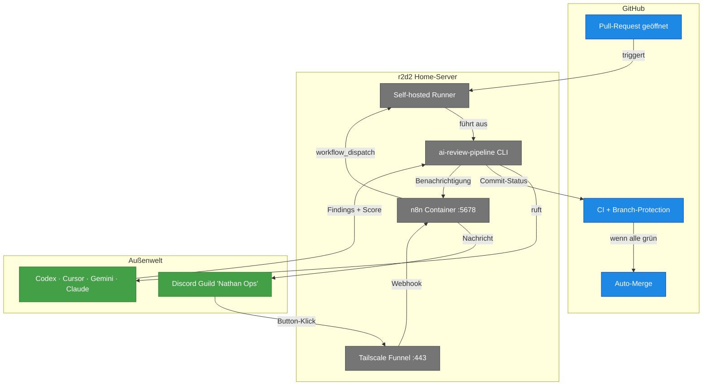

# Überblick — Was ist die AI-Review-Toolchain?

> **TL;DR:** Wenn ein Entwickler einen Vorschlag zur Code-Änderung macht (einen Pull-Request), prüfen vier unterschiedliche KI-Modelle den Code aus vier Blickwinkeln — Logik, zweite Meinung, Sicherheit, Design. Ein fünftes Modell prüft, ob der Vorschlag die im Ticket versprochenen Anforderungen wirklich erfüllt. Die Ergebnisse werden zu einem Gesamturteil verrechnet; ist das klar positiv, wird der Code automatisch freigegeben und eingespielt. Alles passiert auf einem privaten Server im Keller, mit Benachrichtigungen in einem Discord-Channel. Ein Mensch muss nur eingreifen, wenn die Ergebnisse widersprüchlich sind.

## Wie es funktioniert

Die Toolchain hat **drei Schichten**:

1. **GitHub-Schicht** (oben im Diagramm): Der Ort, wo Pull-Requests geöffnet und fertige Änderungen gemerged werden. GitHub startet alles über das `pull_request`-Event.
2. **r2d2-Schicht** (Mitte): Ein kleiner privater Server zu Hause, auf dem ein Self-hosted GitHub-Actions-Runner läuft, eine Python-Pipeline die Reviews ausführt, ein n8n-Container für die Discord-Integration, und ein Tailscale-Funnel der den öffentlichen Webhook für Discord-Interaktionen bereitstellt.
3. **Außenwelt** (unten): Vier externe KI-Modelle (Codex, Cursor, Gemini, Claude) liefern die Reviews, und ein Discord-Server zeigt die Ergebnisse und erlaubt manuelle Eingriffe per Button-Klick.

Die **Bewegungsrichtung** der Daten im Normalfall:

- PR öffnet → GitHub → Runner → Pipeline → KI-Modelle → Pipeline → GitHub (Status) + n8n (Discord)
- Button-Klick → Discord → Funnel → n8n → GitHub (neuer Workflow-Dispatch)
- Bei Timeout/Stillstand: n8n-Cron → Discord-Eskalation

## Technische Details

### Die fünf Review-Stufen

| Stufe | KI-Modell | Blickwinkel | Tool-Integration |
|---|---|---|---|
| **Code-Review** | Codex (GPT-5) | Funktionale Korrektheit, TypeScript strict, TDD-Compliance | `ai-review stage code-review` |
| **Code-Cursor** | Cursor (composer-2) | Zweite Meinung mit anderem Modell | `ai-review stage cursor-review` |
| **Security** | Gemini 2.5 Pro + `semgrep` | OWASP, Secret-Leaks, Injection-Risiken | `ai-review stage security` |
| **Design** | Claude Opus 4.7 | UI/UX, Accessibility, Design-System-Konformität | `ai-review stage design` |
| **AC-Validation** | Codex primary + Claude second-opinion | 1:1-Mapping Acceptance-Criteria ↔ Test | `ai-review ac-validate` |

Details: [`10-konzepte/00-ai-review-pipeline.md`](10-konzepte/00-ai-review-pipeline.md).

### Bewertung und Consensus

Jede Stage liefert einen Score 1–10 plus Findings. Die Consensus-Logik aggregiert confidence-gewichtet:

- `avg ≥ 8` → **Success** (Auto-Merge freigegeben)
- `5 ≤ avg < 8` → **Soft** (Nachfrage an Menschen, 30 Min Timeout)
- `avg < 5` → **Failure** (Blockiert, Auto-Fix-Loop startet)
- Eine Stage fehlt komplett → **Pending** (Fail-Closed)

Details: [`10-konzepte/10-consensus-scoring.md`](10-konzepte/10-consensus-scoring.md).

### Phasen-Modell

Die Toolchain läuft aktuell in zwei Modi parallel auf dem Zielprojekt:

- **v1** (Legacy-Pipeline, live, blocking): Fest verdrahtet im ai-portal-Repo, Stages als einzelne YAML-Workflows. Required-Check `ai-review/consensus` blockiert Merges.
- **v2 Shadow** (neue Pipeline, non-blocking): Nutzt die extrahierte `ai-review-pipeline` aus dem agent-stack-Ökosystem. Status-Context `ai-review-v2/consensus` — parallel, aber nicht in der Branch-Protection.

Der Cutover von v1 auf v2 (Phase 5) tauscht nur die Required-Checks aus und aktiviert `blocking: true` in der Config. Details: [`10-konzepte/20-shadow-vs-cutover.md`](10-konzepte/20-shadow-vs-cutover.md) und [`30-workflows/40-cutover-phase-4-zu-5.md`](30-workflows/40-cutover-phase-4-zu-5.md).

### Infrastruktur-Fakten

| Komponente | Ort | Wie man zugreift |
|---|---|---|
| Self-hosted Runner | r2d2 (Home-Server) | systemd-User-Service `actions.runner.EtroxTaran-ai-review-pipeline.r2d2-ai-review-pipeline` |
| n8n-Container | r2d2, Port 5678 (localhost) | `docker exec ai-portal-n8n-portal-1 n8n list:workflow` |
| Public Webhook | `https://r2d2.tail4fc6dd.ts.net/webhook/discord-interaction` | Via Tailscale-Funnel, Port 443 |
| Secrets | `/home/clawd/.config/ai-workflows/env` (chmod 600) | Separate Domain von `~/.openclaw/.env` |
| Pipeline-Code | `github.com/EtroxTaran/ai-review-pipeline` | Als Python-Package via `pip install git+…` |
| Discord-Guild | "Nathan Ops", Application-ID `1472703891371069511` | Bot-Token im n8n-Container |

Details pro Komponente in [`20-komponenten/`](20-komponenten/).

### Was ist gerade live?

Stand dieses Dokuments:

- **Infrastruktur:** n8n Up 2+ Tage, Funnel aktiv, Runner online, alle drei n8n-Workflows aktiv (dispatcher, callback, escalation)
- **Pipeline:** v1 Legacy läuft blocking im ai-portal, v2 Shadow läuft non-blocking auf demselben PR parallel
- **Letzter E2E-Proof:** Shadow-Run #24853468198 mit allen 6 Jobs + Consensus success
- **Tests:** 13/13 Callback-Unit-Tests + 25/25 E2E-Validation-Checks grün

Aktueller Status immer via [`ops/n8n/tests/ai-review-e2e-validate.sh`](../../ops/n8n/tests/ai-review-e2e-validate.sh) prüfbar.

## Verwandte Seiten

- [Die AI-Review-Pipeline im Detail](10-konzepte/00-ai-review-pipeline.md) — die 5 Stages
- [Ein neuer PR, End-to-End](30-workflows/00-neuer-pr-e2e.md) — der komplette Flow mit Sequence-Diagram
- [Quickstart für ein neues Projekt](40-setup/00-quickstart-neues-projekt.md) — wie man die Toolchain im eigenen Repo aktiviert
- [Stolpersteine](50-runbooks/60-stolpersteine.md) — die 15 häufigsten Probleme und Fixes

## Quelle der Wahrheit (SoT)

- [`AGENTS.md §8 Review-Charter`](https://github.com/EtroxTaran/agent-stack/blob/main/AGENTS.md) — globale Review-Regeln
- [`ai-review-pipeline` Repository](https://github.com/EtroxTaran/ai-review-pipeline) — die Pipeline selbst
- [`~/.claude/plans/ai-review-pipeline-completion-report.md`](https://github.com/EtroxTaran/agent-stack) — finale Abnahme-Dokumentation (lokal im Home-Verzeichnis, nicht committet)
