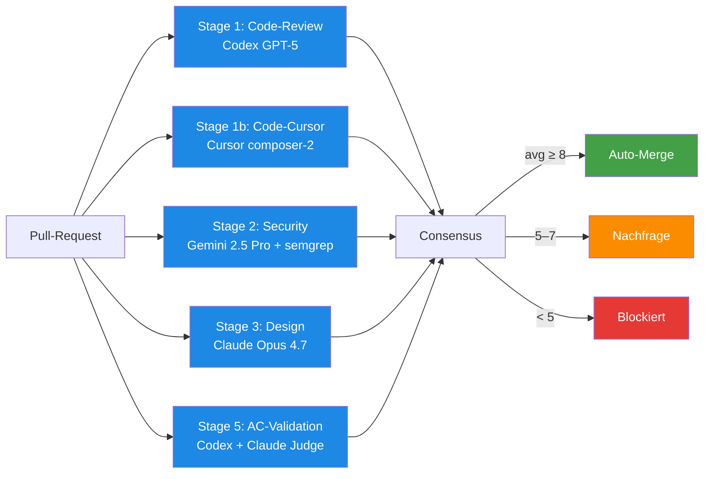

# AI-Review-Pipeline — Die fünf Prüf-Stufen

> **TL;DR:** Jede vorgeschlagene Code-Änderung wird von fünf unabhängigen Instanzen bewertet, bevor sie angenommen wird. Vier davon sind unterschiedliche KI-Modelle, die denselben Code aus vier Blickwinkeln betrachten — Logik, zweite Meinung, Sicherheit, Gestaltung. Die fünfte prüft, ob die Änderung tatsächlich das liefert, was im zugehörigen Ticket versprochen wurde. Die Ergebnisse werden zu einem Gesamturteil verrechnet und entscheiden, ob die Änderung automatisch angenommen, zurückgestellt oder abgelehnt wird.

## Wie es funktioniert



Jede der fünf Stufen ist ein eigenständiger CI-Job, der parallel läuft. Sie teilen sich nur den gemeinsamen Startpunkt (das PR-Event) und das gemeinsame Endziel (Consensus-Aggregation). Eine Stage kennt die Ergebnisse der anderen nicht — jede urteilt isoliert.

Das ist bewusst so: Mehrere KI-Modelle in einer Kaskade würden sich gegenseitig beeinflussen (der zweite sieht die Antwort des ersten und wiederholt sie). Parallel laufen lassen zwingt jedes Modell zu einer unabhängigen Bewertung, die dann erst in der Consensus-Stufe zusammengeführt wird.

Die **Stufennummer** ist historisch — Stufe 1 kam zuerst, dann 1b (Zweit-Modell für dieselbe Frage), dann 2, 3 und zuletzt 5. Es gibt keine Stufe 4 mehr; die war eine frühere Scope-Check-Stufe, die jetzt in die Input-Validierung vor Stufe 1 gewandert ist.

## Technische Details

### Die fünf Stufen im Detail

| Stufe | Modell | Prüft | Output | Tool-Integration |
|---|---|---|---|---|
| **1 Code-Review** | Codex GPT-5 | Funktionale Korrektheit, TypeScript-strict, TDD-Compliance, API-Contract-Konsistenz, Dependency-Injection-Muster | Numbered findings mit Severity + Score 1–10 | `ai-review stage code-review --pr N` |
| **1b Code-Cursor** | Cursor composer-2 | Zweite Meinung auf denselben Code — derselbe Scope wie Codex, aber mit einem anderen Sprach-Modell, um Blindspots zu finden | Score 1–10 + Findings-Liste | `ai-review stage cursor-review --pr N` |
| **2 Security** | Gemini 2.5 Pro + `semgrep` | OWASP-Top-10, Secret-Leaks, SQL-Injection, XSS, unsichere Deserialisierung, SAST-Regeln | Findings + semgrep-JSON + Score | `ai-review stage security --pr N` |
| **3 Design** | Claude Opus 4.7 | UI/UX-Konformität gegen `DESIGN.md`, Accessibility (WCAG 2.1 AA), Design-Token-Usage (keine Hex-Farben), Shadcn/Radix-Import-Regeln | UX-Findings + Design-System-Verletzungen | `ai-review stage design --pr N` |
| **5 AC-Validation** | Codex primary + Claude second-opinion | 1:1-Mapping zwischen Acceptance-Criteria (Given-When-Then aus dem Ticket) und Test-Files im PR | Coverage-Ratio 0.0–1.0 + fehlende AC-Items | `ai-review ac-validate --pr-body-file … --linked-issues-file …` |

### Prompts und Package-Data

Jede Stufe lädt einen spezifischen Prompt aus [`src/ai_review_pipeline/stages/prompts/`](https://github.com/EtroxTaran/ai-review-pipeline/tree/main/src/ai_review_pipeline/stages/prompts):

- `code_review.md` — Codex-Prompt für Stage 1
- `cursor_review.md` — Cursor-Prompt für Stage 1b
- `security_review.md` — Gemini-Prompt für Stage 2
- `design_review.md` — Claude-Prompt für Stage 3

Die Prompts sind **Package-Data** — sie müssen im gebauten Wheel enthalten sein. Ein historischer Bug (PR#8) hatte sie im Source-Tree aber nicht im Wheel, wodurch alle Stages zur Laufzeit mit `FileNotFoundError` crashten. Die Regression wird seit PR#9 in [`tests/test_wheel_packaging.py`](https://github.com/EtroxTaran/ai-review-pipeline/blob/main/tests/test_wheel_packaging.py) abgesichert.

### Modell-Defaults und Override

Die Standard-Modelle sind in [`CLAUDE.md §8 Review-Charter`](https://github.com/EtroxTaran/agent-stack/blob/main/AGENTS.md) verankert:

```
codex: gpt-5.x
cursor: composer-2
gemini: gemini-2.5-pro
claude: claude-opus-4-7
```

Pro Projekt überschreibbar via `.ai-review/config.yaml`:

```yaml
reviewers:
  codex: gpt-5
  cursor: composer-2
  gemini: gemini-2.5-pro
  claude: claude-opus-4-7
```

Details: [`40-setup/20-ai-review-config-schema.md`](../40-setup/20-ai-review-config-schema.md).

### Wann eine Stage skipped wird

- **Design-Review** wird geskippt, wenn keine UI-relevanten Dateien geändert wurden (keine `.tsx`, `.css`, `.svg`). Der Status bleibt `success` mit der Beschreibung `skipped — no design-relevant files changed`.
- **AC-Validation** wird nicht geskippt, aber liefert Score 0, wenn das PR keinen `Closes #N`-Verweis hat. Dann schlägt Consensus an, und ein `ac-waiver` wird nötig.
- **Cursor-Review** kann bei Rate-Limit-Erreichen einen Sentinel-Status posten (`skipped: rate-limit — consensus uses other stages`), damit der Consensus nicht blockiert.

### Status-Contexts

Jede Stage schreibt einen GitHub-Commit-Status:

- v1 Legacy-Pipeline (ai-portal): `ai-review/code`, `ai-review/code-cursor`, `ai-review/security`, `ai-review/design`, `ai-review/ac-validation`
- v2 Shadow-Pipeline: `ai-review-v2/code`, `ai-review-v2/code-cursor`, `ai-review-v2/security`, `ai-review-v2/design`, `ai-review-v2/ac-validation`

Das Präfix wird via CLI-Flag `--status-context-prefix` gesteuert. Details: [`70-reference/20-status-contexts.md`](../70-reference/20-status-contexts.md).

## Verwandte Seiten

- [Consensus-Scoring](10-consensus-scoring.md) — wie die fünf Scores zu einem Gesamturteil werden
- [Shadow-Mode vs. Cutover](20-shadow-vs-cutover.md) — warum zwei parallele Pipelines existieren
- [CLI-Commands](../70-reference/00-cli-commands.md) — alle `ai-review`-Subcommands
- [Neuer PR E2E](../30-workflows/00-neuer-pr-e2e.md) — wie die Stufen im realen Flow zusammenspielen

## Quelle der Wahrheit (SoT)

- [`AGENTS.md §8 Review-Charter`](https://github.com/EtroxTaran/agent-stack/blob/main/AGENTS.md) — global verankerte Stages-Definition
- [`src/ai_review_pipeline/stages/`](https://github.com/EtroxTaran/ai-review-pipeline/tree/main/src/ai_review_pipeline/stages) — die Implementation pro Stage
- [`.ai-review/config.yaml` (ai-portal)](https://github.com/EtroxTaran/ai-portal/blob/main/.ai-review/config.yaml) — Beispiel-Projekt-Config
