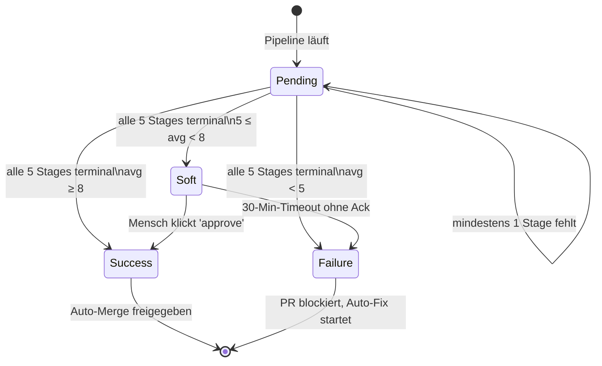

# Consensus-Scoring — Wie aus fünf Bewertungen ein Urteil wird

> **TL;DR:** Jede der fünf Prüf-Stufen liefert eine Punktzahl zwischen 1 und 10 sowie eine Vertrauens-Angabe, wie sicher sich das Modell ist. Diese Einzel-Werte werden gewichtet zusammengerechnet zu einem Gesamt-Score. Liegt der über 8, gilt der Vorschlag als klar angenommen und kann automatisch gemerged werden. Liegt er zwischen 5 und 8, ist das Urteil unklar und ein Mensch muss nachfragen. Unter 5 wird abgelehnt. Fehlt eine Stufe ganz, gilt das als "noch nicht entschieden" (Fail-Closed) — nicht als Freigabe.

## Wie es funktioniert



Die Kernidee ist **confidence-weighted averaging** — eine Bewertung mit Score 9 bei niedrigem Confidence wiegt weniger als eine Bewertung mit Score 8 bei hohem Confidence. Damit kippen halbsichere Einzelmeinungen nicht das Gesamturteil.

Das **Fail-Closed-Prinzip** ist die zweite wichtige Zutat: Wenn eine Stage aus technischen Gründen (Timeout, Rate-Limit ohne Sentinel, Crash) kein Ergebnis liefert, darf das System **nicht** auf "success" schließen, nur weil die anderen vier grün sind. Stattdessen bleibt der Consensus auf `pending`, bis die fehlende Stage nachgeliefert hat oder explizit als geskippt markiert wurde. Das verhindert, dass ein kaputter Reviewer die Qualitätsprüfung umgeht.

## Technische Details

### Score-Skala

| Score | Bedeutung | Typische Findings-Beispiele |
|---|---|---|
| **10** | Perfekt, keine Anmerkungen | Rein kosmetische Änderungen, Tippfehler |
| **8–9** | Gut, kleine nice-to-haves | Ein überflüssiger Import, leicht verbesserbare Variablennamen |
| **6–7** | Akzeptabel mit Vorbehalten | Fehlende Edge-Case-Tests, kleinere Design-Inkonsistenzen |
| **4–5** | Problematisch | Race-Conditions, unsichere Input-Validierung, fehlende AC-Coverage |
| **1–3** | Ernsthaft fehlerhaft | Injection-Angriffsflächen, Datenverlust-Potential, Breaking-Change ohne Test |

### Confidence-Skala

`confidence: float` im Bereich 0.0–1.0. Ein Wert von 1.0 heißt "das Modell ist sich sehr sicher", 0.5 heißt "es fehlen wichtige Infos zur Bewertung". Typisch liefern Modelle 0.85–0.95; Werte unter 0.5 werden im `nachfrage.py`-Modul extra hervorgehoben.

### Aggregations-Formel

Implementiert in [`src/ai_review_pipeline/scoring.py`](https://github.com/EtroxTaran/ai-review-pipeline/blob/main/src/ai_review_pipeline/scoring.py):

```
weighted_sum = sum(score_i * confidence_i for i in stages)
total_weight = sum(confidence_i for i in stages)
avg = weighted_sum / total_weight
```

Wenn `total_weight == 0` (alle Stages mit `confidence: 0`) → `avg = 0` → Failure.

### Schwellen-Werte

Default-Werte aus [`schema/config.schema.yaml`](https://github.com/EtroxTaran/ai-review-pipeline/blob/main/schema/config.schema.yaml):

```yaml
consensus:
  success_threshold: 8    # avg >= 8
  soft_threshold: 5       # 5 <= avg < 8
  fail_closed_on_missing_stage: true
```

Projekt-Overrides in `.ai-review/config.yaml`. Erhöhen des `success_threshold` auf 9 würde die Pipeline konservativer machen; 7 würde mehr Merges durchwinken (nicht empfohlen).

### Die vier terminalen States

Wie sie im GitHub-Commit-Status erscheinen:

| State | GitHub-Status | Consensus-Description |
|---|---|---|
| `success` | ✅ grün | `"5/5 AI reviewers green, avg 9.2"` |
| `pending` | 🟡 gelb | `"Waiting for stages to complete"` oder `"Missing: code-cursor"` |
| `soft` | 🟠 orange (als `pending` geschrieben) | `"3/5 green, 2 soft — requires human ack"` |
| `failure` | ❌ rot | `"2/5 green — security flagged critical finding"` |

`soft` ist kein eigener GitHub-State — es wird als `pending` mit entsprechender Beschreibung geschrieben, um den Nachfrage-Flow zu triggern. Details: [`40-nachfrage-soft-consensus.md`](40-nachfrage-soft-consensus.md).

### Fail-Closed in der Praxis

Ein historischer Fall: PR#43 hatte alle fünf Stages `success` terminiert, aber `ai-review/consensus` blieb auf `pending`. Grund: Der Consensus-Job war gelaufen, bevor die Stages ihre Status-Commits geschrieben hatten — er sah "noch nichts" und setzte `pending`. Nach dem späteren Terminieren der Stages flippte der Status nicht automatisch zurück auf `success`, weil keine erneute Consensus-Aggregation triggerte.

Der Fix ist ein `gh run rerun` auf den Consensus-Job. Das Runbook dafür: [`50-runbooks/40-consensus-stuck-pending.md`](../50-runbooks/40-consensus-stuck-pending.md).

### Abgrenzung zu v1-Legacy

Die v1-Pipeline in ai-portal rechnet `2/2 AI reviewers green` — nur zwei Reviewer (Codex + Cursor) statt fünf, kein `semgrep`, keine Design- oder AC-Stage. Das ist historisch bedingt und wird im Cutover (Phase 5) auf das volle 5-Stage-Modell gehoben. Siehe [`20-shadow-vs-cutover.md`](20-shadow-vs-cutover.md).

## Verwandte Seiten

- [AI-Review-Pipeline](00-ai-review-pipeline.md) — die fünf Stufen, die bewertet werden
- [Soft-Consensus & Nachfrage](40-nachfrage-soft-consensus.md) — was bei Score 5–7 passiert
- [Waiver-System](30-waiver-system.md) — wie man eine Stage trotzdem durchwinkt (mit Grund)
- [`consensus-stuck-pending` Runbook](../50-runbooks/40-consensus-stuck-pending.md) — wenn der Status hängt

## Quelle der Wahrheit (SoT)

- [`src/ai_review_pipeline/scoring.py`](https://github.com/EtroxTaran/ai-review-pipeline/blob/main/src/ai_review_pipeline/scoring.py) — Aggregations-Logik
- [`src/ai_review_pipeline/consensus.py`](https://github.com/EtroxTaran/ai-review-pipeline/blob/main/src/ai_review_pipeline/consensus.py) — Consensus-Job-Orchestrierung
- [`schema/config.schema.yaml`](https://github.com/EtroxTaran/ai-review-pipeline/blob/main/schema/config.schema.yaml) — Schwellen-Werte im Schema
