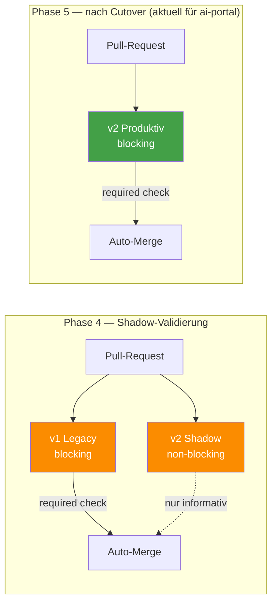

# Shadow-Mode vs. Cutover — Warum zwei Pipelines parallel laufen

> **TL;DR:** Für ai-portal ist dieser Modus seit dem Cutover am **2026-04-24 Geschichte** — nur noch die produktive Pipeline (Phase 5, blocking) läuft. Während der Validierungsphase (20.–24. April 2026) liefen zwei unabhängige Review-Pipelines parallel: die alte (v1, direkt im Repo entwickelt, blockierend) und die neue (v2, extrahiertes Package, bewusst nicht-blockierend). Der Shadow-Modus erlaubt es, eine neue Pipeline unter Real-Bedingungen zu validieren, ohne Entwicklungsarbeit zu riskieren. Für künftige Projekte bleibt der hier dokumentierte Ablauf die empfohlene Rollout-Strategie.

## Wie es funktioniert



Ein Shadow-Modus ist ein klassisches Deployment-Pattern für risiko-behaftete Systemwechsel: Das neue System bekommt echte Produktionslast, aber seine Entscheidungen haben noch keine Konsequenzen. Man beobachtet, ob es dieselben Urteile fällt wie das alte System. Bei Abweichungen untersucht man, welches System "richtig" lag. Erst wenn die neue Pipeline über mehrere Wochen konsistent korrekt urteilt, dreht man den Schalter um.

Der Vorteil gegenüber einem harten Wechsel: Wenn v2 einen Fehler hat (z.B. Score-Aggregation kippt bei ungewöhnlicher Input-Kombination), merkt man es beim Shadow-Lauf, ohne dass ein PR fälschlich blockiert oder durchgewunken wird.

## Technische Details

### Unterschiede im Detail

| Aspekt | v1 Legacy | v2 Shadow |
|---|---|---|
| **Wo liegt die Logik?** | Direkt als YAML-Workflows im ai-portal-Repo | Als Python-Package `ai-review-pipeline`, via `pip install git+…` auf dem Runner installiert |
| **Status-Context** | `ai-review/consensus` | `ai-review-v2/consensus` |
| **Branch-Protection** | Required Check (blockiert Merge) | Nicht in Required Checks |
| **Stages** | 2/2 AI reviewers (Codex + Cursor), kein semgrep, keine Design-Stage, keine AC-Stage | 5/5 Stages (Code, Code-Cursor, Security, Design, AC-Validation) |
| **Discord-Channel** | `DISCORD_CHANNEL_AI_PORTAL` (regulär) | `DISCORD_CHANNEL_AI_PORTAL_SHADOW` (separat, kein @here) |
| **Config-Ort** | Hart verdrahtet in den Workflow-YAMLs | `.ai-review/config.yaml` mit Schema-Validation |
| **Modell-Overrides** | Nur über YAML-env | Pro Projekt im Config-File, mit Schema-Check |
| **Fail-Closed-Verhalten** | Einfach `continue-on-error: false` | Explizit `fail_closed_on_missing_stage: true` in config |

### Shadow-Flags in der CLI

Die `ai-review`-CLI unterstützt Shadow-spezifische Flags, die den Context-Namen und die Discord-Destination übersteuern:

```bash
ai-review stage code-review \
  --pr 42 \
  --status-context-prefix ai-review-v2 \
  --discord-channel "$DISCORD_CHANNEL_AI_PORTAL_SHADOW" \
  --no-ping
```

Ohne diese Flags würde v2 denselben Status-Context wie v1 beschreiben und die reguläre Channel-Message überschreiben. Details: [`70-reference/00-cli-commands.md`](../70-reference/00-cli-commands.md).

### Cutover-Checkliste (Phase 4 → 5)

Der Wechsel ist eine Sequenz aus fünf Änderungen, die in dieser Reihenfolge erfolgen müssen:

1. **Beobachtungs-Bericht erstellen:** Über mindestens 2 Wochen die `ai-review-v2/consensus`-Outputs mit den `ai-review/consensus`-Outputs vergleichen. Divergenzen dokumentieren und jeweils bewerten: lag v1 richtig oder v2?
2. **Alle `blocking: false` → `blocking: true`** in `.ai-review/config.yaml`. Das macht die v2-Stages bindend für den Consensus.
3. **`channel_id` swappen:** `DISCORD_CHANNEL_AI_PORTAL_SHADOW` → `DISCORD_CHANNEL_AI_PORTAL`, `mention_role` setzen.
4. **Branch-Protection umstellen:** `ai-review/consensus` aus Required Checks entfernen, `ai-review-v2/consensus` hinzufügen. Das ist der riskanteste Schritt — einmal gemacht, blockiert nur noch v2.
5. **v1 abschalten:** Die YAML-Workflows in `ai-portal/.github/workflows/ai-code-review.yml`, `ai-security-review.yml`, `ai-review-consensus.yml` etc. löschen oder auf `if: false` setzen.

Schritt-für-Schritt-Anleitung: [`30-workflows/40-shadow-zu-produktion-cutover.md`](../30-workflows/40-shadow-zu-produktion-cutover.md).

### Rollback-Pfad

Wenn nach Schritt 4 herauskommt, dass v2 nicht zuverlässig ist: Branch-Protection zurücksetzen (v1 wieder required), `blocking: false` wieder aktivieren, v1 nicht deaktivieren (Schritt 5 nicht machen). Der Rollback ist unter 10 Minuten durchführbar, solange v1 noch installiert ist.

### Aktueller Status (Stand dieses Dokuments)

- **Phase 5 Cutover durchgeführt** am 2026-04-24 (ai-portal PR#44)
- v2 ist **die einzige Pipeline** im ai-portal; v1 Legacy-Workflows gelöscht
- Shadow-Phase 4 war von 2026-04-20 (Hook-Merge) bis 2026-04-24 aktiv
- Shadow-Run #24853468198 lieferte den grünen E2E-Nachweis vor dem Cutover

## Verwandte Seiten

- [AI-Review-Pipeline](00-ai-review-pipeline.md) — was die Stages prüfen
- [Consensus-Scoring](10-consensus-scoring.md) — wie Urteile gefällt werden
- [ai-portal Integration](../20-komponenten/20-ai-portal-integration.md) — wo die v1 und v2 Workflows im Repo liegen
- [Shadow-zu-Produktion Cutover](../30-workflows/40-shadow-zu-produktion-cutover.md) — der Migrations-Workflow

## Quelle der Wahrheit (SoT)

- [`ai-portal/.github/workflows/ai-review.yml`](https://github.com/EtroxTaran/ai-portal/blob/main/.github/workflows/ai-review.yml) — der Production-Workflow (seit Cutover 2026-04-24)
- [`ai-portal/.ai-review/config.yaml`](https://github.com/EtroxTaran/ai-portal/blob/main/.ai-review/config.yaml) — Production-Config
- [ADR-018 CI/CD Deploy Pipeline](https://github.com/EtroxTaran/ai-portal/blob/main/docs/v2/10-adr/ADR-018-cicd-deploy-pipeline.md) — Architektur-Entscheidung
