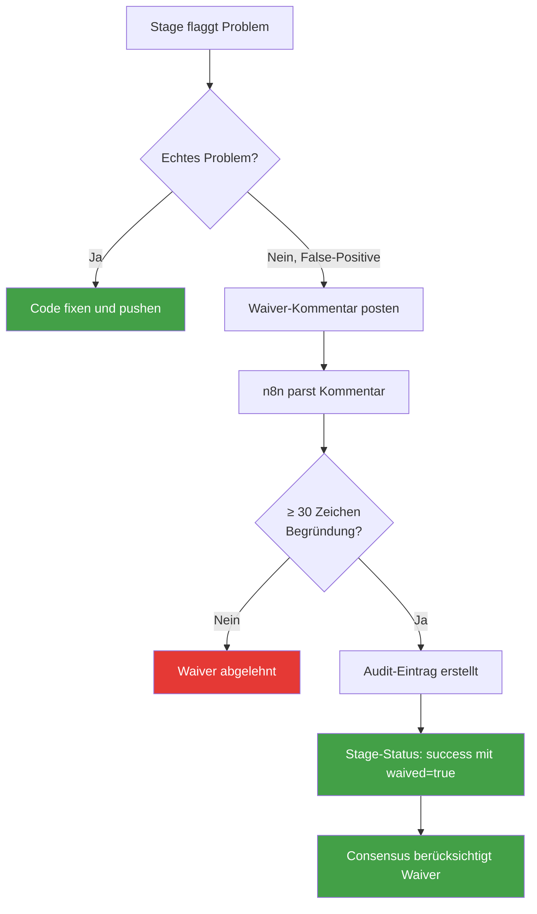
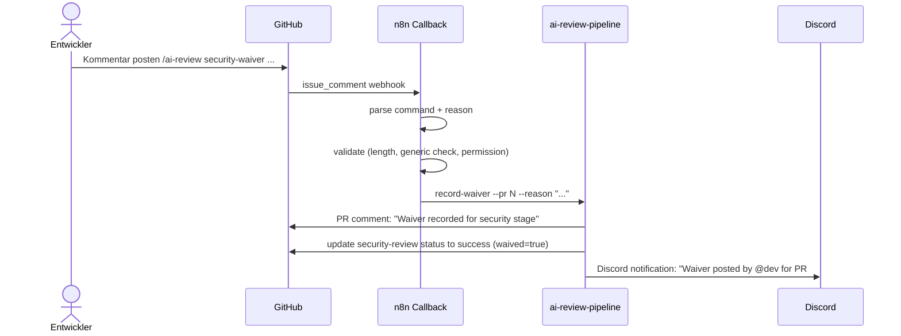

# Waiver-System — Wenn man eine Prüfung trotzdem durchwinken muss

> **TL;DR:** Manchmal flaggt die Pipeline etwas als Problem, das in Wirklichkeit keins ist — ein False-Positive beim Security-Scan, eine Acceptance-Coverage-Lücke bei einem reinen Dokumentations-PR. Für solche Fälle gibt es Waiver: Der Entwickler postet einen speziellen Kommando-Kommentar auf den Pull-Request mit einer Mindest-30-Zeichen-Begründung, warum die Prüfung in diesem konkreten Fall nicht greift. Die Begründung wird geloggt und ist später nachvollziehbar. Kein Label, kein stilles Ignorieren — jede Ausnahme hinterlässt eine Audit-Spur.

## Wie es funktioniert



Die Idee hinter Waivers ist **explizite Ausnahme statt stille Umgehung**. Ohne Waiver gäbe es zwei Alternativen, beide schlecht: Entweder der Entwickler müsste fake-Code schreiben, um den Linter zu beruhigen, oder die Pipeline müsste abgeschaltet werden, bis die neue Version den Fall versteht. Mit Waiver sagt der Entwickler: "Ja, ich weiß, das sieht nach X aus, aber hier der Grund, warum es kein Problem ist."

Die **Begründung** ist der wichtige Teil. "False positive" als Begründung wird abgelehnt — das lernt niemand draus, und in drei Monaten versteht niemand mehr, warum dieser Waiver existierte. Erzwungene 30-Zeichen-Minimum-Länge zwingt zu tatsächlicher Prosa.

Der **Audit-Trail** macht Waivers nicht-label-basiert: Man kann nicht einfach ein `waived`-Label auf einen PR kleben. Nur ein strukturierter Kommando-Kommentar im PR-Body erzeugt einen Waiver-Eintrag, und der Eintrag enthält immer Reason, Autor, Zeitstempel und PR-Nummer.

## Technische Details

### Die zwei Waiver-Arten

**Security-Waiver** — wird für Stage-2-Findings genutzt:

```
/ai-review security-waiver

Semgrep flaggt die Verwendung von `eval()` in dem neuen Template-Engine. Das
ist bewusst, weil die Template-Strings ausschließlich aus einem readonly
Helm-Chart kommen und nie von User-Input getrieben sind. Siehe ADR-042
für die Sandbox-Analyse.
```

**AC-Waiver** — wird genutzt, wenn Stage 5 fehlende Acceptance-Criteria meldet:

```
/ai-review ac-waiver

Dies ist ein reiner Docs-PR (CHANGELOG.md Update + README Typos). Es gibt
kein zugehöriges Feature-Ticket mit Gherkin-AC, daher kann die Pipeline
keine 1:1-Coverage prüfen. Review per Augenschein hat ergeben: keine
Verhaltensänderungen, nur Text.
```

### Die Parser-Regeln

Implementiert in [`src/ai_review_pipeline/nachfrage.py`](https://github.com/EtroxTaran/ai-review-pipeline/blob/main/src/ai_review_pipeline/nachfrage.py) und in [`skills/security-waiver/SKILL.md`](https://github.com/EtroxTaran/agent-stack/blob/main/skills/security-waiver/SKILL.md):

1. **Kommando-Prefix:** Muss exakt `/ai-review security-waiver` oder `/ai-review ac-waiver` sein. Kein `/ai-review waiver`, kein `/ai-review approve-security`.
2. **Begründung:** Muss ≥ 30 nicht-whitespace-Zeichen sein. Reason wird nach dem Kommando erwartet, auf derselben oder der nächsten Zeile.
3. **Anti-Generic-Check:** Die Begründung darf nicht die Phrasen "false positive", "not relevant", "skip this" oder "waive this" enthalten, außer sie sind in einem längeren kontextualisierten Satz eingebettet.
4. **Autor:** Muss ein Repository-Maintainer oder -Collaborator sein (GitHub-Permission-Check).
5. **Wiederholung:** Ein zweiter Waiver für dasselbe Finding auf demselben PR wird ignoriert — der erste zählt.

### Was passiert beim Waiver-Post



### Der Audit-Eintrag

Jeder erfolgreiche Waiver wird in [`metrics.jsonl`](https://github.com/EtroxTaran/ai-review-pipeline/blob/main/src/ai_review_pipeline/metrics.py) protokolliert:

```json
{
  "type": "waiver",
  "kind": "security",
  "pr": 142,
  "repo": "EtroxTaran/ai-portal",
  "reason": "Semgrep flaggt die Verwendung von eval() im neuen Template-Engine...",
  "author": "NicoR",
  "timestamp": "2026-04-23T14:37:12Z",
  "finding_id": "sec-template-engine-eval"
}
```

Der Audit-Trail ist damit query-bar:

```bash
ai-review metrics --since 2026-04-01 --filter type=waiver
```

### Waiver-Skills in agent-stack

Es gibt zwei Skills, die den Waiver-Prozess für Agents orchestrieren:

- [`skills/security-waiver/SKILL.md`](https://github.com/EtroxTaran/agent-stack/blob/main/skills/security-waiver/SKILL.md) — Agent erstellt einen Security-Waiver, prüft die Begründung auf Qualität
- [`skills/ac-waiver/SKILL.md`](https://github.com/EtroxTaran/agent-stack/blob/main/skills/ac-waiver/SKILL.md) — Agent erstellt einen AC-Waiver, schlägt die Begründung vor

Details: [`20-komponenten/70-skills-mcp.md`](../20-komponenten/70-skills-mcp.md).

### Wann kein Waiver erlaubt ist

- **Pipeline-Infrastruktur-PRs:** Ausnahme via `allowed_labels: ["pipeline-bootstrap"]` in der Config, damit die initiale Pipeline-Installation sich nicht selbst blockiert. Nur für die ersten 1–2 PRs eines neuen Repos.
- **Schema-Migration:** Waiver auf Datenbank-Migrations-PRs ist verboten — dort muss ein Mensch explizit approven.
- **Key-Rotation:** Token-Wechsel ohne Review wäre ein Sicherheits-Desaster. Keine Waivers auf `.env*`-Änderungen.

## Verwandte Seiten

- [AI-Review-Pipeline](00-ai-review-pipeline.md) — die fünf Stages, die bewertet werden
- [Soft-Consensus & Nachfrage](40-nachfrage-soft-consensus.md) — wenn das Gesamt-Urteil unklar ist
- [Skills & MCP-Server](../20-komponenten/70-skills-mcp.md) — Agent-Skills für Waiver-Composition

## Quelle der Wahrheit (SoT)

- [`AGENTS.md §8 Review-Charter`](https://github.com/EtroxTaran/agent-stack/blob/main/AGENTS.md) — Waiver-Audit-Regel
- [`src/ai_review_pipeline/nachfrage.py`](https://github.com/EtroxTaran/ai-review-pipeline/blob/main/src/ai_review_pipeline/nachfrage.py) — Parser + Validator
- [`skills/security-waiver/SKILL.md`](https://github.com/EtroxTaran/agent-stack/blob/main/skills/security-waiver/SKILL.md) — Skill-Definition
