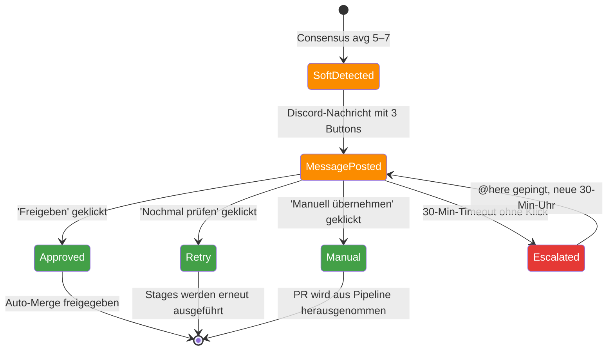

# Soft-Consensus & Nachfrage — Wenn das Urteil zwischen Ja und Nein liegt

> **TL;DR:** Wenn die fünf Review-Stufen einen Durchschnittswert zwischen 5 und 8 ergeben, ist das Ergebnis nicht klar genug für automatische Freigabe, aber auch nicht schlecht genug für Ablehnung. Die Pipeline stellt dann eine Rückfrage in den Discord-Channel, mit einer Zusammenfassung der Einzel-Findings und drei Buttons: Freigeben, Nochmal prüfen, Manuell übernehmen. Klickt innerhalb von 30 Minuten niemand, wird automatisch eskaliert — ein expliziter Alert mit @here-Mention geht raus, damit die Verantwortung sichtbar wird. Es gibt also keinen Zustand, in dem ein PR unbemerkt im Graubereich hängen bleibt.

## Wie es funktioniert



Das Problem, das Soft-Consensus löst: KI-Modelle sind manchmal uneinig. Codex sagt "Score 9, sauber", Gemini sagt "Score 6, da ist ein halbgarer Edge-Case, aber vielleicht unkritisch". Der Durchschnitt liegt bei 7.5 — nicht gut genug für Auto-Merge, nicht schlecht genug für Abweisung. Ohne Soft-Consensus müsste das System willkürlich entscheiden, oder alle solche PRs blocken (frustrierend) oder durchwinken (gefährlich).

Der **Mensch als Schiedsrichter** bekommt eine knappe, handlungsfähige Nachricht: die Einzel-Scores, die Haupt-Findings pro Stage, und drei klare Optionen. Keine seitenlange Diskussion, keine Copy-Paste aus dem PR — nur das, was zum Urteil nötig ist.

Die **30-Min-Timeout-Eskalation** ist das zweite Sicherheitsnetz: Ein PR darf nicht still und unbemerkt liegen bleiben. Nach einer halben Stunde ohne Klick wird ein Alert mit Mention gepostet. Das macht den Status sichtbar und zwingt zur Entscheidung — entweder man klickt, oder man muss explizit erklären, warum man nicht klickt.

## Technische Details

### Das Discord-Message-Format

Die Nachricht wird via n8n-Dispatcher-Workflow gepostet, mit Components-V1 Action-Row und drei Buttons. Das Komponenten-Format nutzt `flags: 32768` nicht (das führte früher zu `MESSAGE_CANNOT_USE_LEGACY_FIELDS_WITH_COMPONENTS_V2`-Fehlern).

```
PR #142 — Soft-Consensus: 2/5 green, avg 7.2

Scores:
  code:       8 (confidence 0.95)
  code-cursor: 9 (confidence 0.91)
  security:   6 (confidence 0.88) — Gemini flagged: "potential race condition in queue_push()"
  design:     7 (confidence 0.90)
  ac-validate: 6 (confidence 0.82) — AC-Coverage 2/3 (missing: "when queue is full, then emit backpressure")

Was sollen wir tun?

[✅ Freigeben]  [🔄 Nochmal prüfen]  [👤 Manuell übernehmen]
```

### Die drei Button-Actions

Jeder Button löst eine spezifische Aktion aus. Die Mechanik steht in [`30-workflows/10-button-click-callback.md`](../30-workflows/10-button-click-callback.md); hier die inhaltlichen Konsequenzen:

**✅ Freigeben** (`custom_id: approve:142`):
- Consensus-Status wird auf `success` gesetzt mit Beschreibung `"human override by @Nico (soft-consensus approval)"`
- Auto-Merge darf greifen, falls alle anderen Required-Checks grün sind
- Audit-Eintrag: `{"type": "soft-approval", "pr": 142, "author": "Nico", "avg_score": 7.2}`

**🔄 Nochmal prüfen** (`custom_id: fix:142`):
- Alle fünf Stages werden neu getriggert (`ai-review stage code-review --pr 142` etc.)
- Nützlich wenn der Entwickler inzwischen einen Fix gepusht hat, oder ein Modell temporär unzuverlässig war
- Kein Audit-Eintrag — erneute Stage-Läufe sind regulärer Betrieb

**👤 Manuell übernehmen** (`custom_id: manual:142`):
- Die Pipeline gibt den PR frei und schaltet sich aus
- Status-Context wird auf `success` mit Beschreibung `"removed from automated pipeline"` gesetzt
- Ein Reviewer-Mensch muss den PR nun per GitHub-Review klassisch approven
- Audit-Eintrag: `{"type": "manual-takeover", "pr": 142, "author": "Nico"}`

### Die 30-Min-Uhr und Eskalation

Ein n8n-Cron-Workflow ([`ai-review-escalation`](https://github.com/EtroxTaran/agent-stack/blob/main/ops/n8n/workflows/ai-review-escalation.json)) läuft alle 5 Minuten und macht:

1. GitHub-API: Alle offenen PRs mit `ai-review/consensus = pending, description like 'soft'` finden
2. Für jeden: Alter der ursprünglichen Soft-Message vergleichen mit `now() - 30min`
3. Falls älter und kein Button-Klick-Event seither → Alert-Message in den Alerts-Channel, mit `@here`-Mention
4. Alert-Message trackt ebenfalls ein Timeout: weitere 30 Min ohne Klick → lautes Eskalations-Follow-up

Details: [`30-workflows/20-escalation-30-min.md`](../30-workflows/20-escalation-30-min.md).

### Ein- und Abschalten

In der Projekt-Config:

```yaml
# .ai-review/config.yaml
notifications:
  target: discord
  discord:
    channel_id: "1495821842093576363"
    mention_role: "@here"          # Leerer String = kein @here
    sticky_message: true            # Nachfrage updated dieselbe Message statt neuer
    soft_consensus_timeout_min: 30  # 0 = keine Eskalation
```

Für Shadow-Phase steht `mention_role: ""` und die Nachricht landet im Shadow-Channel — so lernt die Pipeline ohne zu nerven.

### Sticky-Messages

Statt bei jedem neuen Status (stage läuft durch, score ändert sich bei retry, etc.) eine neue Message zu posten, aktualisiert die Pipeline eine **bestehende** Message per `PATCH /channels/{id}/messages/{id}`. Das macht den Channel übersichtlicher — pro PR gibt es nur einen Thread, nicht zehn Updates.

Die `message_id` wird im n8n-Workflow-Context gespeichert und beim Retry/Update wiederverwendet. Implementiert in [`src/ai_review_pipeline/discord_notify.py`](https://github.com/EtroxTaran/ai-review-pipeline/blob/main/src/ai_review_pipeline/discord_notify.py).

### Nachfrage-Handler-Skill

Der [`nachfrage-respond`](https://github.com/EtroxTaran/agent-stack/blob/main/skills/nachfrage-respond/SKILL.md)-Skill ist für Agents gedacht, die auf Soft-Consensus-Nachfragen reagieren sollen. Der Skill wird getriggert von Kommentaren wie `/ai-review approve`, `/ai-review retry`, `/ai-review security-waiver`, `/ai-review ac-waiver` und übersetzt sie in die richtigen Pipeline-Calls.

## Verwandte Seiten

- [Consensus-Scoring](10-consensus-scoring.md) — wie Scores zu Urteilen werden
- [Waiver-System](30-waiver-system.md) — wenn ein Finding explizit ignoriert werden soll
- [Button-Click-Callback](../30-workflows/10-button-click-callback.md) — was technisch beim Klick passiert
- [Eskalation nach 30 Min](../30-workflows/20-escalation-30-min.md) — der Timeout-Flow
- [Channel-Mapping](../70-reference/30-channel-mapping.md) — welcher Channel für was

## Quelle der Wahrheit (SoT)

- [`src/ai_review_pipeline/nachfrage.py`](https://github.com/EtroxTaran/ai-review-pipeline/blob/main/src/ai_review_pipeline/nachfrage.py) — Soft-Consensus-Handler-Modul
- [`ops/n8n/workflows/ai-review-escalation.json`](https://github.com/EtroxTaran/agent-stack/blob/main/ops/n8n/workflows/ai-review-escalation.json) — Cron-basierter Eskalations-Workflow
- [`skills/nachfrage-respond/SKILL.md`](https://github.com/EtroxTaran/agent-stack/blob/main/skills/nachfrage-respond/SKILL.md) — Agent-Skill für Command-Responses
