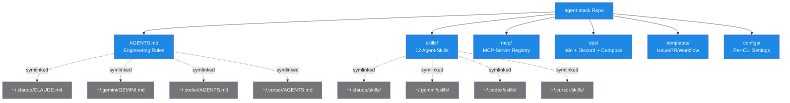

# agent-stack — Das Infrastruktur-Repo

> **TL;DR:** Dieses Repo ist die zentrale Quelle der Wahrheit für alle vier Kommandozeilen-Werkzeuge (Claude, Cursor, Gemini, Codex) und die gesamte Operations-Infrastruktur rund um die AI-Review-Toolchain. Es enthält keine Produktcode, sondern die Regeln, nach denen Produktcode entstehen soll, plus die Workflows, Skripte und Konfigurationen, die die Automatisierung am Laufen halten. Wenn man in einem neuen Projekt die AI-Review-Pipeline aktivieren will, bekommt man die Templates und Skills aus diesem Repo. Wenn sich die Engineering-Regeln ändern, passiert das hier — und wird automatisch in alle vier CLIs synchronisiert.

## Wie es funktioniert



Das Repo folgt dem **Single-Source-of-Truth-Prinzip**: Ein `AGENTS.md`-File liegt einmal hier, und wird per Symlink von allen vier CLIs gelesen. Das verhindert Drift — wenn die TDD-Regel sich ändert, steht das automatisch in Claudes, Cursors, Codex' und Geminis Kontext. Niemand muss vier Dateien manuell synchron halten.

Genauso mit den **Skills** (spezialisierte Agent-Prompts für wiederkehrende Aufgaben wie Code-Review oder PR-Opening) und den **MCP-Servern** (externe Tools, die Agents nutzen können). Alle werden deklarativ in diesem Repo definiert und dann pro CLI in deren jeweilige Konfiguration ausgerollt.

Die **Ops-Infrastruktur** ist die praktische Seite: Docker-Compose-Override für n8n, n8n-Workflow-JSONs, Test-Scripts, Restart-Helfer. All das, was auf r2d2 läuft, wird hier versioniert.

## Technische Details

### Verzeichnisstruktur

```
agent-stack/
├── AGENTS.md                           Global Engineering Rules (SoT)
├── README.md                           Quickstart + Phase-Übersicht
├── install.sh                          Bootstrap-Entrypoint
├── install.conf.yaml                   dotbot Manifest (Symlinks)
├── .env.example                        Token-Template
│
├── configs/                            Per-CLI Config-Templates
│   ├── claude/settings.json + hooks/
│   ├── cursor/cli-config.json + rules/
│   ├── gemini/settings.json
│   └── codex/config.toml
│
├── skills/                             12 Agent-Skills
│   ├── _meta/
│   ├── code-review-expert/SKILL.md
│   ├── design-review/SKILL.md
│   ├── ac-validate/SKILL.md
│   ├── ac-waiver/SKILL.md
│   ├── security-waiver/SKILL.md
│   ├── nachfrage-respond/SKILL.md
│   ├── issue-pickup/SKILL.md
│   ├── pr-open/SKILL.md
│   ├── review-gate/SKILL.md
│   ├── tdd-guard/SKILL.md
│   ├── release-checklist/SKILL.md
│   └── [skill]/evals/evals.json
│
├── mcp/                                MCP-Server-Registry
│   ├── servers.yaml                    deklarative Config (12 Server)
│   └── register.sh                     Multi-CLI Registrar
│
├── templates/                          Projekt-Templates
│   ├── .ai-review/config.yaml
│   ├── ISSUE_TEMPLATE/
│   └── PULL_REQUEST_TEMPLATE.md
│
├── ops/                                Operations
│   ├── README.md
│   ├── compose/
│   │   └── n8n-ai-review.override.yml  Docker-Compose Override
│   ├── n8n/
│   │   ├── workflows/                  3 n8n JSONs (dispatcher, callback, escalation)
│   │   ├── tests/                      Unit + Live-Probe + E2E-Validate
│   │   └── README.md
│   ├── discord-bot/
│   └── scripts/
│       └── restart-n8n-with-ai-review.sh
│
├── scripts/                            Bootstrap-Utilities
│   ├── preflight.sh
│   ├── backup-existing.sh
│   ├── verify.sh
│   ├── uninstall.sh
│   └── ai-init-project.sh
│
├── docs/                               Runbooks + Wiki (du bist hier)
│   ├── wiki/                           Dieses Wiki
│   ├── TROUBLESHOOTING.md
│   └── MCP-SETUP.md
│
└── tests/                              Bash-Validation-Tests
    ├── validate-mcp-servers.sh
    ├── validate-skills.sh
    └── validate-manifest.sh
```

### Das dotbot-Pattern

Die Installation (`install.sh`) nutzt [dotbot](https://github.com/anishathalye/dotbot) als Symlink-Engine. Der Manifest-File ist `install.conf.yaml`:

```yaml
- defaults:
    link:
      force: false       # nie überschreiben ohne Backup
      create: true       # Parent-Dirs anlegen

- link:
    ~/.claude/CLAUDE.md: AGENTS.md
    ~/.claude/skills: skills/
    ~/.gemini/GEMINI.md: AGENTS.md
    ~/.gemini/skills: skills/
    # … analog für codex, cursor
```

Vor dem ersten Run läuft `backup-existing.sh` und verschiebt echte Config-Dateien in `~/backups/agent-stack/`. Dann werden Symlinks gelegt. Beim `uninstall.sh` wird aus dem Backup restauriert.

### MCP-Server-Registrierung

`mcp/servers.yaml` deklariert die 12 verfügbaren MCP-Server:

```yaml
servers:
  github:
    transport: stdio
    command: npx
    args: ["-y", "@modelcontextprotocol/server-github"]
    env:
      GITHUB_PERSONAL_ACCESS_TOKEN: "${GITHUB_TOKEN}"
  context7:
    transport: stdio
    # …
  # … 10 weitere
```

`mcp/register.sh` liest diese YAML und schreibt pro CLI die passende Struktur:

- Claude + Cursor: JSON in `~/.claude/settings.json` bzw. `~/.cursor/cli-config.json`
- Codex: TOML in `~/.codex/config.toml`
- Gemini: JSON in `~/.gemini/settings.json`

Der Registrar ist **idempotent** — er entfernt alte Einträge vor dem Re-Registrieren, damit mehrfache Runs nicht duplizieren.

### Die 12 Skills

Jede Skill liegt unter `skills/<name>/SKILL.md` und folgt dem [agentskills.io](https://agentskills.io/specification)-Standard (YAML-Frontmatter + Markdown-Prompt). Beispielhaft die Skill-Namen:

- **review-Pipeline-zentriert:** `code-review-expert`, `design-review`, `ac-validate`, `ac-waiver`, `security-waiver`, `nachfrage-respond`, `review-gate`
- **Ticket-Workflow:** `issue-pickup`, `pr-open`
- **Qualität:** `tdd-guard`, `release-checklist`

Details pro Skill: [`20-komponenten/70-skills-mcp.md`](70-skills-mcp.md).

### Workflow-Templates für neue Projekte

Unter `templates/.ai-review/config.yaml` liegt die Template-Config, die ein neues Projekt per `scripts/ai-init-project.sh` bekommt:

```yaml
version: "1.0"
# Keine reviewers: Block — Modelle kommen aus Registry (MODEL_REGISTRY.env).
# Override nur wenn absichtlich abweichend:
# reviewers:
#   codex: gpt-5.5
#   gemini: gemini-3.1-pro-preview
stages:
  code_review:
    enabled: true
    blocking: true
  # … 4 weitere
consensus:
  success_threshold: 8
  soft_threshold: 5
  fail_closed_on_missing_stage: true
```

Details: [`40-setup/00-quickstart-neues-projekt.md`](../40-setup/00-quickstart-neues-projekt.md).

### Ops-Ordner

Der `ops/`-Ordner ist die Laufzeit-Infrastruktur:

- **`ops/compose/n8n-ai-review.override.yml`** — Docker-Compose-Override, das zusätzliche Volumes + Env-Files in den n8n-Container mounted
- **`ops/n8n/workflows/*.json`** — Die drei n8n-Workflows als SoT (dispatcher, callback, escalation). Details: [`30-n8n-workflows.md`](30-n8n-workflows.md)
- **`ops/n8n/tests/`** — Die Test-Artefakte für die Callback-Logik + E2E-Validation
- **`ops/scripts/restart-n8n-with-ai-review.sh`** — Recreate des Containers mit korrekten Env-Files

## Verwandte Seiten

- [ai-review-pipeline Repo](10-ai-review-pipeline-repo.md) — die Python-Pipeline selbst
- [Skills & MCP-Server](70-skills-mcp.md) — die 12 Skills und 12 MCP-Server detailliert
- [Secrets & Env](80-secrets-env.md) — wo die Credentials leben
- [agent-stack installieren](../40-setup/10-agent-stack-install.md) — Bootstrap-Anleitung

## Quelle der Wahrheit (SoT)

- [agent-stack Repository](https://github.com/EtroxTaran/agent-stack) — dieses Repo
- [`AGENTS.md`](https://github.com/EtroxTaran/agent-stack/blob/main/AGENTS.md) — global verankerte Regeln
- [`install.sh`](https://github.com/EtroxTaran/agent-stack/blob/main/install.sh) — Bootstrap-Entrypoint
