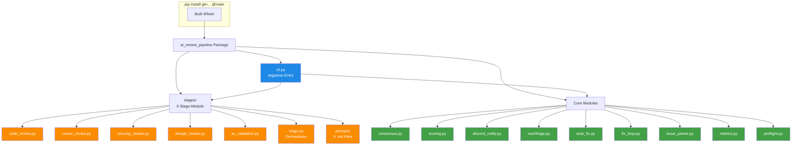

# ai-review-pipeline — Das Python-Paket hinter der Pipeline

> **TL;DR:** Die eigentliche Review-Logik lebt in einem eigenen Python-Paket, das per `pip install` auf dem Runner installiert wird. Es enthält die Orchestrierung der fünf Review-Stufen, die Aggregation der Einzel-Bewertungen, die Benachrichtigungs-Routinen für Discord und GitHub, sowie eine Kommandozeilen-Schnittstelle namens `ai-review`. Das Paket ist bewusst schlank — es hält die Review-Intelligenz an einer Stelle und macht sie über `pip install git+…@main` in jedem Consumer-Projekt verfügbar. Tests halten 90% Code-Coverage, und Regressions-Gates verhindern, dass Kernfunktionen unbemerkt brechen.

## Wie es funktioniert



Der Package-Aufbau folgt einem klaren Zweck-Schema: Die `stages/`-Submodule sind Single-Purpose-Adapter — jedes lädt einen Prompt, ruft ein bestimmtes KI-Modell, und gibt ein normalisiertes Ergebnis zurück. Die Core-Module darum herum kümmern sich um alles, was nicht Stage-spezifisch ist: Aggregation, Notifications, Input-Parsing, Metriken.

Die CLI ist dünne Verpackung über diese Module. Jedes Subkommando mappt auf ein Core-Modul oder einen Stage-Runner. Das hält die Oberfläche testbar — die Tests importieren die Module direkt, nicht die CLI.

## Technische Details

### Package-Metadaten

Aus [`pyproject.toml`](https://github.com/EtroxTaran/ai-review-pipeline/blob/main/pyproject.toml):

```toml
[project]
name = "ai-review-pipeline"
version = "0.1.0"
requires-python = ">=3.11"
dependencies = [
    "pyyaml>=6.0.2",
    "requests>=2.32.0",
]

[project.optional-dependencies]
gherkin = ["gherkin-official==29.0.0"]
dev = ["pytest>=8.3.0", "pytest-cov>=5.0.0", "pytest-mock>=3.14.0", "ruff>=0.6.0"]

[project.scripts]
ai-review = "ai_review_pipeline.cli:main"

[tool.hatch.build.targets.wheel]
packages = ["src/ai_review_pipeline"]
```

Build-Backend ist `hatchling`. Das Wheel enthält **alle** `.py`-Files plus die `.md`-Prompt-Files unter `stages/prompts/` (Package-Data).

### Die fünf Stage-Module

| Modul | Stage | Modell | Tests (Cov %) |
|---|---|---|---|
| `code_review.py` | Stage 1 | Codex GPT-5 | test_code_review.py (18 Tests, 87%) |
| `cursor_review.py` | Stage 1b | Cursor composer-2 | test_cursor_review.py (15 Tests, 94%) |
| `security_review.py` | Stage 2 | Gemini 2.5 Pro + semgrep | test_security_review.py (21 Tests, 97%) |
| `design_review.py` | Stage 3 | Claude Opus 4.7 | test_design_review.py (27 Tests, 94%) |
| `ac_validation.py` | Stage 5 | Codex + Claude Judge | test_ac_validation.py (28 Tests, 96.81%) |

Jedes Modul implementiert dieselbe Signatur:

```python
def run(cfg: StageConfig, args) -> int:
    """Returns exit-code (0 = success, non-zero = stage failed)."""
```

Der gemeinsame Orchestrator in `stage.py` dispatched via `importlib`:

```python
def run_stage(stage_name: str, args) -> int:
    module = importlib.import_module(f"ai_review_pipeline.stages.{stage_name}")
    return module.run(args)
```

### Die CLI-Subcommands

Vollständige Referenz: [`70-reference/00-cli-commands.md`](../70-reference/00-cli-commands.md).

```bash
ai-review stage <name> --pr <N> [--max-iterations N] [--skip-fix-loop]
ai-review consensus --sha <commit> --pr <N> [--target-url URL]
ai-review ac-validate --pr-body-file F --linked-issues-file F --changed-files CSV --diff-file F
ai-review auto-fix --pr <N> --reason "..."
ai-review fix-loop --stage <name> --pr <N> [--max-iterations 2]
ai-review metrics [--since YYYY-MM-DD] [--filter key=value]
ai-review --version
```

Shadow-Flags (seit PR#2):
- `--status-context-prefix <prefix>` — schreibt Status mit `<prefix>/<stage>` statt default `ai-review/<stage>`
- `--status-context <full-ctx>` — nur für `consensus`: override des Consensus-Context-Namens
- `--discord-channel <id>` — override des Default-Channels aus der Config
- `--no-ping` — unterdrückt `@here`-Mention im Discord-Post

### Package-Data (die Prompt-Files)

Historischer Bug: Die `.md`-Files unter `src/ai_review_pipeline/stages/prompts/` waren zwar im Source-Tree, aber nicht im gebauten Wheel. Zur Laufzeit crashten alle Stages mit:

```
FileNotFoundError: '/…/site-packages/ai_review_pipeline/stages/prompts/code_review.md'
```

Fix in PR#8: `hatchling`-Config explizit auf `packages = ["src/ai_review_pipeline"]` gesetzt (nicht `src`), was den `.md`-Files das Einschließen im Wheel garantiert.

Regressions-Schutz in PR#9: [`tests/test_wheel_packaging.py`](https://github.com/EtroxTaran/ai-review-pipeline/blob/main/tests/test_wheel_packaging.py) hat zwei Tests:

1. **Zipfile-Check:** Baut das Wheel mit `python -m build` und prüft via `zipfile.namelist()`, dass alle 4 `.md`-Files im Archiv sind
2. **Install-Integration:** Installiert das Wheel in ein frisches venv und ruft `stage.load_prompt()` für jeden der 4 Stages auf

Details: [`60-tests/20-wheel-packaging-regression.md`](../60-tests/20-wheel-packaging-regression.md).

### Core-Module im Detail

| Modul | Zweck | Tests |
|---|---|---|
| `common.py` | Geteilte HTTP-Helpers, Severity-Enums, Scoring-Konstanten | 95 (cov 96%) |
| `consensus.py` | Stage-Statuses von GitHub pollen, aggregieren, posten | 59 (cov 96%) |
| `scoring.py` | Confidence-weighted Aggregation, Threshold-Matching | 14 (cov 87%) |
| `discord_notify.py` | Discord-Webhook-Post, Sticky-Message-Handling | 33 (cov 94%) |
| `nachfrage.py` | Soft-Consensus-Handler, Command-Parser, Escalation | 13 (cov 94%) |
| `auto_fix.py` | Single-Pass-Fix (commit + push) | 37 (cov 92%) |
| `fix_loop.py` | Iterative Stage → Fix → Stage Schleife, max N Iterationen | 25 (cov 82%) |
| `issue_parser.py` | Gherkin-Given-When-Then Parsing aus Issue-Body | 22 (cov 90%) |
| `issue_context.py` | GitHub-Issue-Fetching + AC-Coverage-Berechnung | 25 (cov 85%) |
| `metrics.py` | JSONL-basiertes Event-Log | 12 (cov 91%) |
| `metrics_summary.py` | Aggregation + Trend-Report über `metrics.jsonl` | 27 (cov 95%) |
| `preflight.py` | OAuth-Presence-Check für Codex/Cursor/Gemini/Claude | 22 (cov 95%) |

### Testen und Coverage

```bash
cd ai-review-pipeline
pip install -e ".[dev,gherkin]"
pytest
# Output: 565 passed in ~7s (mit test_wheel_packaging)
```

Coverage-Gate in CI via `pyproject.toml`:

```toml
[tool.coverage.report]
fail_under = 80
```

Einzel-Module unter 80% werden in CI rot. Die Ausreißer (auto_fix 82%, cli 83%, issue_context 85%, scoring 87%) sind akzeptiert, weil die fehlenden Pfade reine Logging-Branches oder defensive Error-Handler sind.

### Die Workflow-Templates

Unter [`workflows/`](https://github.com/EtroxTaran/ai-review-pipeline/tree/main/workflows) liegen 10 YAML-Templates, die Consumer-Repos per `gh ai-review install` bekommen:

- `ai-code-review.yml` — Stage 1 CI-Workflow
- `ai-cursor-review.yml` — Stage 1b
- `ai-security-review.yml` — Stage 2
- `ai-design-review.yml` — Stage 3
- `ai-review-ac-validation.yml` — Stage 5
- `ai-review-consensus.yml` — Aggregation
- `ai-review-nachfrage.yml` — Soft-Consensus-Handler
- `ai-review-auto-fix.yml` — Manual-Trigger für Auto-Fix
- `ai-review-auto-escalate.yml` — Cron-Escalation
- `ai-review-scope-check.yml` — PR-Body-Validation

Details: [`40-setup/30-workflow-templates.md`](../40-setup/30-workflow-templates.md).

### Die `gh`-Extension

Installiert die Workflow-Templates im Consumer-Repo:

```bash
gh ai-review install    # kopiert workflows/*.yml in .github/workflows/
gh ai-review verify     # prüft Installation + Required Secrets
gh ai-review update     # pullt die neueste Version
```

Code unter [`gh-extension/gh-ai-review/`](https://github.com/EtroxTaran/ai-review-pipeline/tree/main/gh-extension/gh-ai-review). Details: [`40-setup/40-gh-extension.md`](../40-setup/40-gh-extension.md).

## Verwandte Seiten

- [AI-Review-Pipeline (Konzept)](../10-konzepte/00-ai-review-pipeline.md) — was die Stages prüfen
- [CLI-Commands](../70-reference/00-cli-commands.md) — alle Subcommands mit Flags
- [Wheel-Packaging-Regression](../60-tests/20-wheel-packaging-regression.md) — der PR#9-Test
- [Workflow-Templates](../40-setup/30-workflow-templates.md) — die 10 YAMLs erklärt
- [`gh ai-review` Extension](../40-setup/40-gh-extension.md) — Consumer-Repo-Installer

## Quelle der Wahrheit (SoT)

- [ai-review-pipeline Repository](https://github.com/EtroxTaran/ai-review-pipeline)
- [`src/ai_review_pipeline/`](https://github.com/EtroxTaran/ai-review-pipeline/tree/main/src/ai_review_pipeline) — der Package-Code
- [`tests/`](https://github.com/EtroxTaran/ai-review-pipeline/tree/main/tests) — 565 Tests
- [`pyproject.toml`](https://github.com/EtroxTaran/ai-review-pipeline/blob/main/pyproject.toml) — Paket-Definition
