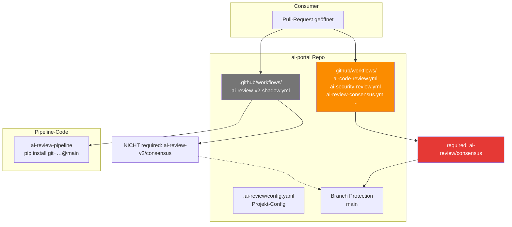
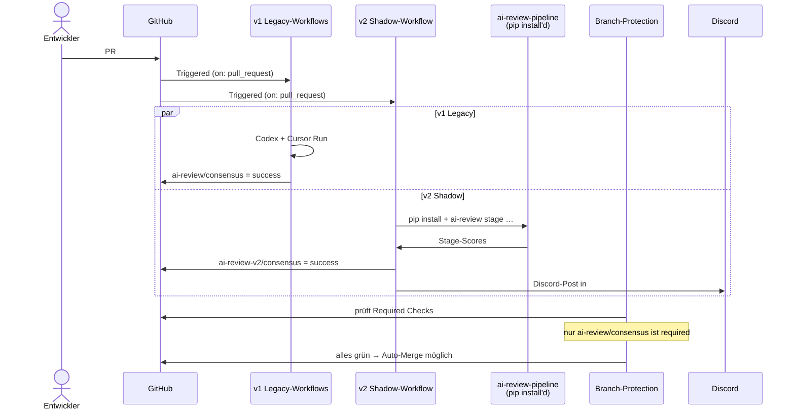

# ai-portal Integration — Wie das Ziel-Projekt die Pipeline nutzt

> **Status seit 2026-04-24:** Phase-5-Cutover abgeschlossen (PR#44). Die Seite beschreibt die Post-Cutover-Realität: **nur noch v2**, die 5 v1-Legacy-Workflows gelöscht, `ai-review-v2-shadow.yml` → `ai-review.yml` umbenannt, alle 5 Stages `blocking: true`. Phase-4-Mechanik (zwei parallele Pipelines) siehe [`10-konzepte/20-shadow-vs-cutover.md`](../10-konzepte/20-shadow-vs-cutover.md) als Playbook für künftige Migrationen.
>
> **TL;DR (Post-Cutover):** Das ai-portal-Repo ist das erste Produktiv-Projekt, das die AI-Review-Toolchain nutzt. Die Integration besteht aus einer Config-Datei (`.ai-review/config.yaml`), einem produktiven Workflow (`ai-review.yml`) und einer Branch-Protection-Einstellung (`ai-review/consensus` als Required-Check). Shadow-Phase war 2026-04-20 bis 2026-04-24.

## Wie es funktioniert



Die Integration hat drei bewegliche Teile:

1. **Die Config** sagt der Pipeline, welche Stages aktiviert sind, welche Modelle, welche Consensus-Schwellen und welcher Discord-Channel. Pro Projekt einmalig.
2. **Die Workflows** sind die tatsächlichen CI-Jobs. Die alten (v1) stehen seit langem im Repo und schreiben `ai-review/*`-Statuses. Der neue (v2 Shadow) nutzt die extrahierte Pipeline und schreibt `ai-review-v2/*`-Statuses.
3. **Die Branch-Protection** entscheidet, welche Statuses den Merge blockieren. Aktuell ist nur `ai-review/consensus` (v1) required; `ai-review-v2/consensus` läuft parallel, aber sein Ausfall blockiert nichts.

## Technische Details

### Die Config-Datei

[`ai-portal/.ai-review/config.yaml`](https://github.com/EtroxTaran/ai-portal/blob/main/.ai-review/config.yaml) — das Phase-4-Setup:

```yaml
version: "1.0"

reviewers:
  codex: gpt-5
  cursor: composer-2
  gemini: gemini-2.5-pro
  claude: claude-opus-4-7

stages:
  code_review:
    enabled: true
    blocking: false   # Shadow: non-blocking
  cursor_review:
    enabled: true
    blocking: false
  security:
    enabled: true
    blocking: false
  design:
    enabled: true
    blocking: false
  ac_validation:
    enabled: true
    blocking: false
    judge_model: gpt-5
    second_opinion_model: claude-opus-4-7
    min_coverage: 1.0

consensus:
  success_threshold: 8
  soft_threshold: 5
  fail_closed_on_missing_stage: true

notifications:
  target: discord
  discord:
    channel_id: "1495821842093576363"   # #ai-review-shadow-ai-portal
    mention_role: ""                     # kein @here im Shadow
    sticky_message: true

waivers:
  min_reason_length: 30
  allowed_labels: ["pipeline-bootstrap"]
```

Schema-Referenz: [`40-setup/20-ai-review-config-schema.md`](../40-setup/20-ai-review-config-schema.md).

### Der Shadow-Workflow

[`ai-portal/.github/workflows/ai-review-v2-shadow.yml`](https://github.com/EtroxTaran/ai-portal/blob/main/.github/workflows/ai-review-v2-shadow.yml) ist ein einziger Workflow mit 6 Jobs:

```yaml
name: AI Review v2 (Shadow)

on:
  pull_request:
    types: [opened, synchronize, reopened]

concurrency:
  group: ai-review-v2-shadow-${{ github.event.pull_request.number }}
  cancel-in-progress: true

jobs:
  ac-validate:    # Stage 5
    runs-on: [self-hosted, r2d2, ai-review]
    steps:
      - actions/checkout@v4 (submodules: false)
      - actions/setup-python@v5
      - pip install --force-reinstall --no-deps --no-cache-dir git+https://github.com/EtroxTaran/ai-review-pipeline.git@main
      - pip install git+https://github.com/EtroxTaran/ai-review-pipeline.git@main
      - ai-review ac-validate --pr-body-file … --linked-issues-file …

  code-review:     # Stage 1
  cursor-review:   # Stage 1b
  security-review: # Stage 2
  design-review:   # Stage 3
  consensus:       # Aggregation, needs: all 5 above
```

**Wichtige Design-Entscheidungen im Workflow:**

- **`--force-reinstall --no-deps --no-cache-dir`** vor jedem Stage-Run. Ohne das erkennt pip die bereits installierte `ai-review-pipeline==0.1.0` als "satisfied" und überspringt den Install — wodurch neue Prompts oder Fixes auf main nie ankommen. Runbook-Details: [`50-runbooks/30-pip-install-bricht.md`](../50-runbooks/30-pip-install-bricht.md)
- **`submodules: false`** bei allen Checkouts. Das Repo hat einen Orphan-Gitlink `.temp/Uiplatformguide` ohne `.gitmodules`-Mapping, der actions/checkout zum Crash brachte. `.gitmodules` wurde in PR#43 ergänzt, aber `submodules: false` ist der Gürtel-und-Hosenträger-Ansatz
- **`closingIssuesReferences` via GraphQL** statt `gh pr view --json` (das Feld existiert nur im GraphQL-Schema, nicht im REST-Wrapper)

### Die Legacy v1-Workflows

Im selben `.github/workflows/`-Ordner liegen die älteren Dateien, aus der Zeit vor der Package-Extraction:

- `ai-code-review.yml` — Codex-Review direkt, ohne `ai-review`-CLI
- `ai-security-review.yml` — Gemini + semgrep, älterer Code-Pfad
- `ai-review-consensus.yml` — Aggregation, schreibt `ai-review/consensus`
- `ai-review-scope-check.yml` — Pre-Check: PR-Body-Format

Diese Workflows rufen keine externe Pipeline auf, sondern haben den Logik-Code direkt in YAML-Run-Scripts. Sie sind die blockierenden Required-Checks in der aktuellen Phase 4.

### Branch-Protection

Die aktuelle Protection auf `ai-portal/main` verlangt:

```
checks                                                         [CI]
e2e                                                            [Playwright E2E]
design-conformance                                             [Design-System-Linter]
Secret Scan (gitleaks)                                         [Security]
SAST (semgrep)                                                 [Security]
Container CVE Scan (trivy) (portal-api, …)                     [Security]
Container CVE Scan (trivy) (portal-shell, …)                   [Security]
ai-review/consensus                                            [v1 Consensus — BLOCKING]
```

Auffällig: `ai-review-v2/consensus` steht **nicht** in der Liste. Das ist Shadow-Mode per Definition. Cutover-Schritte: [`30-workflows/40-cutover-phase-4-zu-5.md`](../30-workflows/40-cutover-phase-4-zu-5.md).

### Was läuft wo



### Required Secrets im Repo

Für die v2-Pipeline müssen folgende Secrets im ai-portal-Repo gesetzt sein:

- `ANTHROPIC_API_KEY` — für Claude (Design + AC-Second-Opinion)
- Discord-Credentials werden über den Runner-Env aus `~/.config/ai-workflows/env` bezogen, nicht aus GitHub-Secrets. Das ist bewusst — die Credentials gehören nicht in die Cloud.

Details zu den Secret-Domänen: [`80-secrets-env.md`](80-secrets-env.md).

### Ein realer PR-Durchlauf

PR#42 (`docs(changelog): add missing Keep a Changelog reference links`) vom 2026-04-20 ist der erste dogfood-getestete Real-PR:

- **v1 Legacy:** `ai-review/scope-check` ✅ · `ai-review/code` ✅ · `ai-review/security` ✅ · `ai-review/design` ✅ (skipped, keine UI) · `ai-review/consensus` ✅ (2/2 AI reviewers green) → Auto-Merge
- **v2 Shadow:** zuerst crashte mit `FileNotFoundError` auf `stages/prompts/` → PR#8 (Prompts hinzufügen) → danach lief sauber durch

Die Lesson: In Phase 4 lernt die v2-Pipeline, wo sie stolpert, ohne Produktions-Merges zu blockieren.

## Verwandte Seiten

- [Shadow-Mode vs. Cutover](../10-konzepte/20-shadow-vs-cutover.md) — die Phasen-Logik
- [n8n Workflows](30-n8n-workflows.md) — die Komponenten, die v2 mit Discord verbinden
- [ai-review-pipeline Repo](10-ai-review-pipeline-repo.md) — die Package-Details
- [Cutover Phase 4 → 5](../30-workflows/40-cutover-phase-4-zu-5.md) — wie man v2 zur Required-Check macht
- [pip-install-bricht Runbook](../50-runbooks/30-pip-install-bricht.md) — was tun bei Force-Reinstall-Problemen

## Quelle der Wahrheit (SoT)

- [ai-portal Repository](https://github.com/EtroxTaran/ai-portal)
- [`ai-review-v2-shadow.yml`](https://github.com/EtroxTaran/ai-portal/blob/main/.github/workflows/ai-review-v2-shadow.yml)
- [`.ai-review/config.yaml`](https://github.com/EtroxTaran/ai-portal/blob/main/.ai-review/config.yaml)
- [ADR-018 CI/CD Deploy Pipeline](https://github.com/EtroxTaran/ai-portal/blob/main/docs/v2/10-adr/ADR-018-cicd-deploy-pipeline.md)
