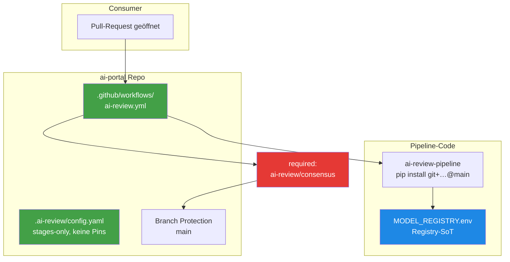
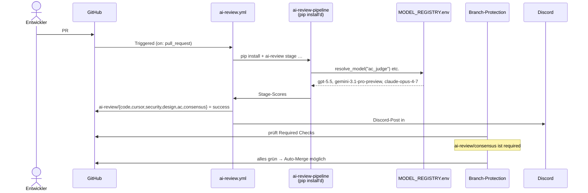

# ai-portal Integration — Wie das Ziel-Projekt die Pipeline nutzt

> **TL;DR:** Das ai-portal-Repo ist das erste Produktiv-Projekt, das die AI-Review-Toolchain nutzt. Seit **2026-04-24 (PR#44)** läuft es in **Phase 5**: die v2-Pipeline ist produktiv, blocking, und die einzige Review-Pipeline im Repo. Der Shadow-Modus ist beendet, die fünf v1-Legacy-Workflows sind gelöscht, der Status-Context `ai-review/consensus` ist required für Auto-Merge. Model-Pins liegen nicht mehr in der Project-Config — sie kommen aus der zentralen Registry im ai-review-pipeline-Repo.

## Wie es funktioniert



Die Integration hat drei bewegliche Teile:

1. **Die Project-Config** (`.ai-review/config.yaml`) sagt der Pipeline, welche Stages aktiv sind, wie Consensus verrechnet wird und welcher Discord-Channel angepingt wird. **Model-Pinning findet hier bewusst nicht mehr statt** — die Modelle kommen aus der Registry.
2. **Der Workflow** (`ai-review.yml`) ist der einzige AI-Review-Job. Er installiert die Pipeline frisch pro Run, führt alle fünf Stages aus und schreibt `ai-review/*`-Statuses.
3. **Die Branch-Protection** macht `ai-review/consensus` zum Required-Check — ohne grünes Consensus kein Auto-Merge.

## Technische Details

### Die Config-Datei

[`ai-portal/.ai-review/config.yaml`](https://github.com/EtroxTaran/ai-portal/blob/main/.ai-review/config.yaml) — aktuelle Phase-5-Produktion:

```yaml
# AI-Review-Pipeline — Production-Config (Phase 5 Cutover, aktiv seit 2026-04-24).
# Alle Stages blocking: Pipeline ist required-check für Auto-Merge.
#
# Modell-Versionen werden NICHT hier konfiguriert.
# Single-Source-of-Truth ist die Registry:
# ai-review-pipeline/registry/MODEL_REGISTRY.env

version: "1.0"

stages:
  code_review:     { enabled: true, blocking: true }
  cursor_review:   { enabled: true, blocking: true }
  security:        { enabled: true, blocking: true }
  design:          { enabled: true, blocking: true }
  ac_validation:
    enabled: true
    blocking: true
    min_coverage: 1.0
    # judge_model + second_opinion_model kommen aus Registry.

consensus:
  success_threshold: 8
  soft_threshold: 5
  fail_closed_on_missing_stage: true

notifications:
  target: discord
  discord:
    channel_id: "${DISCORD_CHANNEL_AI_PORTAL}"   # Production-Channel
    mention_role: "@here"
    sticky_message: true

waivers:
  min_reason_length: 30
  allowed_labels: ["pipeline-bootstrap"]
```

Schema-Referenz: [`40-setup/20-ai-review-config-schema.md`](../40-setup/20-ai-review-config-schema.md).

### Der Workflow

[`ai-portal/.github/workflows/ai-review.yml`](https://github.com/EtroxTaran/ai-portal/blob/main/.github/workflows/ai-review.yml) — ein einziger Workflow mit sechs Jobs (fünf Stages + Consensus):

```yaml
name: AI Review

on:
  pull_request:
    types: [opened, synchronize, reopened]

concurrency:
  group: ai-review-${{ github.event.pull_request.number }}
  cancel-in-progress: true

jobs:
  ac-validate:     # Stage 5
  code-review:     # Stage 1
  cursor-review:   # Stage 1b
  security-review: # Stage 2
  design-review:   # Stage 3
  consensus:       # Aggregation, needs: all 5 above
```

**Wichtige Design-Entscheidungen im Workflow:**

- **`--force-reinstall --no-deps --no-cache-dir`** vor jedem Stage-Run. Ohne das erkennt pip die bereits installierte `ai-review-pipeline==0.1.0` als "satisfied" und überspringt den Install — wodurch neue Prompts oder Fixes auf main nie ankommen. Runbook: [`50-runbooks/30-pip-install-bricht.md`](../50-runbooks/30-pip-install-bricht.md)
- **`submodules: false`** bei allen Checkouts. Das Repo hatte historisch einen Orphan-Gitlink `.temp/Uiplatformguide` ohne `.gitmodules`-Mapping, der actions/checkout zum Crash brachte. Auch nach Fix in PR#43 bleibt `submodules: false` als Gürtel-und-Hosenträger.
- **`closingIssuesReferences` via GraphQL** statt `gh pr view --json` (das Feld existiert nur im GraphQL-Schema).
- **Model-Resolution über `resolve_model`** aus der ai-review-pipeline — der Workflow selbst hat keine Modell-Pins. Pro-Stage-Override nur via `AI_REVIEW_MODEL_<ROLE>` Env-Var, wenn experimentiert wird.

### Branch-Protection

Aktuelle Protection auf `ai-portal/main` verlangt:

```
checks                                                         [CI]
e2e                                                            [Playwright E2E]
design-conformance                                             [Design-System-Linter]
Secret Scan (gitleaks)                                         [Security]
SAST (semgrep)                                                 [Security]
Container CVE Scan (trivy) (portal-api, …)                     [Security]
Container CVE Scan (trivy) (portal-shell, …)                   [Security]
ai-review/consensus                                            [AI-Review — BLOCKING]
```

Der `ai-review-v2/*`-Kontext, der bis zum Cutover parallel lief, ist aus der Protection entfernt — Shadow-Slot existiert nicht mehr. Wie der Cutover ausgeführt wurde (als generisches Playbook für weitere Projekte): [`30-workflows/40-shadow-zu-produktion-cutover.md`](../30-workflows/40-shadow-zu-produktion-cutover.md).

### Was läuft wo



### Model-Pin-Auflösung

Die Pipeline ruft `resolve_model(role, config)` für jede Stage auf. Reihenfolge der Auflösung:

1. **Stage-spezifischer Env-Override**: `AI_REVIEW_MODEL_AC_JUDGE` etc.
2. **Project-Config-Override**: `reviewers.codex` in `.ai-review/config.yaml` (ai-portal nutzt das **nicht**).
3. **Registry-SoT**: `MODEL_REGISTRY.env` im ai-review-pipeline-Repo — das ist der Produktiv-Pfad.

So bekommt ai-portal bei jedem Release automatisch die neuesten Modelle, sobald die Registry ein PR-Drift-Update durchläuft. Kein manueller Config-Touch pro Upgrade.

### Required Secrets im Repo

Für die Pipeline müssen folgende Secrets im ai-portal-Repo gesetzt sein:

- `ANTHROPIC_API_KEY` — für Claude (Design + AC-Second-Opinion)
- Discord-Credentials werden über den Runner-Env aus `~/.config/ai-workflows/env` bezogen, nicht aus GitHub-Secrets. Das ist bewusst — die Credentials gehören nicht in die Cloud.

Details: [`80-secrets-env.md`](80-secrets-env.md).

### Historische Phase-4-Shadow-Konfiguration

Vor dem Cutover (20.–24. April 2026) lief eine **parallele v2-Shadow-Pipeline** neben den fünf v1-Legacy-Workflows:

- `ai-review-v2-shadow.yml` mit `--status-context-prefix ai-review-v2`, `blocking: false`, Shadow-Channel `#ai-review-shadow-ai-portal`
- Die v1-Workflows (`ai-code-review.yml`, `ai-security-review.yml`, `ai-design-review.yml`, `ai-review-scope-check.yml`, `ai-review-consensus.yml`) schrieben `ai-review/*`-Statuses und waren required.

Im Cutover am 2026-04-24 wurden die fünf Legacy-Workflows gelöscht, `ai-review-v2-shadow.yml` zu `ai-review.yml` umbenannt, alle Shadow-Flags entfernt und der Metrics-Pfad `.ai-review/metrics-v2.jsonl` auf `.ai-review/metrics.jsonl` umgeschrieben. Changelog: [`80-historie/00-changelog.md`](../80-historie/00-changelog.md#2026-04-24--phase-5-cutover-im-ai-portal-pr44).

## Verwandte Seiten

- [Shadow-Mode vs. Cutover](../10-konzepte/20-shadow-vs-cutover.md) — die Phasen-Logik
- [n8n Workflows](30-n8n-workflows.md) — die Komponenten, die den Workflow mit Discord verbinden
- [ai-review-pipeline Repo](10-ai-review-pipeline-repo.md) — die Package-Details
- [Shadow-zu-Produktion Cutover Playbook](../30-workflows/40-shadow-zu-produktion-cutover.md) — wie man v2 zur Required-Check macht
- [pip-install-bricht Runbook](../50-runbooks/30-pip-install-bricht.md) — was tun bei Force-Reinstall-Problemen

## Quelle der Wahrheit (SoT)

- [ai-portal Repository](https://github.com/EtroxTaran/ai-portal)
- [`ai-review.yml`](https://github.com/EtroxTaran/ai-portal/blob/main/.github/workflows/ai-review.yml)
- [`.ai-review/config.yaml`](https://github.com/EtroxTaran/ai-portal/blob/main/.ai-review/config.yaml)
- [MODEL_REGISTRY.env](https://github.com/EtroxTaran/ai-review-pipeline/blob/main/src/ai_review_pipeline/registry/MODEL_REGISTRY.env)
- [ADR-018 CI/CD Deploy Pipeline](https://github.com/EtroxTaran/ai-portal/blob/main/docs/v2/10-adr/ADR-018-cicd-deploy-pipeline.md)
