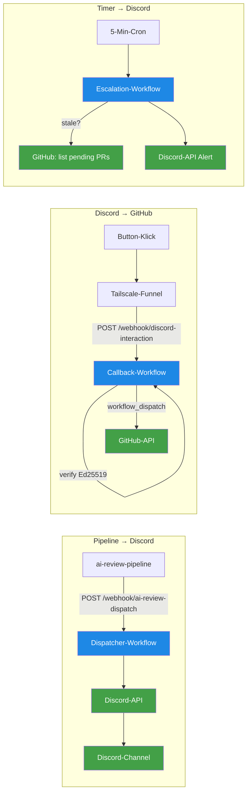

# n8n-Workflows — Dispatcher, Callback, Escalation

> **TL;DR:** Zwischen der Review-Pipeline und Discord sitzt ein n8n-Container mit drei Workflows, die Nachrichten hin- und herroutieren. Der Dispatcher-Workflow nimmt die Review-Ergebnisse von der Pipeline entgegen und postet sie als formatierte Discord-Nachricht mit Buttons. Der Callback-Workflow empfängt Button-Klicks von Discord, verifiziert die Signatur, und triggert die passende GitHub-Action. Der Escalation-Workflow läuft auf einem Timer und erinnert, wenn eine Rückfrage unbeantwortet bleibt. Alle drei laufen als JSON-Definitionen im n8n-Container auf dem Home-Server r2d2.

## Wie es funktioniert



Der n8n-Container auf r2d2 ist das Bindeglied zwischen der lokalen Pipeline und der externen Discord-Welt. Er läuft auf Port 5678 (nur localhost) und ist via Tailscale-Funnel öffentlich erreichbar — aber nur für einen einzigen Pfad, den Discord-Callback-Endpunkt.

Die drei Workflows sind logisch voneinander getrennt:

- **Dispatcher** ist outbound — er schickt Nachrichten von der Pipeline Richtung Discord
- **Callback** ist inbound — er empfängt Button-Klicks, verifiziert sie, und startet GitHub-Actions
- **Escalation** ist zeitgesteuert — er prüft regelmäßig den Zustand offener PRs und schickt Alerts bei Timeouts

Dass das alles in n8n statt in einem eigenen Service läuft hat einen klaren Grund: n8n ist visuell editierbar, gut debugbar (Execution-View zeigt jeden Node-Input/Output), und man braucht keinen zusätzlichen Deployment-Pfad. Für drei kleine Integrations-Workflows ist das perfekt.

## Technische Details

### Die drei Workflow-Dateien

Liegen als JSON-Definitionen unter [`agent-stack/ops/n8n/workflows/`](https://github.com/EtroxTaran/agent-stack/tree/main/ops/n8n/workflows):

| Datei | Workflow-ID | Trigger | Zweck |
|---|---|---|---|
| `ai-review-dispatcher.json` | `ai-review-dispatcher` | POST-Webhook `/webhook/ai-review-dispatch` | Pipeline → Discord-Nachricht posten |
| `ai-review-callback.json` | `ai-review-callback` | POST-Webhook `/webhook/discord-interaction` | Discord-Button → GitHub workflow_dispatch |
| `ai-review-escalation.json` | `ai-review-escalation` | Schedule-Cron alle 5 Min | Stale PRs finden und eskalieren |

Die JSONs sind die **Quelle der Wahrheit**. Bei Änderungen: JSON editieren → `n8n import:workflow --input=<file>` → Container restart.

### Der Dispatcher-Workflow

**Input:**

```json
POST http://127.0.0.1:5678/webhook/ai-review-dispatch
{
  "channel_id": "1495821842093576363",
  "pr_number": 42,
  "pr_url": "https://github.com/EtroxTaran/ai-portal/pull/42",
  "pr_title": "Fix race condition in queue_push()",
  "pr_author": "NicoR",
  "scores": {"code": 9, "cursor": 8, "security": 6, "design": 7, "ac": 8},
  "consensus": "soft",
  "project": "ai-portal"
}
```

**Flow:**

1. **Webhook-Node** empfängt POST
2. **Set-Node** formatiert den Message-Body (Scores-Tabelle, Action-Row mit 3 Buttons)
3. **HTTP-Request-Node** an Discord-API: `POST /channels/{id}/messages` mit Bot-Token im Authorization-Header
4. **Respond-Node** schickt `{"ok": true, "message_id": "…", "channel_id": "…", "pr": "…"}` zurück

### Der Callback-Workflow

**Input:**

```json
POST https://r2d2.tail4fc6dd.ts.net/webhook/discord-interaction
Headers:
  X-Signature-Ed25519: <hex-signature>
  X-Signature-Timestamp: <unix-timestamp>
Body (raw):
  {"type": 3, "data": {"custom_id": "approve:42"}, "member": {...}, ...}
```

**Flow:**

1. **Webhook-Node** mit `options.rawBody: true` — muss die exakten Bytes für Signatur-Verifikation liefern
2. **Code-Node "Verify + Route"** macht:
   - Rawbody aus `$binary.data` extrahieren (kompatibel mit Buffer und base64)
   - Timestamp-Skew-Check ±300s (Replay-Schutz)
   - Ed25519-Signatur-Verify via Node's `crypto.verify` mit SPKI-Prefix
   - Falls `type: 1` (PING) → pong response `{type: 1}`
   - Falls `type: 3` (Button-Click) → parse `custom_id = action:pr`, route
3. **Switch-Node** verzweigt zwischen "dispatch" und "reject"
4. **HTTP-Request-Node** zu GitHub-API: `POST /repos/…/actions/workflows/handle-button-action.yml/dispatches`
5. **Respond-Node** schickt `{type: 6}` (ACK) innerhalb 3 Sekunden zurück an Discord

**Kritische Details:**

- `webhookId: "discord-interaction"` am Webhook-Node ist zwingend, sonst registriert n8n die Route unter einem nested Path und der Endpoint ist unerreichbar. Die unit-tests stellen das sicher
- `crypto.verify` mit SPKI-prefix (`302a300506032b6570032100` + 32 byte pub) ist deterministisch; `crypto.subtle.verify` war in verschiedenen Node-Versionen unzuverlässig
- HTTP-Request hat `retryOnFail: true, maxTries: 3, waitBetweenTries: 2000` — GitHub-API kann transient failen
- `neverError: true, fullResponse: true` — damit der Respond-Node IMMER innerhalb 3s ein ACK zurückgibt, auch wenn GitHub hängt

Der vollständige JS-Code der Verify-Logik wird in [`60-tests/10-callback-unit-tests.md`](../60-tests/10-callback-unit-tests.md) mit 13 Test-Cases abgesichert.

### Der Escalation-Workflow

**Trigger:** Cron `*/5 * * * *` (alle 5 Minuten)

**Flow:**

1. **GitHub-API-Node:** Liste alle PRs mit `ai-review/consensus = pending, description like '%soft%'`
2. **Filter-Node:** Nur die, deren Soft-Message älter als 30 Minuten ist und seither kein Button-Klick-Event war
3. **Discord-API-Node:** Alert in den Alerts-Channel (`DISCORD_ALERTS_CHANNEL_ID`) mit `@here`-Mention
4. **State-Update:** Markiert, dass der Alert für diesen PR gepostet wurde, um nicht im 5-Min-Rhythmus zu spammen

Details zum Flow: [`30-workflows/20-escalation-30-min.md`](../30-workflows/20-escalation-30-min.md).

### Deployment-Modell

Die Workflows leben in zwei Zuständen:

- **SoT (agent-stack Repo):** `ops/n8n/workflows/*.json` — hier wird editiert, committed, gereviewt
- **Live-Container (r2d2):** importiert via n8n-CLI. Nach Änderung am Repo-JSON muss das Importieren explizit erfolgen

Die Recreation erfolgt via Helfer-Script:

```bash
bash ~/projects/agent-stack/ops/scripts/restart-n8n-with-ai-review.sh
```

Das Script macht:
1. `docker stop ai-portal-n8n-portal-1`
2. `docker cp` der JSONs in den Container
3. `docker exec n8n n8n import:workflow --input=<file>`
4. `docker exec n8n n8n update:workflow --id=<id> --active=true`
5. `docker start ai-portal-n8n-portal-1`

### Wichtige Stolpersteine

- **n8n 2.15.x braucht Restart nach Workflow-Re-Import.** Ohne Container-Neustart greifen Änderungen am JS-Code nicht. Siehe [`50-runbooks/10-n8n-db-korruption.md`](../50-runbooks/10-n8n-db-korruption.md)
- **SQLite-Korruption bei direkter DB-Manipulation.** Niemals direkt via `sqlite3` in die n8n-DB schreiben, immer via `n8n import:workflow`. Siehe [Stolpersteine](../50-runbooks/60-stolpersteine.md) Nr. 1
- **`update:workflow` ist deprecated,** stattdessen `publish:workflow`. Die Restart-Skripte sind bereits auf das neue Kommando umgestellt

## Verwandte Seiten

- [Button-Click-Callback](../30-workflows/10-button-click-callback.md) — der Flow mit Sequence-Diagram
- [Discord-Bridge](40-discord-bridge.md) — Bot, Guild, Channels
- [Tailscale-Funnel](50-tailscale-funnel.md) — wie der öffentliche Webhook erreichbar wird
- [Callback-Unit-Tests](../60-tests/10-callback-unit-tests.md) — die 13 Verify-Tests
- [n8n-DB-Korruption-Runbook](../50-runbooks/10-n8n-db-korruption.md) — wenn SQLite streikt

## Quelle der Wahrheit (SoT)

- [`ops/n8n/workflows/ai-review-dispatcher.json`](https://github.com/EtroxTaran/agent-stack/blob/main/ops/n8n/workflows/ai-review-dispatcher.json)
- [`ops/n8n/workflows/ai-review-callback.json`](https://github.com/EtroxTaran/agent-stack/blob/main/ops/n8n/workflows/ai-review-callback.json)
- [`ops/n8n/workflows/ai-review-escalation.json`](https://github.com/EtroxTaran/agent-stack/blob/main/ops/n8n/workflows/ai-review-escalation.json)
- [`ops/scripts/restart-n8n-with-ai-review.sh`](https://github.com/EtroxTaran/agent-stack/blob/main/ops/scripts/restart-n8n-with-ai-review.sh)
