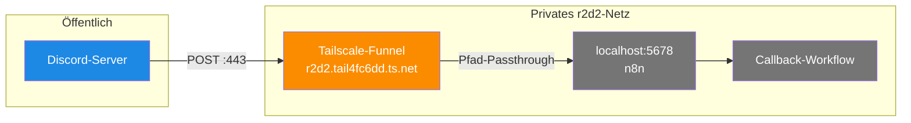

# Tailscale-Funnel — Der öffentliche Webhook-Endpoint

> **TL;DR:** Discord muss einen öffentlich erreichbaren URL anpingen können, wenn jemand einen Button klickt. Da der n8n-Container auf einem privaten Heimserver ohne öffentliche IP läuft, wird genau eine Route ("`/webhook/discord-interaction`") via Tailscale-Funnel ins Internet exponiert. Tailscale-Funnel ist ein kleines Feature, das gezielt einzelne Pfade eines Tailscale-Node öffentlich macht — alles andere am Server bleibt privat. Der Traffic läuft verschlüsselt über HTTPS auf Port 443, mit automatischem TLS-Zertifikat von Tailscale.

## Wie es funktioniert



Ein Heimserver hinter einer Fritz-Box hat normalerweise keine öffentliche IP — jeder Versuch, von außen eine Verbindung aufzubauen, scheitert am Router. Tailscale löst das klassisch, indem es den Server in ein mesh VPN einbindet; der Server ist dann für andere Geräte im VPN erreichbar, aber nicht fürs öffentliche Internet.

Für Discord ist das ein Problem — Discord-Server sind natürlich nicht im VPN und müssen trotzdem den Webhook erreichen können. **Funnel** ist Tailscales Lösung dafür: Tailscale selbst agiert als öffentlicher Reverse-Proxy. Eingehende HTTPS-Requests auf die Tailscale-Subdomain (`r2d2.tail4fc6dd.ts.net`) werden durch den mesh VPN an den Zielserver weitergeleitet.

Die **Pfad-Restriktion** ist das Sicherheits-Merkmal: Funnel exponiert nicht den ganzen Server, sondern nur den expliziten Pfad `/webhook/discord-interaction`. Alles andere — andere n8n-Webhooks, der Portal-Shell, der Docker-Socket — bleibt komplett unsichtbar fürs Internet.

## Technische Details

### Die aktuelle Funnel-Konfiguration

```
$ tailscale funnel status
# Funnel on:
#     - https://r2d2.tail4fc6dd.ts.net

https://r2d2.tail4fc6dd.ts.net (Funnel on)
|-- /                            proxy http://127.0.0.1:18790
|-- /webhook/discord-interaction proxy http://localhost:5678/webhook/discord-interaction
```

Zwei Routen sind aktiv:
- `/` → lokales Dev-Dashboard auf Port 18790 (Tailscale-intern, nicht Teil der AI-Review-Toolchain)
- `/webhook/discord-interaction` → durchgereicht an n8n auf Port 5678

Die zweite Route ist die einzige, die für die Pipeline relevant ist.

### Wie Funnel eingerichtet wurde

```bash
# Einmalig: Funnel aktivieren (verlangt sudo + Tailscale-Account)
sudo tailscale serve --bg --https=443 \
  --set-path /webhook/discord-interaction http://localhost:5678/webhook/discord-interaction

sudo tailscale funnel --bg --https=443 on
```

Die **Pfad-Passthrough-Flag** (`--set-path`) mit vollem Ziel-URL ist wichtig: Wenn man nur `--set-path /webhook/discord-interaction localhost:5678` angibt, strippt Funnel den Pfad ab und leitet an `localhost:5678/` weiter — wo n8n nichts matcht und 404 zurückgibt. Mit voller Ziel-URL bleibt der Pfad erhalten.

### Was Discord sieht

Discord's Developer-Portal-Setting für Interactions Endpoint URL:

```
https://r2d2.tail4fc6dd.ts.net/webhook/discord-interaction
```

Beim "Save" im Portal schickt Discord einen Test-PING:

```
POST https://r2d2.tail4fc6dd.ts.net/webhook/discord-interaction
Headers:
  X-Signature-Ed25519: <signed by Discord's test key>
  X-Signature-Timestamp: <now>
Body:
  {"type": 1, "application_id": "..."}
```

Der Callback-Workflow muss innerhalb 3 Sekunden mit `{"type": 1}` antworten. Das ist der Handshake, ohne den der Endpoint nicht als "verifiziert" gilt.

### Verifikations-Probe

Die Erreichbarkeit kann jederzeit probiert werden:

```bash
# Public via Funnel (sollte 401 invalid_signature zurückgeben)
curl -sS -X POST https://r2d2.tail4fc6dd.ts.net/webhook/discord-interaction \
  -H 'Content-Type: application/json' \
  --data-raw '{"type":1}'
# → {"error":"invalid_timestamp"}

# Der gleiche Test via localhost (sollte identisches Ergebnis liefern)
curl -sS -X POST http://127.0.0.1:5678/webhook/discord-interaction \
  -H 'Content-Type: application/json' \
  --data-raw '{"type":1}'
# → {"error":"invalid_timestamp"}
```

Beide Requests müssen `{"error":"invalid_timestamp"}` zurückgeben — bei fehlender/alter Signatur-Timestamp. Das beweist: Funnel leitet korrekt weiter, n8n läuft, und die Verify-Logik greift. Das automatisierte E2E-Script [`callback-live-probe.sh`](https://github.com/EtroxTaran/agent-stack/blob/main/ops/n8n/tests/callback-live-probe.sh) macht diese Probe plus zwei weitere.

### TLS-Zertifikate

Tailscale stellt automatisch Let's-Encrypt-Zertifikate für `*.ts.net`-Subdomains aus. Keine manuelle Cert-Rotation nötig — läuft transparent im Hintergrund. Das Zertifikat ist bis auf Tailscale-Account-Ebene gültig, also für alle Geräte im eigenen Tailnet.

### Was bei Ausfall passiert

Wenn Funnel ausfällt (Tailscale-Daemon crasht, r2d2 geht offline, Tailscale-Service hat Outage), kommt Discord's Button-Klick nicht an. Die Message bleibt in Discord sichtbar, aber der Klick macht nichts. Kein Auto-Merge, keine Rückfrage, keine Eskalation.

Runbook: [`50-runbooks/00-discord-webhook-down.md`](../50-runbooks/00-discord-webhook-down.md) — zeigt wie man das erkennt und fixt.

### Alternative: Cloudflare Tunnel / ngrok / etc.

Warum Tailscale-Funnel und nicht eine Alternative?

- **Cloudflare Tunnel:** Würde auch gehen, aber Cloudflare als zusätzlicher Provider — wir sind schon in Tailscale drin fürs VPN, kein Grund noch einen Anbieter hinzuzufügen
- **ngrok:** Eigene Domain nötig, kostet bei Dauerbetrieb, und die URL ändert sich bei Reconnect
- **Selbst-gehostet hinter DynDNS + Cert-Bot:** Braucht Port-Forwarding am Router (= Angriffsfläche fürs ganze Heimnetz), Let's-Encrypt-Renewal, mehr Wartung
- **Öffentliche Cloud-VM:** Monatliche Kosten, extra Infrastruktur

Funnel ist für unseren Scope (ein Pfad, kleine Traffic-Volumen, privater Use-Case) der sauberste Weg.

### Sicherheits-Annahmen

Die Pfad-Beschränkung des Funnel ist die erste Linie. Die zweite Linie ist die **Ed25519-Signatur-Verifikation** im Callback-Workflow — selbst wenn jemand die Funnel-URL erraten würde, könnte er ohne Discord's Private-Key keine valide Request erzeugen. Details: [`30-n8n-workflows.md`](30-n8n-workflows.md) und [`60-tests/10-callback-unit-tests.md`](../60-tests/10-callback-unit-tests.md).

Die dritte Linie ist das **Timestamp-Skew-Limit** von ±300 Sekunden — das verhindert Replay-Angriffe mit einer alten, gültigen Signatur.

## Verwandte Seiten

- [n8n Workflows](30-n8n-workflows.md) — wo der Callback-Workflow lebt
- [Discord-Bridge](40-discord-bridge.md) — wie Discord die Endpoint-URL nutzt
- [Button-Click-Callback](../30-workflows/10-button-click-callback.md) — der Flow mit Sequence-Diagram
- [Discord-Webhook-Down-Runbook](../50-runbooks/00-discord-webhook-down.md) — was tun wenn's hängt

## Quelle der Wahrheit (SoT)

- Tailscale CLI: `tailscale funnel status` — Live-Config auf r2d2
- [`ops/n8n/tests/callback-live-probe.sh`](https://github.com/EtroxTaran/agent-stack/blob/main/ops/n8n/tests/callback-live-probe.sh) — E2E-Probe-Script
- [Tailscale Funnel Docs](https://tailscale.com/kb/1223/funnel) — offizielle Dokumentation
