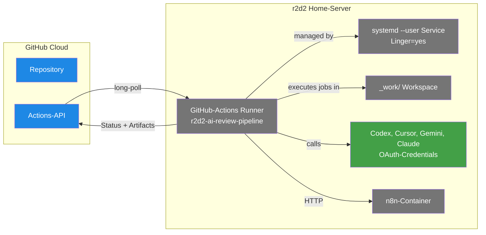

# Self-hosted Runner — r2d2 als GitHub-Actions-Runner

> **TL;DR:** Statt die Review-Stages in GitHubs Cloud-Runnern laufen zu lassen, läuft ein eigener Runner auf dem Heimserver r2d2. Das hat drei Vorteile: Die LLM-Credentials (Codex, Cursor, Gemini, Claude) bleiben lokal und müssen nicht in GitHub-Secrets hinterlegt werden; der Runner hat direkten Zugriff auf den lokalen n8n-Container für Discord-Notifications; und die Kosten für GitHub-Actions-Minuten entfallen komplett. Der Runner läuft als systemd-User-Service und reconnected sich automatisch nach Reboots.

## Wie es funktioniert



Der Self-hosted-Runner ist ein kleiner Go-Binary, den GitHub zur Verfügung stellt. Er baut beim Start eine long-poll-Verbindung zur GitHub-Actions-API auf und wartet auf Jobs. Sobald ein Job für einen passenden Label-Set ankommt (`self-hosted, r2d2, ai-review`), zieht der Runner ihn lokal, führt ihn im `_work/`-Workspace aus, streamt die Logs zurück zur API, und meldet den Ausgang.

Der **Workspace** ist das Arbeitsverzeichnis pro Repo: Bei jedem Job wird der Repo-Code nach `_work/<repo>/<repo>/` gecheckt (actions/checkout), dort laufen alle Steps, und am Ende wird aufgeräumt. Der Workspace ist zwischen Jobs persistent, was gut (pip-Cache bleibt, npm-Cache bleibt) und manchmal schlecht ist (Orphan-Files von früheren Jobs können Checkouts stören).

Der Runner läuft bewusst als **User-Service** (nicht system-wide): Er nutzt die OAuth-Credentials in `/home/clawd/.codex/`, `/home/clawd/.cursor/`, etc. Diese liegen im Home-Verzeichnis und sind für den User `clawd` les-/schreibbar. Ein system-wide Runner könnte sie nicht benutzen.

## Technische Details

### Runner-Registrierung

Einmalig angelegt via GitHub Actions Settings → Runners → New self-hosted runner:

```bash
# Auf r2d2, als user clawd:
cd ~/github-runner
./config.sh \
  --url https://github.com/EtroxTaran/ai-review-pipeline \
  --token <registration-token> \
  --name r2d2-ai-review-pipeline \
  --labels self-hosted,Linux,X64,r2d2,ai-review \
  --work _work \
  --unattended
```

Die Labels `self-hosted, r2d2, ai-review` sind der Schlüssel: Ein Workflow `runs-on: [self-hosted, r2d2, ai-review]` matcht nur, wenn ALLE drei Labels vorhanden sind. Das schließt andere Runner aus.

Der Runner ist an **einen Repo-Scope** gebunden (ai-review-pipeline), aber kann auch Jobs aus anderen Repos annehmen, wenn er zur Organization gehört. In unserem Setup läuft er Repo-scoped.

### systemd-User-Service

Der Service-File liegt in `~/.config/systemd/user/github-actions-runner.service`:

```ini
[Unit]
Description=GitHub Actions Runner (r2d2-ai-review-pipeline)
After=network.target

[Service]
Type=simple
WorkingDirectory=/home/clawd/github-runner
ExecStart=/home/clawd/github-runner/run.sh
Restart=always
RestartSec=10

[Install]
WantedBy=default.target
```

Aktivierung:

```bash
systemctl --user enable --now github-actions-runner
loginctl enable-linger clawd   # damit Service auch ohne User-Login startet
```

Das `linger` ist wichtig: Ohne würde der User-Service beim Logout beendet und nach Reboot nicht automatisch starten.

### Runner-Workspace-Struktur

```
/home/clawd/github-runner/
├── config.sh             # Einmalig für Registrierung
├── run.sh                # Main-Loop
├── svc.sh                # systemd-Wrapper
├── .credentials          # OAuth-Token + Runner-ID (chmod 600)
├── .runner               # Runner-Metadaten (JSON)
├── _work/                # Workspaces pro Repo
│   ├── ai-portal/ai-portal/
│   ├── ai-review-pipeline/ai-review-pipeline/
│   └── _tool/Python/3.12.13/   # Pre-installed Python-Versions
├── _diag/                # Logs + Diagnosen
├── bin/                  # Runner-Binary + Deps
└── externals/            # Zusätzliche Tools
```

Der **Tool-Cache** unter `_work/_tool/Python/` wird von `actions/setup-python@v5` genutzt. Wenn pip dort beschädigt ist (z.B. durch halben pip-Upgrade), schlagen alle Stages fehl. Runbook: [`50-runbooks/30-pip-install-bricht.md`](../50-runbooks/30-pip-install-bricht.md).

### Status-Abfrage

```bash
# Via GitHub-API
gh api repos/EtroxTaran/ai-review-pipeline/actions/runners --jq '.runners[] | {name, status, labels: [.labels[].name]}'
# → {"name": "r2d2-ai-review-pipeline", "status": "online", "labels": [...]}

# Via systemctl lokal
systemctl --user status github-actions-runner

# Live-Log
journalctl --user -u github-actions-runner -f
```

### OAuth-Credentials für die KI-Modelle

Die Runner nutzt OAuth-Credentials aus dem User-Home:

- **Codex:** `~/.codex/` (für `gh codex`-Login oder direkt die Codex-CLI)
- **Cursor:** `~/.cursor/` (cursor-agent-Login)
- **Gemini:** `~/.gemini/` (gcloud-Login für Gemini-API)
- **Claude:** `ANTHROPIC_API_KEY` env-var aus dem Runner-env oder GitHub-Secret

Die CLI-Tools werden vor jedem Stage-Run geprüft via [`preflight.py`](https://github.com/EtroxTaran/ai-review-pipeline/blob/main/src/ai_review_pipeline/preflight.py) — fehlt eine Credential, fail-fast statt halber Stage-Run.

### Concurrency und Job-Queuing

Default hat der Runner **ein Slot** — er kann immer nur einen Job gleichzeitig ausführen. Das ist ein bewusster Engpass, damit mehrere parallele Jobs sich nicht gegenseitig ihre Credentials oder pip-Caches durcheinander bringen.

Bei einem typischen Shadow-PR-Run werden fünf Stage-Jobs + ein Consensus-Job gequeued. Der Runner arbeitet sie sequenziell ab, was in der Regel **90 Sekunden bis 4 Minuten** braucht, abhängig von Stage-Latenz (Codex-Call + Auto-Fix-Loop).

### Netzwerk-Voraussetzungen

Der Runner braucht ausgehend:
- `api.github.com` + `*.actions.githubusercontent.com` (für Job-Dispatch + Log-Upload)
- LLM-Endpoints: `api.openai.com`, `api.anthropic.com`, `cursor.sh`, `generativelanguage.googleapis.com`
- `github.com` (für git clone)
- `pypi.org` (für pip install)
- `127.0.0.1:5678` (für n8n-Dispatcher-Calls)

Eingehend braucht er **nichts** — das long-poll geht immer vom Runner aus, kein Port-Forwarding nötig.

### Upgrade-Pfad

Runner-Versionen veralten periodisch (GitHub kündigt Deprecation an). Upgrade-Prozedur:

```bash
cd ~/github-runner
systemctl --user stop github-actions-runner
./config.sh remove --token <removal-token>
# neue Version herunterladen + entpacken
./config.sh --url <...> --token <new-reg-token> --name r2d2-ai-review-pipeline --labels ...
systemctl --user start github-actions-runner
```

Details: [`50-runbooks/20-runner-offline.md`](../50-runbooks/20-runner-offline.md).

## Verwandte Seiten

- [agent-stack](00-agent-stack.md) — das Infrastruktur-Repo
- [ai-review-pipeline Repo](10-ai-review-pipeline-repo.md) — was auf dem Runner ausgeführt wird
- [pip-install-bricht-Runbook](../50-runbooks/30-pip-install-bricht.md) — Tool-Cache-Probleme
- [Runner-offline-Runbook](../50-runbooks/20-runner-offline.md) — wenn der Runner nicht anwortet
- [Secrets & Env](80-secrets-env.md) — wie die LLM-Credentials verwaltet werden

## Quelle der Wahrheit (SoT)

- `~/.config/systemd/user/github-actions-runner.service` — Service-Definition auf r2d2
- `~/github-runner/.runner` — Runner-Identität (Name, Labels, URL)
- [GitHub Runner Settings](https://github.com/EtroxTaran/ai-review-pipeline/settings/actions/runners) — Online-Status + Labels
