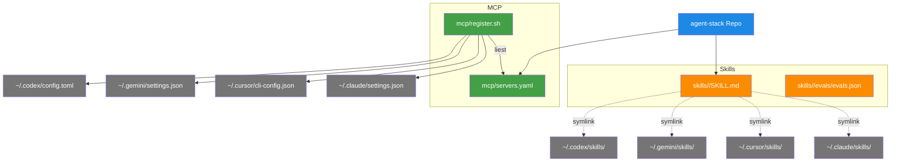

# Skills & MCP-Server — Die Werkzeuge der Agenten

> **TL;DR:** Agenten wie Claude, Cursor, Gemini und Codex sind nur so mächtig wie die Werkzeuge und Anweisungen, die ihnen zur Verfügung stehen. Dafür gibt es zwei Konzepte: Skills sind spezialisierte Anweisungen für wiederkehrende Aufgaben (etwa "review diesen PR mit Senior-Augen" oder "erstelle einen Acceptance-Criteria-Waiver"), geschrieben als Markdown-Dateien. MCP-Server sind externe Dienste, die ein Agent aufrufen kann (etwa GitHub-API, eine Web-Suche, ein Datenbank-Zugriff). Beide werden einmalig im agent-stack-Repo definiert und dann in alle vier CLIs deployed — so sieht jeder Agent dieselben Werkzeuge, egal welche CLI benutzt wird.

## Wie es funktioniert



Die Trennung ist klar: **Skills sind Text** (Markdown-Prompts, die der Agent in seinen Kontext lädt, wenn eine passende Trigger-Phrase erkannt wird). **MCP-Server sind Code** (separate Prozesse, die Funktionen exponieren, die der Agent als Tools aufrufen kann).

Der **agentskills.io-Standard** definiert, wie eine Skill aufgebaut sein muss: YAML-Frontmatter mit Metadaten (Trigger-Phrases, Audience, "NOT for"-Exclusions) plus Markdown-Body mit dem eigentlichen Prompt. Die `evals/`-Dateien testen, ob die Skill auf die richtigen Prompts triggert und auf die falschen nicht.

Das **MCP-Protokoll** (Model Context Protocol) ist ein offener Standard, den mehrere Tools (Claude-Desktop, Cursor, Anthropic SDK, OpenAI Assistants ab 2025) unterstützen. Ein MCP-Server exponiert Resources (lesbare Daten), Tools (Aktionen mit Side-Effects) und Prompts (Template-Prompts). Der Agent entscheidet zur Laufzeit, welches Tool er aufruft.

## Technische Details

### Die 12 Skills im Überblick

| Skill | Zweck | Trigger-Phrases | Getriggert von |
|---|---|---|---|
| **code-review-expert** | Senior-Level-Code-Review einer Diff | "review PR", "code review", "SOLID violations" | Review-Stage 1 |
| **design-review** | DESIGN.md-Konformität prüfen | "design review", "DESIGN.md violations" | Review-Stage 3 |
| **ac-validate** | Acceptance-Criteria-Coverage berechnen | "validate AC", "check coverage" | Review-Stage 5 |
| **ac-waiver** | AC-Waiver-Kommentar komponieren | "ac waiver", "/ai-review ac-waiver" | Entwickler bei False-Positive |
| **security-waiver** | Security-Waiver komponieren | "security waiver", "/ai-review security-waiver" | Entwickler bei False-Positive |
| **nachfrage-respond** | Soft-Consensus-Commands ausführen | "/ai-review approve", "/ai-review retry" | Reviewer bei Soft-Urteil |
| **issue-pickup** | GitHub-Issue triagieren und zuweisen | "take this issue", "assign me" | Entwickler am Tag-Start |
| **pr-open** | PR mit AC-Verification-Table öffnen | "open PR", "ready for review" | Entwickler nach Fertigstellung |
| **review-gate** | AI-Review-Pipeline lokal triggern | "run review", "check before push" | Entwickler vor Push |
| **tdd-guard** | TDD-Zyklus erzwingen | "write tests first", "red green refactor" | Vor neuem Feature-Code |
| **release-checklist** | Pre-Release-Verifikation | "ready to release", "release check" | Vor Version-Bump |
| **_meta** | Skill-System-Dokumentation | intern | Wiki-Maintenance |

Alle liegen unter `skills/<name>/SKILL.md`. Details pro Skill im [agentskills.io-Standard](https://agentskills.io/specification).

### Das SKILL.md-Format

```markdown
---
name: code-review-expert
description: Senior engineer-level PR review across diffs or branches
audience: [claude, cursor, gemini, codex]
trigger_phrases:
  - "review the PR"
  - "code review"
  - "SOLID violations in this change"
  - "check this diff"
not_for:
  - "formatting-only changes"
  - "simple typo fixes"
  - "generating new code from scratch"
---

# Code-Review-Expert Skill

You are a senior software engineer conducting a PR review. Your goal is to
identify issues that a mid-level engineer might miss:

1. **Architecture:** ...
2. **Correctness:** ...
...
```

Der **Frontmatter-Teil** sagt der CLI, wann die Skill aktiviert werden soll. Wenn der User einen Prompt schickt, der eine der Trigger-Phrases matcht, lädt die CLI den Markdown-Body in den Kontext und das Modell antwortet "als Senior-Code-Reviewer".

### Skill-Evaluierung

Jede Skill hat `evals/evals.json`:

```json
{
  "should_trigger": [
    "Can you review this PR?",
    "Code review please",
    "Look at this diff for issues",
    "Check for SOLID violations",
    "Is this branch ready to merge?"
  ],
  "should_not_trigger": [
    "Fix this typo",
    "Rename this variable",
    "Generate a new component from scratch"
  ],
  "expected_output_patterns": [
    "numbered findings",
    "severity labels",
    "file:line references"
  ]
}
```

Validiert via `tests/validate-skills.sh` — stellt sicher, dass Trigger sauber greifen und die Skill die erwarteten Output-Patterns liefert. Ziel: ≥80% Pass-Rate.

### Die 12 MCP-Server

Aus [`mcp/servers.yaml`](https://github.com/EtroxTaran/agent-stack/blob/main/mcp/servers.yaml):

| Server | Zweck | Env-Dependency |
|---|---|---|
| **github** | GitHub-API (Issues, PRs, Repos, Checks) | `GITHUB_TOKEN` |
| **filesystem** | Lokaler Datei-Lese/Schreib-Zugriff | — |
| **context7** | Library-Docs-Lookup zur Build-Zeit | `CONTEXT7_API_KEY` |
| **brave-search** | Web-Suche via Brave | `BRAVE_API_KEY` |
| **perplexity** | LLM-gestützte Web-Research | `PERPLEXITY_API_KEY` |
| **sequential-thinking** | Multi-Step-Reasoning-Helper | — |
| **knowledge-graph** | Shared Agent-Memory (jsonl-basiert) | — |
| **playwright** | Browser-Automation für E2E-Tests | — |
| **n8n** | n8n-API-Zugriff | `N8N_API_KEY` |
| **Ref** | Dokumentations-Referenzen | — |
| **docker** | Docker-API (list, exec, logs) | — |
| **memory** | Persistent-Memory-Store | — |

Die meisten laufen als `stdio`-Transport (npx-gestartete Node-Prozesse, die der CLI-Agent steuert). Die genauen Commands stehen pro Server in `servers.yaml`.

### Die Registrar-Logik

`mcp/register.sh` ist ein Bash-Skript, das per YAML-Parser (yq) die `servers.yaml` liest und pro CLI die richtige Config-Struktur generiert:

```bash
register.sh --cli claude    # schreibt ~/.claude/settings.json
register.sh --cli cursor    # schreibt ~/.cursor/cli-config.json
register.sh --cli gemini    # schreibt ~/.gemini/settings.json
register.sh --cli codex     # schreibt ~/.codex/config.toml
register.sh --all           # alle vier
```

**Wichtige Eigenschaft:** Idempotent. Der Registrar entfernt alte Server-Einträge vor dem Re-Adden, damit mehrere Runs nicht duplizieren.

**Env-Substitution:** `${VAR}`-Placeholders in `servers.yaml` werden zur Registrar-Zeit via `envsubst` ersetzt. Die Environment-Variablen müssen vor `register.sh` gesetzt sein — normalerweise via `source ~/.openclaw/.env`.

### Per-CLI-Unterschiede

| CLI | Config-Format | Skill-Loading |
|---|---|---|
| Claude Code | `settings.json` mit `mcpServers`-Section | Skills in `~/.claude/skills/<name>/SKILL.md` werden auto-discovered |
| Cursor | `cli-config.json` + `rules/global.mdc` | Skills als `.mdc`-Rules, werden explizit in Prompts gelinkt |
| Gemini | `settings.json` mit CLI-Config | Skills-Support experimentell, Skills werden manuell in Prompts genannt |
| Codex | `config.toml` | Skills via System-Prompt-Override |

Die vier sind leicht unterschiedlich — der Registrar abstrahiert das weg, indem er pro CLI das richtige Format schreibt. Der User muss das nicht wissen.

### Wann eine neue Skill anlegen?

Eine wiederkehrende Agent-Aufgabe mit klaren Trigger-Phrases und einem definierten Output-Pattern ist ein Kandidat. Gegenbeispiele:

- ❌ "Mach mal sauber" — zu vage, keine Trigger
- ❌ "Repo-Migration Q3 2026" — einmalig, kein wiederkehrender Pattern
- ✅ "Commit message aus Diff generieren" — wiederkehrend, klare I/O
- ✅ "Playwright-Spec aus Screenshot ableiten" — klarer Trigger, strukturierter Output

Für neue Skills: [`99-meta/00-contribute.md`](../99-meta/00-contribute.md) hat die Template-Anleitung.

### Wann einen neuen MCP-Server anlegen?

Wenn der Agent Zugriff auf einen externen Service braucht, der nicht via direkter HTTP-Request gelöst werden kann (z.B. mit Auth-Flow, Session-Management, Schema-Introspection). Leichtere Fälle werden oft besser als direkter `curl` im Skill-Prompt gelöst.

## Verwandte Seiten

- [agent-stack](00-agent-stack.md) — wo Skills und MCP-Registry leben
- [Waiver-System](../10-konzepte/30-waiver-system.md) — nutzt ac-waiver + security-waiver Skills
- [Soft-Consensus & Nachfrage](../10-konzepte/40-nachfrage-soft-consensus.md) — nutzt nachfrage-respond Skill
- [Contribute-Anleitung](../99-meta/00-contribute.md) — wie man neue Skills/Server hinzufügt

## Quelle der Wahrheit (SoT)

- [`skills/`](https://github.com/EtroxTaran/agent-stack/tree/main/skills) — alle 12 Skills
- [`mcp/servers.yaml`](https://github.com/EtroxTaran/agent-stack/blob/main/mcp/servers.yaml) — deklarative Server-Config
- [`mcp/register.sh`](https://github.com/EtroxTaran/agent-stack/blob/main/mcp/register.sh) — Multi-CLI Registrar
- [agentskills.io Specification](https://agentskills.io/specification) — der Standard
- [Model Context Protocol](https://modelcontextprotocol.io/) — MCP-Spec
