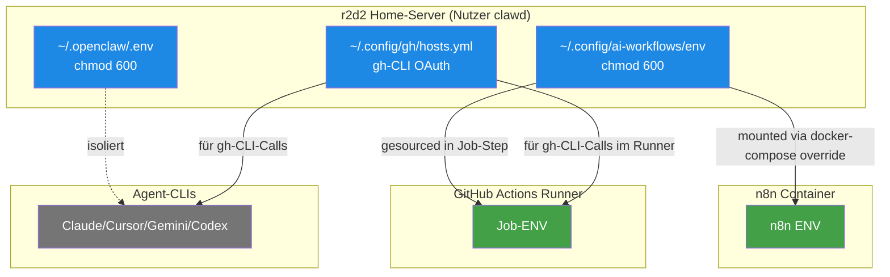

# Secrets & Env — Wo welche Credentials leben

> **TL;DR:** Die Toolchain nutzt zwei getrennte Credential-Domänen, die sich gegenseitig nicht sehen. Die AI-Workflows-Domäne enthält Tokens und IDs für alles, was mit Discord, GitHub-Actions-Dispatch und der Review-Pipeline zu tun hat — sie lebt in einer 600-Mode-Datei im User-Config-Verzeichnis. Die OpenClaw-Agent-Domäne (separat) enthält die Credentials für das persönliche Agent-Framework. Beide Domänen sind bewusst getrennt, damit eine Kompromittierung in einem Bereich nicht den anderen mitzieht. Keine Secrets im Git-Repo, keine in GitHub-Secrets — alles lokal auf r2d2.

## Wie es funktioniert



Die **Domain-Separation** ist die Kern-Entscheidung. Historisch gab es einen Vorfall, bei dem der AI-Workflows-Setup versehentlich die OpenClaw-env-Datei überschrieben hat — das Ergebnis war eine Mischung aus zwei sensiblen Secret-Sets, die nicht zusammen existieren sollten. Seitdem ist die Trennung strikt: Jede Domäne hat ihre eigene Datei, die Scripts der einen Domäne editieren niemals die der anderen.

Der **Locality-Vorteil**: Alle Secrets bleiben auf r2d2. Die Review-Pipeline läuft auf dem Self-hosted-Runner, der die lokalen env-Dateien sourcen kann. Der n8n-Container bekommt die env-Datei via Docker-Compose-Override gemountet. GitHub-Actions in der Cloud braucht die Secrets nicht — sie hat keinen Grund, den Discord-Bot-Token oder den Runner-Scope-Token zu kennen.

## Technische Details

### Die AI-Workflows-Domäne

**Datei:** `/home/clawd/.config/ai-workflows/env` (600-Mode, nur `clawd` lesbar)

**Inhalt (14 Keys, nur Namen — NIEMALS Werte hier auflisten):**

```bash
# Discord-Integration
DISCORD_BOT_TOKEN=<72 chars>
DISCORD_APPLICATION_ID=<19 chars>
DISCORD_PUBLIC_KEY=<64 hex chars>
DISCORD_GUILD_ID=<19 chars>
DISCORD_ALERTS_CHANNEL_ID=<19 chars>
DISCORD_CHANNEL_AI_PORTAL=<19 chars>
DISCORD_CHANNEL_AI_PORTAL_SHADOW=<19 chars>
DISCORD_CHANNEL_AI_REVIEW_PIPELINE=<19 chars>
DISCORD_CHANNEL_AI_REVIEW_PIPELINE_SHADOW=<19 chars>
DISCORD_CHANNEL_AGENT_STACK=<19 chars>
DISCORD_CHANNEL_AGENT_STACK_SHADOW=<19 chars>

# GitHub
GITHUB_TOKEN=<40 chars, classic PAT mit admin-repo scope>
GITHUB_REPO=EtroxTaran/ai-review-pipeline
GITHUB_TARGET_REPO=EtroxTaran/ai-portal
```

**Permissions-Check:**

```bash
$ ls -la /home/clawd/.config/ai-workflows/env
-rw------- 1 clawd clawd 1155 Apr 20 22:03 /home/clawd/.config/ai-workflows/env
```

**Backup-Strategie:** Keine automatischen Cloud-Backups (= keine Leak-Gefahr). Manuelles Backup empfohlen bei größeren Token-Rotationen, in einen verschlüsselten Passwort-Manager.

### Die OpenClaw-Domäne

**Datei:** `/home/clawd/.openclaw/.env` (600-Mode)

Diese Domäne ist **nicht Teil dieses Wikis** — sie gehört zum OpenClaw-Agent-Framework, das parallel zur AI-Review-Toolchain existiert. Das Wiki dokumentiert sie nur zur Abgrenzung: Sie enthält eigene LLM-API-Keys, Datenbank-Credentials für den Agent-State, und Keys für Dienste, die OpenClaw-Agents nutzen. Die AI-Review-Pipeline greift nicht auf diese Datei zu.

Details zu OpenClaw: `~/.openclaw/workspace/AGENTS.md` (lokal).

### Die gh-CLI-Auth

Der `gh`-CLI-Login liegt in `~/.config/gh/hosts.yml`:

```yaml
github.com:
  user: EtroxTaran
  oauth_token: <redacted>
  git_protocol: https
```

Das wird bei `gh auth login` gesetzt und ist der Standard-Weg für alle `gh`-Calls. Der Runner und die CLIs nutzen denselben Login.

**Abgrenzung zu `GITHUB_TOKEN` in der env-Datei:**

- `GITHUB_TOKEN` (in ai-workflows/env): Ein explizites PAT, das in n8n-Workflows zum Triggern von `workflow_dispatch` genutzt wird. Muss `repo` + `workflow` scope haben
- `gh-CLI-Auth`: Nutzer-interaktiver Login, der beim `gh pr create`, `gh run list` etc. automatisch gezogen wird

Beide sind legitim — Use-Case-Trennung.

### Wie n8n die env-Datei bekommt

Via Docker-Compose-Override in [`ops/compose/n8n-ai-review.override.yml`](https://github.com/EtroxTaran/agent-stack/blob/main/ops/compose/n8n-ai-review.override.yml):

```yaml
services:
  n8n-portal:
    env_file:
      - /home/clawd/.openclaw/.env           # bestehend, für legacy Vars
      - /home/clawd/.config/ai-workflows/env # neu, für AI-Review
```

Die Vars werden beim Container-Start ins Env gemerged. `docker-compose up --force-recreate` ist erforderlich, wenn die env-Datei sich ändert — normaler Restart reicht nicht, weil die Container-Env unveränderlich nach Start ist.

Helfer-Skript: [`ops/scripts/restart-n8n-with-ai-review.sh`](https://github.com/EtroxTaran/agent-stack/blob/main/ops/scripts/restart-n8n-with-ai-review.sh).

### Wie der Runner die env-Datei bekommt

Die Runner-Jobs sourcen die env-Datei explizit, wenn sie Credentials brauchen:

```yaml
# In .github/workflows/ai-review-v2-shadow.yml:
- name: Source AI-Workflows env
  run: |
    set -a
    source /home/clawd/.config/ai-workflows/env
    set +a
    echo "DISCORD_ALERTS_CHANNEL_ID=$DISCORD_ALERTS_CHANNEL_ID" >> $GITHUB_ENV
```

Aktuell ist das noch nicht in allen Workflows — einige werden einfach implizit ausgeführt, weil der Runner-User `clawd` ist und die env-Vars nicht explizit per Workflow gepushed werden müssen, wenn die Pipeline direkt ohne GITHUB_ENV-Export läuft.

### Token-Rotation

Jedes Token wird nach einem anderen Zeitplan rotiert:

| Token | Rotations-Grund | Wie |
|---|---|---|
| `DISCORD_BOT_TOKEN` | bei Verdacht auf Leak, oder nach Schema-Änderung im Bot | Discord Dev Portal → Bot → "Reset Token" → env updaten → Container recreate |
| `DISCORD_PUBLIC_KEY` | bei Verdacht auf Kompromittierung (sehr selten) | Dev Portal → General → "Reset Public Key" |
| `GITHUB_TOKEN` | alle 12 Monate oder bei Verdacht | GitHub Settings → Developer Settings → PAT → regenerate |
| `GITHUB_TOKEN` als fine-grained | User-Entscheidung 2026-04-21: aktuell classic PAT ist OK | — |
| OAuth-Credentials (Codex/Cursor/Gemini) | auto-refreshed vom CLI | `gh codex login` etc. |

Ausführliches Runbook: [`50-runbooks/50-token-rotation.md`](../50-runbooks/50-token-rotation.md).

### Was NICHT in env-Dateien gehört

- **Anthropic-API-Key** für den Portal-Container: Liegt in n8n-Credentials, niemals im Container-env (siehe `ai-portal/CLAUDE.md` Env-Var-Discipline)
- **Telegram-Bot-Token:** Ausrangiert, gehört nicht mehr in die AI-Review-Toolchain
- **OAuth-Access-Tokens für Google Drive/Gmail:** Liegen in n8n-Credentials, nicht in env

### Secret-Leak-Prevention

Drei Schichten:

1. **`.gitignore`:** Alle `.env`-Pattern sind repo-weit ignoriert. `.env.example` ist OK (listet nur Key-Namen, keine Werte)
2. **gitleaks-Scan:** CI-Workflow prüft jede Commit auf Secret-Patterns
3. **Wiki-Regel:** Niemals Token-Werte in Docs oder Commit-Messages — nur Längen und Struktur-Info

Die Wiki-Prose-Regel dazu steht im [Style-Guide](../99-meta/10-style-guide.md).

## Verwandte Seiten

- [Discord-Bridge](40-discord-bridge.md) — was die Discord-Vars steuern
- [Self-hosted Runner](60-self-hosted-runner.md) — wo der Runner die env-Datei sourct
- [n8n Workflows](30-n8n-workflows.md) — wie n8n die env bekommt
- [Token-Rotation-Runbook](../50-runbooks/50-token-rotation.md) — Schritt-für-Schritt
- [Env-Variablen-Referenz](../70-reference/10-env-variables.md) — alle Vars mit Zwecken

## Quelle der Wahrheit (SoT)

- `/home/clawd/.config/ai-workflows/env` — die echte Datei auf r2d2 (nicht im Repo)
- [`ops/compose/n8n-ai-review.override.yml`](https://github.com/EtroxTaran/agent-stack/blob/main/ops/compose/n8n-ai-review.override.yml) — Mount-Config
- [`.env.example`](https://github.com/EtroxTaran/agent-stack/blob/main/.env.example) — Template mit Keys ohne Werte
- [`AGENTS.md §10 Security Guardrails`](https://github.com/EtroxTaran/agent-stack/blob/main/AGENTS.md) — globale Secrets-Regel
