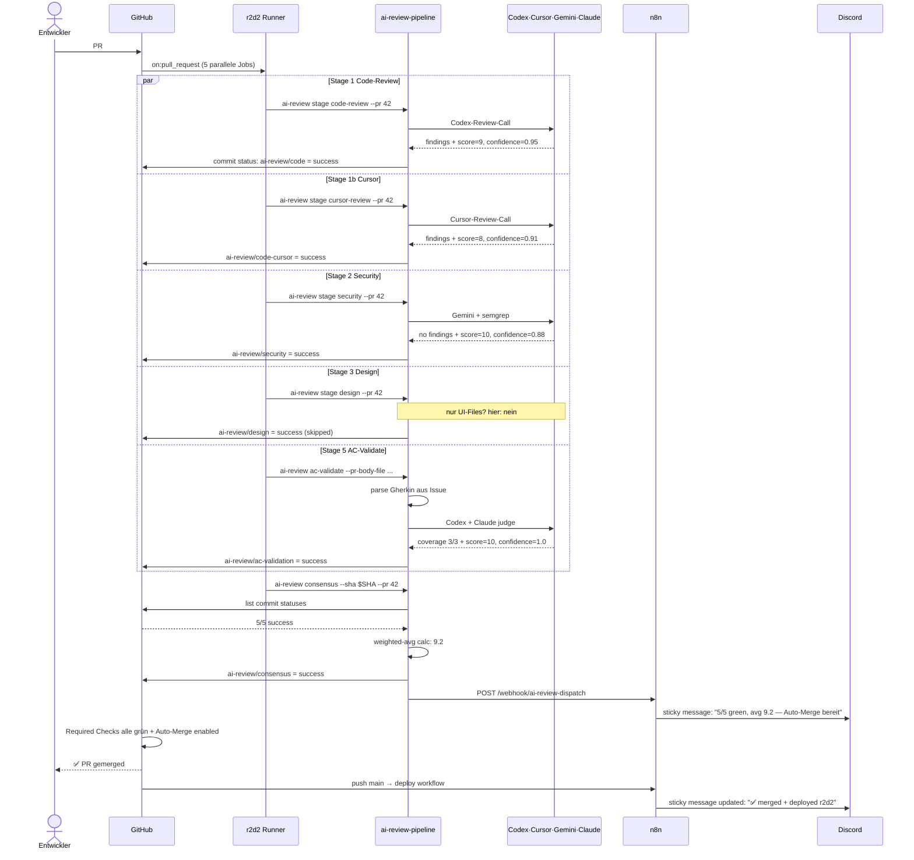

# Neuer PR End-to-End — Von Entwurf bis Auto-Merge

> **TL;DR:** Wenn ein Entwickler einen Pull-Request öffnet, startet eine Kette automatisierter Schritte, die normalerweise innerhalb von 2–4 Minuten abgeschlossen ist. Fünf KI-Modelle prüfen den Code parallel, eine Aggregation verrechnet die Einzelurteile zu einem Gesamt-Score, und bei klarem Ergebnis wird der PR automatisch gemerged — ohne dass ein Mensch manuell eingreifen muss. Der Entwickler bekommt zuerst eine Discord-Nachricht mit dem Urteil, der Merge passiert im Hintergrund, und am Ende steht nur noch die Benachrichtigung "deployed" im Channel.

## Wie es funktioniert



Der Flow hat vier Phasen:

1. **Trigger:** GitHub erkennt das PR-Event und dispatcht fünf Jobs an den Self-hosted-Runner. Alle laufen parallel, weil sie voneinander unabhängig sind.
2. **Review:** Jede Stage ruft ihr Modell, erzeugt ein Urteil, schreibt es als GitHub-Commit-Status.
3. **Consensus:** Ein sechster Job wartet, bis alle fünf terminiert sind (via `needs:`), aggregiert die Scores, und setzt den finalen Consensus-Status.
4. **Merge + Deploy:** Branch-Protection sieht alle Required Checks grün, Auto-Merge (wenn aktiviert) triggert den eigentlichen Merge. Ein separater Deploy-Workflow fasst den frischen main-Stand und deployed auf r2d2.

Die **Parallelität** ist der Grund, warum das Ganze in 2–4 Minuten läuft statt in 10–20. Jeder Review-Call dauert 30–90 Sekunden; sequenziell wären das 5×60s = 5 Minuten nur für Stages. Parallel ist es 1×90s für die langsamste Stage plus 10s Consensus-Overhead.

## Technische Details

### Trigger-Events

Die Pipeline reagiert auf:
- `pull_request.opened`
- `pull_request.synchronize` (neuer Commit auf PR-Branch)
- `pull_request.reopened`

Nicht auf `pull_request.labeled` oder `pull_request.edited` — das würde bei reinen Metadaten-Änderungen unnötig Stages triggern.

Concurrency-Gruppe pro PR:

```yaml
concurrency:
  group: ai-review-v2-shadow-${{ github.event.pull_request.number }}
  cancel-in-progress: true
```

Das `cancel-in-progress` sorgt dafür: Wenn der Entwickler während eines laufenden Review-Zyklus einen neuen Commit pusht, wird der alte Run sofort abgebrochen und ein neuer gestartet. Keine doppelten Reviews auf stale Commits.

### Commit-Status-Contexts

Jeder Job schreibt **genau einen** Status pro PR-HEAD-SHA:

| Job | Context | Mögliche States |
|---|---|---|
| code-review | `ai-review/code` | success / pending / failure |
| cursor-review | `ai-review/code-cursor` | success / pending / failure / success-with-note="rate-limit" |
| security-review | `ai-review/security` | success / pending / failure |
| design-review | `ai-review/design` | success / pending / success-with-note="skipped" |
| ac-validate | `ai-review/ac-validation` | success / pending / failure |
| consensus | `ai-review/consensus` | success / pending / failure |

Das Präfix `ai-review/*` ist produktiv und required. Der historische Shadow-Präfix `ai-review-v2/*` existiert seit dem Phase-5-Cutover (2026-04-24) nicht mehr. Details: [`70-reference/20-status-contexts.md`](../70-reference/20-status-contexts.md).

### Die Consensus-Aggregation im Detail

```python
# Vereinfacht, aus consensus.py:
statuses = gh_api.list_commit_statuses(sha)
relevant = [s for s in statuses if s.context.startswith(f"{prefix}/")]

if len(relevant) < 5 or any(s.state == "pending" for s in relevant):
    return "pending"  # Fail-Closed

scores = [parse_score(s.description) for s in relevant]
confidences = [parse_confidence(s.description) for s in relevant]

weighted_sum = sum(score * conf for score, conf in zip(scores, confidences))
total_weight = sum(confidences)
avg = weighted_sum / total_weight if total_weight > 0 else 0

if avg >= 8:  state = "success"
elif avg >= 5: state = "pending"  # soft
else:          state = "failure"
```

Code: [`src/ai_review_pipeline/consensus.py`](https://github.com/EtroxTaran/ai-review-pipeline/blob/main/src/ai_review_pipeline/consensus.py).

### Auto-Merge-Voraussetzungen

Damit der Auto-Merge greift, müssen **alle** folgenden Bedingungen erfüllt sein:

1. **Branch-Protection:** Alle Required Checks in `main`-Protection grün (→ siehe [`20-komponenten/20-ai-portal-integration.md`](../20-komponenten/20-ai-portal-integration.md) für die Liste)
2. **Auto-Merge aktiviert:** `gh pr merge 42 --auto --squash` wurde beim Öffnen oder später auf dem PR gemacht
3. **Approver-Review:** Falls die Protection "Require at least N approving reviews" verlangt, muss eine Review da sein. Im ai-portal-Setup ist das nicht der Fall — dort reichen die CI-Checks
4. **Kein Conflict:** PR ist rebaseable/mergeable (kein Merge-Conflict mit main)

Ist Auto-Merge nicht aktiviert, bleibt der PR trotz grüner Checks offen und wartet auf manuellen Merge.

### Post-Merge: Der Deploy-Workflow

Nach dem Merge läuft ein separater Workflow (in ai-portal: [`deploy.yml`](https://github.com/EtroxTaran/ai-portal/blob/main/.github/workflows/deploy.yml)):

1. Checkout von `main`
2. Docker-Compose-Build auf r2d2 via SSH-Tunnel
3. `docker compose up -d --wait` — health-gatete Replacement
4. Post-Deploy Playwright-Smoke-Tests (`docker-auth.smoke.spec.ts`)
5. Bei Fehler: Auto-Rollback via `docker-compose.rollback.yml`

Details in [ADR-018](https://github.com/EtroxTaran/ai-portal/blob/main/docs/v2/10-adr/ADR-018-cicd-deploy-pipeline.md).

### Zeiten: Was dauert wie lange?

Beispiel aus dem Shadow-Run #24853468198:

| Phase | Dauer |
|---|---|
| GitHub-Event → Runner-Pickup | ~3s |
| `actions/checkout` | 5–10s |
| `pip install --force-reinstall --no-deps` | 3–5s |
| `pip install` (Deps, cached) | 1s |
| Stage-Run (Codex, Cursor, Gemini oder Claude Call) | 30–90s |
| `semgrep`-Scan (nur Security-Stage) | 10–40s |
| Status-Post zu GitHub | <1s |
| Consensus-Job Wait + Aggregation | 10–30s |
| Discord-Post | 1–2s |
| Auto-Merge-Trigger | <5s |
| Deploy-Workflow | 2–5 Min |

**Total für Review-Zyklus** (ohne Deploy): ~2 Minuten bei Cache-Hit, ~4 Minuten bei Cold-Start. Deploy dauert weitere 2–5 Minuten.

### Was geht schief

Typische Abweichungen vom Happy-Path:

| Symptom | Wahrscheinliche Ursache | Runbook |
|---|---|---|
| Eine Stage bleibt auf `pending` > 5 Min | Runner offline oder Rate-Limit | [`50-runbooks/20-runner-offline.md`](../50-runbooks/20-runner-offline.md) |
| `ai-review/consensus = pending` obwohl alle 5 Stages success | Consensus-Job zu früh gelaufen | [`50-runbooks/40-consensus-stuck-pending.md`](../50-runbooks/40-consensus-stuck-pending.md) |
| Stage schlägt sofort mit `FileNotFoundError` fehl | Prompts nicht im Wheel, pip-skip-Install | [`50-runbooks/30-pip-install-bricht.md`](../50-runbooks/30-pip-install-bricht.md) |
| Keine Discord-Nachricht | n8n offline oder DB-Korruption | [`50-runbooks/10-n8n-db-korruption.md`](../50-runbooks/10-n8n-db-korruption.md) |
| Soft-Consensus 5–7 statt success | Modelle uneinig — echtes Urteil, nicht Bug | [`10-konzepte/40-nachfrage-soft-consensus.md`](../10-konzepte/40-nachfrage-soft-consensus.md) |

## Verwandte Seiten

- [AI-Review-Pipeline (Konzept)](../10-konzepte/00-ai-review-pipeline.md) — die 5 Stages
- [Consensus-Scoring](../10-konzepte/10-consensus-scoring.md) — wie aggregiert wird
- [Button-Click-Callback](10-button-click-callback.md) — was beim Reviewer-Klick passiert
- [Eskalation nach 30 Min](20-escalation-30-min.md) — wenn die Rückfrage unbeantwortet bleibt
- [Shadow-zu-Produktion Cutover](40-shadow-zu-produktion-cutover.md) — der Migrations-Flow

## Quelle der Wahrheit (SoT)

- [`ai-portal/.github/workflows/ai-review-v2-shadow.yml`](https://github.com/EtroxTaran/ai-portal/blob/main/.github/workflows/ai-review-v2-shadow.yml) — der Shadow-Workflow
- [`src/ai_review_pipeline/consensus.py`](https://github.com/EtroxTaran/ai-review-pipeline/blob/main/src/ai_review_pipeline/consensus.py) — Aggregations-Code
- [ADR-018](https://github.com/EtroxTaran/ai-portal/blob/main/docs/v2/10-adr/ADR-018-cicd-deploy-pipeline.md) — Auto-Merge-Entscheidung
