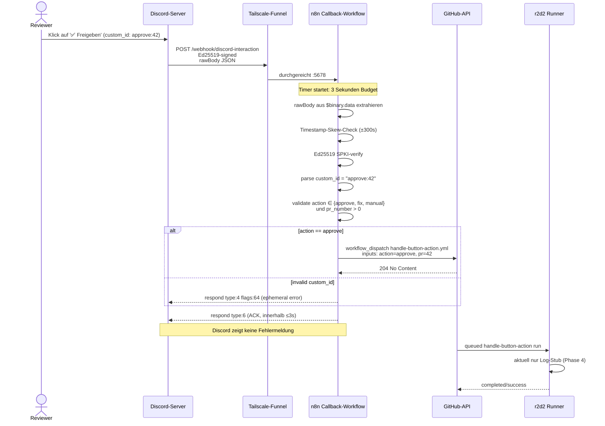

# Button-Click-Callback — Von Discord zur GitHub-Action

> **TL;DR:** Wenn ein Reviewer in Discord einen der drei Buttons einer Review-Nachricht klickt, läuft ein kryptographisch verifizierter Flow los: Die Discord-Server schicken eine signierte HTTP-Anfrage an den öffentlichen Tailscale-Endpoint, n8n prüft die Ed25519-Signatur und den Timestamp, parst die Button-ID zu einer Aktion plus PR-Nummer, und triggert einen GitHub-Actions-Workflow, der die Aktion ausführt. Das Ganze muss in unter drei Sekunden passieren, sonst zeigt Discord dem Reviewer "This interaction failed". Fehlerfall-Resilienz ist daher Kernanforderung: Selbst wenn GitHub API gerade hakt, kommt das Discord-ACK rechtzeitig zurück.

## Wie es funktioniert



Der Flow hat drei kritische Eigenschaften:

1. **Sicherheits-Validierung:** Jede Anfrage wird kryptographisch verifiziert. Ohne eine gültige Discord-Signatur und einen frischen Timestamp wird sie abgelehnt. Das verhindert Replay-Attacken und gefälschte Requests.
2. **3-Sekunden-Garantie:** Discord erwartet innerhalb 3 Sekunden ein ACK. Deshalb ist der GitHub-Dispatch mit `retryOnFail` + `neverError: true` konfiguriert — wenn GitHub hängt, kommt trotzdem das ACK rechtzeitig zurück. Der GitHub-Call wird asynchron noch retried.
3. **Keine Persistenz:** Der Callback-Workflow hält keinen State. Alles, was er braucht, steckt in der Signatur + Timestamp + custom_id. Wenn n8n neu startet, läuft beim nächsten Klick einfach wieder der Workflow — keine Recovery-Logik nötig.

## Technische Details

### Die Anatomie einer Discord-Interaction-Request

```http
POST https://r2d2.tail4fc6dd.ts.net/webhook/discord-interaction HTTP/1.1
Content-Type: application/json
X-Signature-Ed25519: <128-hex-chars>
X-Signature-Timestamp: <unix-seconds>

{
  "id": "1234567890",
  "application_id": "1472703891371069511",
  "type": 3,
  "data": {
    "custom_id": "approve:42",
    "component_type": 2
  },
  "member": {
    "user": {
      "id": "987654321",
      "username": "NicoR"
    }
  },
  "token": "<interaction-token>",
  "version": 1
}
```

**Signatur-Formel:**

```
msg_bytes = (timestamp + raw_body).encode('utf-8')
signature_bytes = ed25519_sign(private_key, msg_bytes)   # bei Discord gemacht
                ^
                verify auf unserem Ende mit Discord's public_key
```

### Die Verify-Logik im Detail

Aus dem Code-Node "Verify + Route" im Callback-Workflow:

```javascript
const crypto = require('crypto');
const MAX_TIMESTAMP_SKEW_SEC = 300;
const VALID_ACTIONS = new Set(['approve', 'fix', 'manual']);

// 1. rawBody extrahieren (flexibel für Buffer, base64, oder String)
let rawBody = '';
if (binaryPart.data) {
  const d = binaryPart.data;
  if (Buffer.isBuffer(d)) rawBody = d.toString('utf8');
  else if (typeof d === 'string') rawBody = Buffer.from(d, 'base64').toString('utf8');
  else if (d.data) rawBody = Buffer.isBuffer(d.data)
    ? d.data.toString('utf8')
    : Buffer.from(d.data, 'base64').toString('utf8');
}
if (!rawBody && typeof jsonPart.body === 'string') rawBody = jsonPart.body;
if (!rawBody && jsonPart.body) rawBody = JSON.stringify(jsonPart.body);

// 2. Parse
let body = {};
try { body = JSON.parse(rawBody || '{}'); } catch (e) {}

// 3. Timestamp-Skew-Check
const tsNum = parseInt(timestamp, 10);
const nowSec = Math.floor(Date.now() / 1000);
if (!Number.isFinite(tsNum) || Math.abs(nowSec - tsNum) > MAX_TIMESTAMP_SKEW_SEC) {
  return [{ json: { _route: 'reject', _response: { error: 'invalid_timestamp' }, _status: 401 } }];
}

// 4. Ed25519-Verify mit SPKI-Prefix
const SPKI_ED25519_PREFIX = Buffer.from('302a300506032b6570032100', 'hex');
const pub = Buffer.from(publicKey, 'hex');
const sig = Buffer.from(signature, 'hex');
const msg = Buffer.from(timestamp + rawBody, 'utf8');
const verifyOk = crypto.verify(
  null, msg,
  { key: Buffer.concat([SPKI_ED25519_PREFIX, pub]), format: 'der', type: 'spki' },
  sig
);

if (!verifyOk) {
  return [{ json: { _route: 'reject', _response: { error: 'invalid_signature' }, _status: 401 } }];
}

// 5. Type-Routing
if (body.type === 1) {
  // PING — Discord Dev-Portal Save
  return [{ json: { _route: 'pong', _response: { type: 1 } } }];
}

if (body.type === 3) {
  // MESSAGE_COMPONENT (Button-Klick)
  const customId = body.data?.custom_id ?? '';
  const [actionRaw, prRaw] = customId.split(':');
  const action = (actionRaw ?? '').toLowerCase().trim();
  const prNumber = parseInt(prRaw ?? '', 10);

  if (!VALID_ACTIONS.has(action) || !Number.isFinite(prNumber) || prNumber <= 0) {
    return [{ json: { _route: 'reject', _response: { type: 4, data: { content: `Unknown action \`${customId}\``, flags: 64 } }, _status: 200 } }];
  }

  return [{ json: {
    _route: 'dispatch',
    _response: { type: 6 },  // deferred ack — Discord zeigt sofort "thinking..."
    _dispatch: { action, pr_number: prNumber, user_id: body.member?.user?.id }
  } }];
}
```

### Die SPKI-Prefix-Konstante

`302a300506032b6570032100` ist der ASN.1-DER-kodierte SubjectPublicKeyInfo-Header für einen Ed25519-Public-Key (laut RFC 8410). Ohne diesen Prefix weigert sich Node's `crypto.verify`, den raw-32-byte-Public-Key zu verstehen.

Alternative `crypto.subtle.verify` war in verschiedenen Node-Versionen unzuverlässig; `crypto.verify` mit explizitem SPKI-Wrap ist deterministisch.

### GitHub-Dispatch-Konfiguration

Der HTTP-Request-Node zum GitHub-API:

```json
{
  "method": "POST",
  "url": "https://api.github.com/repos/EtroxTaran/ai-review-pipeline/actions/workflows/handle-button-action.yml/dispatches",
  "headers": {
    "Authorization": "Bearer {{ $env.GITHUB_TOKEN }}",
    "Accept": "application/vnd.github+json",
    "X-GitHub-Api-Version": "2022-11-28"
  },
  "body": {
    "ref": "main",
    "inputs": {
      "action": "{{ $json._dispatch.action }}",
      "pr_number": "{{ $json._dispatch.pr_number }}",
      "user_id": "{{ $json._dispatch.user_id }}"
    }
  },
  "options": {
    "retry": {"retryOnFail": true, "maxTries": 3, "waitBetweenTries": 2000},
    "response": {"neverError": true, "fullResponse": false}
  }
}
```

Die **`retryOnFail`** + **`neverError`**-Kombination ist der Trick für die 3-Sekunden-Garantie: Wenn GitHub-API hakt, rennt der Retry-Loop asynchron weiter, der Respond-Node schickt aber schon längst ACK zurück.

### Der handle-button-action-Workflow

Im ai-review-pipeline-Repo: [`.github/workflows/handle-button-action.yml`](https://github.com/EtroxTaran/ai-review-pipeline/blob/main/.github/workflows/handle-button-action.yml):

```yaml
name: Handle Button Action
on:
  workflow_dispatch:
    inputs:
      action:
        type: string
        required: true
      pr_number:
        type: string
        required: true
      user_id:
        type: string
        required: true
jobs:
  dispatch:
    runs-on: ubuntu-latest
    steps:
      - name: Log the action
        run: |
          echo "Action: ${{ inputs.action }}"
          echo "PR: ${{ inputs.pr_number }}"
          echo "User: ${{ inputs.user_id }}"
      # Stand 2026-04-24: Log-Stub bewusst aktiv — Button-Actions werden noch nicht
      # automatisiert ausgeführt. Follow-up tracked in agent-stack-Issue #20 (Epic)
      # unter "Phase 2 — Audit-Trail & Visibility" bzw. "Phase 5 — Hardening".
```

In Phase 4 ist der Workflow ein **Stub** — er loggt nur, was geklickt wurde, ohne die Aktion auszuführen. Das reicht um den E2E-Flow zu validieren, ohne bei Bugs echte Merges/Retries auszulösen.

In Phase 5 wird der Stub durch echte Aktionen ersetzt:
- `approve` → `gh pr merge <pr> --squash`
- `fix` → `gh workflow run ai-review-v2-shadow.yml --ref <branch>` (re-triggert Stages)
- `manual` → Status-Context auf success setzen + Label "manually-approved"

### Das 3-Sekunden-Budget

| Schritt | Typische Dauer |
|---|---|
| Funnel-Proxy (Discord → r2d2) | ~100–300ms |
| n8n-Request-Parsing | ~10ms |
| `crypto.verify` | ~1–2ms |
| GitHub-Dispatch (async, geht trotzdem in Budget zählen) | ~500–1500ms |
| Respond-Node schreibt ACK | ~10ms |
| ACK zurück zu Discord (via Funnel) | ~100–300ms |
| **Total** | **~700–2200ms** |

Das Budget wird normalerweise zu 30% ausgereizt — genug Headroom für Jitter.

### Button-Actions, die derzeit nichts tun

Bis Phase 5 kommt, sind die Button-Klicks **beobachtbar, aber nicht wirksam**:
- Approve-Klick loggt die Action, merged aber (noch) nicht automatisch
- Fix-Klick loggt, re-triggert aber (noch) nicht die Stages
- Manual-Klick loggt, macht den PR aber (noch) nicht manuell-handled

Das ist Absicht — in der Shadow-Phase soll der Flow zwar komplett durchlaufen (als Proof-of-Concept), aber keine Produktions-Konsequenzen haben. Die Stub-Action macht den Unterschied zwischen "Flow funktioniert" und "Action würde gefährliches tun".

### Unit-Tests dieser Logik

Die JavaScript-Verify-Logik steht 1:1 in [`ops/n8n/tests/callback-logic.test.js`](https://github.com/EtroxTaran/agent-stack/blob/main/ops/n8n/tests/callback-logic.test.js) mit 13 Test-Cases:

- Gültige PING → pong
- Ungültige Signatur → 401
- Alter Timestamp (Replay) → 401 invalid_timestamp
- Zukünftiger Timestamp > 5min → 401
- Gültige Button-Clicks (3 Varianten)
- Case-insensitive Action
- Fehlerhafte custom_id (bogus:abc) → ephemeral error
- Unbekannte Action (delete:5) → rejected
- Negative PR-Nummer → rejected
- Unbekannter Interaction-Type → 400
- Leerer Body → invalid_signature
- Falscher Public-Key → invalid_signature

Details: [`60-tests/10-callback-unit-tests.md`](../60-tests/10-callback-unit-tests.md).

## Verwandte Seiten

- [Tailscale-Funnel](../20-komponenten/50-tailscale-funnel.md) — der öffentliche Endpoint
- [n8n Workflows](../20-komponenten/30-n8n-workflows.md) — der Callback-Workflow-Ort
- [Soft-Consensus & Nachfrage](../10-konzepte/40-nachfrage-soft-consensus.md) — wann die Buttons erscheinen
- [Callback-Unit-Tests](../60-tests/10-callback-unit-tests.md) — die 13 Test-Cases
- [Cutover Phase 4 → 5](40-cutover-phase-4-zu-5.md) — wenn die Stubs zu echten Actions werden

## Quelle der Wahrheit (SoT)

- [`ops/n8n/workflows/ai-review-callback.json`](https://github.com/EtroxTaran/agent-stack/blob/main/ops/n8n/workflows/ai-review-callback.json) — der n8n-Workflow
- [`ai-review-pipeline/.github/workflows/handle-button-action.yml`](https://github.com/EtroxTaran/ai-review-pipeline/blob/main/.github/workflows/handle-button-action.yml) — das Dispatch-Target
- [Discord Interactions API Reference](https://discord.com/developers/docs/interactions/receiving-and-responding) — offizielle Spec
- [RFC 8410 (Ed25519 SPKI)](https://datatracker.ietf.org/doc/html/rfc8410) — Key-Encoding-Spec
