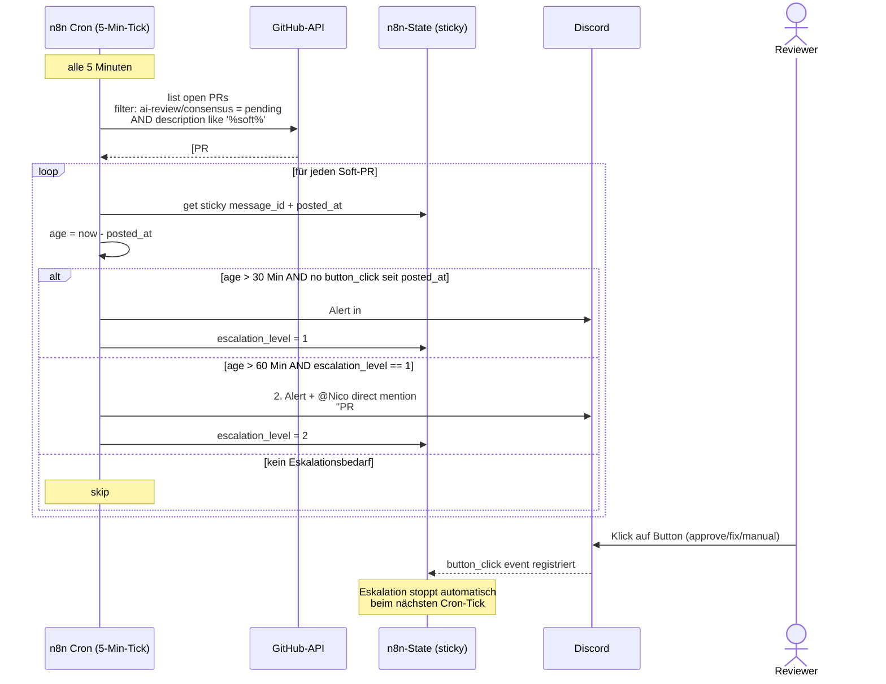

# Eskalation nach 30 Min — Wenn keiner klickt

> **TL;DR:** Wenn die Pipeline ein unklares Urteil fällt und niemand innerhalb von 30 Minuten auf die Nachfrage reagiert, wird automatisch ein lauterer Alert gesendet. Ein Cron-Job in n8n scannt alle 5 Minuten die offenen Pull-Requests, findet die mit nicht-beantworteter Soft-Consensus-Nachfrage, und postet in den Alerts-Channel mit `@here`-Mention. Das Ziel ist bewusst, den Status sichtbar zu machen: Ein PR darf nicht unbemerkt im Graubereich hängen bleiben. Nach weiteren 30 Min ohne Reaktion folgt eine zweite, noch lautere Eskalation.

## Wie es funktioniert



Die Eskalation ist **laut aber höflich**: Der erste Alert ist ein normaler `@here`-Ping im Alerts-Channel. Keine direkten Benachrichtigungen einzelner Personen, keine Notfall-SMS. Das ist bewusst — die meisten Soft-Consensus-Situationen sind keine Krisen, sondern einfach Situationen, die Aufmerksamkeit brauchen.

Der zweite Alert nach einer Stunde **mentioned Nico direkt** (als Repo-Owner), weil dann wirklich etwas hängt. Das zwingt zur Entscheidung: Entweder klicken, oder explizit per Kommentar erklären "arbeite gerade dran, Fortsetzung später".

Die **5-Minuten-Tick-Frequenz** ist ein Kompromiss: Kleiner (1 Min) wäre präziser, aber Overkill für einen Flow, bei dem 30 Min die Skala ist. Größer (15 Min) könnte den Alert um bis zu 15 Min verzögern. 5 Minuten hält die maximale Verzögerung bei <20% des Timeouts.

## Technische Details

### Der Cron-Trigger

In [`ops/n8n/workflows/ai-review-escalation.json`](https://github.com/EtroxTaran/agent-stack/blob/main/ops/n8n/workflows/ai-review-escalation.json) als Schedule-Node:

```json
{
  "parameters": {
    "rule": {
      "interval": [{"field": "minutes", "minutesInterval": 5}]
    }
  },
  "type": "n8n-nodes-base.scheduleTrigger",
  "typeVersion": 1.1
}
```

Alle 5 Minuten, 24/7. Kein Sleep bei Nacht — falls nachts ein PR eskaliert, wird im Channel gepingt, aber nicht per Handy — Discord-Notifications können User-seitig stummgeschaltet werden.

### Die GitHub-API-Query

Der PR-Filter nutzt die Commit-Status-API:

```bash
# Vereinfacht — n8n HTTP-Node Aufruf:
GET https://api.github.com/repos/EtroxTaran/ai-portal/pulls?state=open
→ liste aller offenen PRs

# Pro PR:
GET https://api.github.com/repos/.../commits/{sha}/status
→ filtere: context="ai-review/consensus" AND state="pending"
→ zusätzlich: description contains "soft"
```

Die `description`-Prüfung ist wichtig, weil `pending` auch "waiting for stages" bedeuten kann — nur Descriptions wie "2/5 green, avg 7.2 — requires human ack" zählen als Soft-Consensus.

### Die State-Tracking-Datei

n8n hat keinen eingebauten State zwischen Executions. Die Escalation nutzt eine einfache JSON-Datei als State:

```json
// /home/node/.n8n/ai-review-escalation-state.json
{
  "pr_42_sha_abc123": {
    "message_id": "1234567890",
    "posted_at": "2026-04-23T14:30:00Z",
    "last_button_click_at": null,
    "escalation_level": 0
  }
}
```

Der erste Escalation-Cron-Run nach dem Post legt den Eintrag an. Button-Klicks aktualisieren `last_button_click_at`. Der Cron liest immer den aktuellen State, entscheidet pro PR, updated wenn nötig.

Alternative wäre eine SQLite-Tabelle in der n8n-DB, aber das ist Overkill für einen kleinen State-Store. JSON-File reicht.

### Der Alerts-Channel-Post

```json
// Erste Eskalation (after 30 Min)
{
  "channel_id": "{{ $env.DISCORD_ALERTS_CHANNEL_ID }}",
  "content": "@here — PR #42 wartet seit 30 Minuten auf eine Entscheidung.\n\nSoft-Consensus: 2/5 green, avg 7.2\nLink: https://github.com/EtroxTaran/ai-portal/pull/42",
  "allowed_mentions": {"parse": ["everyone"]}
}

// Zweite Eskalation (after 60 Min)
{
  "channel_id": "{{ $env.DISCORD_ALERTS_CHANNEL_ID }}",
  "content": "<@{{ $env.DISCORD_OWNER_USER_ID }}> — PR #42 wartet seit 1 Stunde. Bitte entscheiden oder manuell übernehmen.\n\nLink: https://github.com/EtroxTaran/ai-portal/pull/42",
  "allowed_mentions": {"users": ["{{ $env.DISCORD_OWNER_USER_ID }}"]}
}
```

Die **Mention-Escalation** geht von `@here` (alle Online im Channel) zu einem direkten User-Mention (`<@123...>`). Die direkte Mention triggert eine Push-Notification auf Handy, falls der User das nicht deaktiviert hat.

### Re-Triggering bei Status-Update

Wenn der Reviewer klickt **während** der Cron-Tick läuft, kann es zu einem Race-Condition kommen: Cron sieht "unbeantwortet", postet Alert, Klick kommt 10 Sekunden später. Der Alert ist dann überflüssig.

Der Workflow tolieriert das: Der überflüssige Alert erscheint einmal, und beim nächsten Cron-Tick (5 Min später) erkennt die Logik, dass `last_button_click_at > posted_at` ist, und stoppt die Eskalation. Keine weitere Alerts werden gepostet.

Kein kritischer Fehler — nur kosmetisch einmalig nervig.

### Stoppen der Eskalation

Drei Wege, eine Eskalation zu beenden:

1. **Button-Klick** (häufigster Weg): Der Callback-Workflow updated `last_button_click_at`. Nächster Cron-Tick: Eskalation stoppt.
2. **PR-Merge oder -Close:** Der Cron-Filter findet den PR nicht mehr, State wird beim nächsten Tick gelöscht.
3. **Manuelle Status-Override:** Jemand setzt `ai-review/consensus` manuell auf success via `gh api`. Dann matcht der Filter nicht mehr.

### Monitoring: Wie oft eskaliert's?

Die Events werden in der `metrics.jsonl` geloggt:

```bash
ai-review metrics --since 2026-04-01 --filter type=escalation
```

Output beispielhaft:

```
2026-04-22 escalation_level=1  pr=47  project=ai-portal  resolved_after_min=32
2026-04-23 escalation_level=2  pr=51  project=ai-portal  resolved_after_min=78
```

Wenn Eskalations-Häufung steigt, ist das ein Signal, dass entweder:
- Die Soft-Consensus-Schwellen zu niedrig sind (zu oft Soft statt klare Urteile)
- Die Reviewer nicht genug aufmerksam sind
- Der Alerts-Channel ist versehentlich stummgeschaltet

### Pause für Urlaub etc.

Um Eskalationen temporär zu pausieren (z.B. während Urlaub):

```bash
# Setze eine Env-Var, die der Workflow prüft:
docker exec ai-portal-n8n-portal-1 sh -c 'echo "ESCALATION_PAUSED_UNTIL=2026-05-10T00:00:00Z" >> /tmp/pause'
# Oder einfacher: Workflow deaktivieren
docker exec ai-portal-n8n-portal-1 n8n update:workflow --id ai-review-escalation --active false
docker restart ai-portal-n8n-portal-1
```

Nicht vergessen, nach dem Urlaub wieder `--active true` + restart. Ein Ops-Erinnerung-Issue im GitHub wäre klug.

## Verwandte Seiten

- [Soft-Consensus & Nachfrage](../10-konzepte/40-nachfrage-soft-consensus.md) — warum Eskalation überhaupt nötig wird
- [n8n Workflows](../20-komponenten/30-n8n-workflows.md) — wo der Escalation-Workflow lebt
- [Channel-Mapping](../70-reference/30-channel-mapping.md) — welcher Channel der Alerts-Channel ist

## Quelle der Wahrheit (SoT)

- [`ops/n8n/workflows/ai-review-escalation.json`](https://github.com/EtroxTaran/agent-stack/blob/main/ops/n8n/workflows/ai-review-escalation.json) — der Workflow
- [`src/ai_review_pipeline/nachfrage.py`](https://github.com/EtroxTaran/ai-review-pipeline/blob/main/src/ai_review_pipeline/nachfrage.py) — Soft-Consensus-Detection
