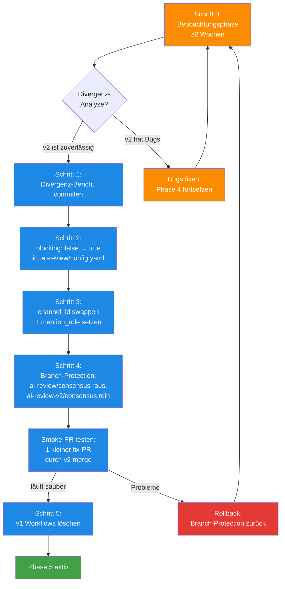

# Cutover Phase 4 → 5 — Shadow in Produktion überführen (Playbook)

> **Status seit 2026-04-24:** Dieses Playbook wurde für den ai-portal-Cutover (PR#44) am 2026-04-24 einmal durchlaufen. Die Seite bleibt als **wiederverwendbare Anleitung** für künftige Pipeline-Migrationen (z.B. Schema-Registry, weitere Repos). Code-Beispiele zeigen noch die ai-portal-spezifischen Pfade — beim nächsten Einsatz entsprechend adaptieren.
>
> **TL;DR:** Der Wechsel von der parallel-laufenden Shadow-Pipeline zur produktiven Pipeline ist eine sorgfältig geordnete Sequenz von fünf Schritten. Zuerst muss die Shadow-Pipeline über mehrere Wochen beweisen, dass sie dieselben Urteile fällt wie die Legacy-Pipeline. Dann werden die Stages von `blocking: false` auf `blocking: true` umgeschaltet, der Discord-Kanal vom Shadow- auf den Produktiv-Kanal gewechselt, die Branch-Protection in GitHub umgestellt, und zuletzt die alte Pipeline abgeschaltet. Der Rollback ist bis Schritt 4 einfach — einfach die vorigen Konfigurationen wiederherstellen. Nach Schritt 5 (alte Pipeline gelöscht) wird's aufwändiger.

## Wie es funktioniert



Der Cutover ist eine **Ein-Weg-Migration, die rückgängig gemacht werden kann** — solange Schritt 5 (Löschung der alten Pipeline) noch nicht passiert ist. Bis dahin kann man die Branch-Protection zurückstellen und v1 übernimmt wieder.

Die **Reihenfolge der Schritte** ist wichtig: Erst alle Konfigurationen und Kanäle umstellen (2+3), dann die Branch-Protection (4). Würde man die Protection vor dem Channel-Swap umstellen, landet ein Produktions-Consensus-Urteil kurzzeitig im Shadow-Kanal — unsichtbar für Reviewer.

Die **Smoke-Phase nach Schritt 4** ist das letzte Sicherheitsnetz: Ein kleiner, risikoarmer PR (Typo-Fix, Docs-Update) wird durch die jetzt-required v2-Pipeline geschickt. Wenn das durchläuft, ist das System produktiv. Wenn nicht → sofortiger Rollback.

## Technische Details

### Schritt 0: Beobachtungsphase (≥2 Wochen)

Vor dem Cutover muss die Shadow-Pipeline **gedichtet-beobachtet** werden. Die Ziel-Metriken:

| Metrik | Schwelle |
|---|---|
| Anzahl Real-PRs durch v2 | ≥ 10 |
| Divergenz-Rate (v1 vs. v2 Urteil) | ≤ 10% (max 1 von 10 PRs darf unterschiedliche Urteile fällen) |
| v2 hat keine FileNotFoundError / ImportError / Timeout-Crashes | 0 Vorkommen in letzten 7 Tagen |
| Alle 5 Stages geben konsistent Scores in erwarteten Ranges | kein `score=0` bei trivialen PRs |

Das **Divergenz-Bericht-Dokument** listet pro PR: v1-Urteil, v2-Urteil, welches war "richtig" laut menschlichem Review. Liegt in `docs/v2-cutover-evidence.md` im ai-portal-Repo.

### Schritt 1: Divergenz-Bericht commiten

```bash
cd ~/projects/ai-portal
cat > docs/v2-cutover-evidence.md <<EOF
# v2 Shadow-Pipeline Cutover Evidence

**Beobachtungszeitraum:** 2026-04-21 bis 2026-05-05 (2 Wochen)
**PRs durchgelaufen:** 14
**Divergenz-Rate:** 0/14 (0%)

| PR | v1-Urteil | v2-Urteil | Richtig |
|---|---|---|---|
| #42 | success (9.0) | success (9.2) | v2 |
| #43 | success (8.5) | success (8.7) | konsistent |
| ...
EOF

git add docs/v2-cutover-evidence.md
git commit -m "docs: v2 shadow-pipeline cutover evidence after 2 weeks observation"
git push
```

Das Dokument ist der **Audit-Trail**: Wenn sich später herausstellt, dass v2 doch Probleme hat, kann man genau rekonstruieren, welche Beweislage zum Cutover vorlag.

### Schritt 2: `blocking: false` → `blocking: true`

Bearbeite `ai-portal/.ai-review/config.yaml`:

```diff
 stages:
   code_review:
     enabled: true
-    blocking: false   # Shadow: non-blocking
+    blocking: true
   cursor_review:
     enabled: true
-    blocking: false
+    blocking: true
   security:
     enabled: true
-    blocking: false
+    blocking: true
   design:
     enabled: true
-    blocking: false
+    blocking: true
   ac_validation:
     enabled: true
-    blocking: false
+    blocking: true
```

Das `blocking: true` bedeutet: Fällt eine Stage aus, geht der Consensus auf `pending` (Fail-Closed). Vorher war der Ausfall eine Warnung, jetzt wird's ein Blocker.

```bash
git commit -am "chore(ai-review): enable blocking for all 5 stages (Phase 5 cutover)"
git push
```

Die Pipeline-Änderung allein reicht noch nicht — der Workflow-Call + die Branch-Protection müssen auch angepasst werden.

### Schritt 3: Channel-Swap

In derselben Config:

```diff
 notifications:
   target: discord
   discord:
-    channel_id: "1495821842093576363"   # #ai-review-shadow-ai-portal
+    channel_id: "${DISCORD_CHANNEL_AI_PORTAL}"   # regulärer Kanal
-    mention_role: ""                      # kein @here im Shadow
+    mention_role: "@here"                 # regulärer Mention-Modus
```

Die ENV-Variable-Referenz ist besser als harte Channel-ID — so wird sie beim Cutover automatisch aus `/home/clawd/.config/ai-workflows/env` resolved. Wenn der reguläre Channel-ID geändert wird, muss nur die env-Datei aktualisiert werden.

**Optional auch im Workflow selbst:**

```diff
# ai-portal/.github/workflows/ai-review-v2-shadow.yml
env:
-  DISCORD_SHADOW_CHANNEL: ai-review-shadow-ai-portal
+  DISCORD_SHADOW_CHANNEL: ai-review-ai-portal
```

Nach dem Push warten bis der nächste PR den neuen Channel nutzt — ein Proof, dass der Swap wirkt.

### Schritt 4: Branch-Protection umstellen

Das ist der **riskanteste Schritt** — sobald die Protection geändert ist, entscheidet v2-Consensus über Merges.

```bash
# Aktuelle Protection abfragen:
gh api repos/EtroxTaran/ai-portal/branches/main/protection --jq '.required_status_checks.contexts'

# Output:
[
  "checks",
  "e2e",
  "design-conformance",
  "Secret Scan (gitleaks)",
  "SAST (semgrep)",
  "Container CVE Scan (trivy) (portal-api, ., apps/portal-api/Dockerfile)",
  "Container CVE Scan (trivy) (portal-shell, ., apps/portal-shell/Dockerfile)",
  "ai-review/consensus"
]
```

Neue Liste schreiben via `gh api PATCH`:

```bash
gh api -X PATCH repos/EtroxTaran/ai-portal/branches/main/protection \
  -F required_status_checks[strict]=true \
  -F required_status_checks[contexts][]="checks" \
  -F required_status_checks[contexts][]="e2e" \
  -F required_status_checks[contexts][]="design-conformance" \
  -F "required_status_checks[contexts][]=Secret Scan (gitleaks)" \
  -F "required_status_checks[contexts][]=SAST (semgrep)" \
  -F "required_status_checks[contexts][]=Container CVE Scan (trivy) (portal-api, ., apps/portal-api/Dockerfile)" \
  -F "required_status_checks[contexts][]=Container CVE Scan (trivy) (portal-shell, ., apps/portal-shell/Dockerfile)" \
  -F required_status_checks[contexts][]="ai-review-v2/consensus"
```

Änderung:
- `ai-review/consensus` (v1) **entfernt**
- `ai-review-v2/consensus` **hinzugefügt**

Alternativ via Web-UI: Repo Settings → Branches → main → Edit rule.

### Smoke-Test nach Schritt 4

Bevor Schritt 5 (Löschung) passiert, einen Smoke-PR durchlaufen lassen:

```bash
# Einen kleinen Test-PR erstellen, z.B. Typo-Fix
git checkout -b chore/cutover-smoke-test
echo "// cutover smoke test $(date -Iseconds)" >> README.md
git commit -am "chore: cutover smoke test"
git push -u origin chore/cutover-smoke-test
gh pr create --title "chore: cutover smoke test" --body "Closes #1"
gh pr merge --auto --squash
```

Erwartet:
1. v2-Stages laufen parallel zu v1 (beide noch aktiv)
2. Branch-Protection wartet auf `ai-review-v2/consensus = success`
3. v1 consensus ist noch grün, aber wird ignoriert
4. Auto-Merge triggert nach v2-success

Wenn **alles grün** → weiter zu Schritt 5. Wenn **v2 hängt** oder **blockiert** → Rollback sofort.

### Schritt 5: v1-Workflows löschen

```bash
cd ~/projects/ai-portal
git checkout -b chore/remove-v1-pipeline

git rm .github/workflows/ai-code-review.yml
git rm .github/workflows/ai-security-review.yml
git rm .github/workflows/ai-design-review.yml
git rm .github/workflows/ai-review-consensus.yml
git rm .github/workflows/ai-review-scope-check.yml
# … weitere v1-Workflows

# Auch den v2-Workflow umbenennen (ist nicht mehr "shadow"):
git mv .github/workflows/ai-review-v2-shadow.yml .github/workflows/ai-review.yml

# Config aktualisieren — keine "v2"-Referenzen mehr:
sed -i 's/ai-review-v2\//ai-review\//g' .ai-review/config.yaml

git commit -m "chore: remove v1 legacy pipeline, rename v2 to main (Phase 5 complete)"
git push -u origin chore/remove-v1-pipeline
gh pr create --title "chore: cutover Phase 4 → 5 complete"
```

**Letzter Status-Context-Swap:** Die v2-Statuses sollen jetzt `ai-review/*` heißen (nicht mehr `ai-review-v2/*`). Der Workflow-Patch:

```diff
 env:
-  AI_REVIEW_METRICS_PATH: .ai-review/metrics-v2.jsonl
+  AI_REVIEW_METRICS_PATH: .ai-review/metrics.jsonl

 jobs:
   code-review:
     steps:
       - run: |
           ai-review stage code-review --pr ... \
-            --status-context-prefix ai-review-v2
+            --status-context-prefix ai-review
```

Das macht v2 zur "offiziellen" Pipeline. Branch-Protection muss nochmal angepasst werden: `ai-review-v2/consensus` raus, `ai-review/consensus` rein (jetzt wieder mit dem alten Namen, aber hinter der neuen Pipeline).

### Rollback-Prozedur (bis Schritt 4)

Falls Probleme auftreten, bevor Schritt 5 passiert ist:

1. **Branch-Protection zurückstellen:** v1-`ai-review/consensus` wieder als Required, v2 raus
2. **Config zurück:** `blocking: false` überall, Channel-ID zurück auf Shadow
3. **Workflow-Env zurück:** `DISCORD_SHADOW_CHANNEL: ai-review-shadow-ai-portal`

Das dauert ≤ 10 Minuten. Phase 4 ist wieder aktiv, Dev-Arbeit kann weiterlaufen.

**Nach Schritt 5:** Ein Rollback braucht jetzt, die v1-Workflow-Files wieder herzustellen (aus Git-History möglich). Nicht unmöglich, aber mit PR + Review + erneutem Cutover-Planning. Deshalb: Schritt 5 erst nach gründlichem Smoke-Test.

### Wann ist der richtige Zeitpunkt für Cutover?

Nicht vor:
- Freitag 16:00 (keine Deploys vorm Wochenende — wenn's bricht, ist niemand da)
- Direkt vor Urlaub
- Vor Release-Tagen

Optimal:
- Dienstag/Mittwoch Vormittag (genug Tagesreserve)
- Wenn mindestens 2 Wochen stabiles Shadow-Running vorliegen
- Wenn keine kritischen PRs offen sind, die mitten im Cutover gemerged werden müssten

### Wissens-Transfer nach Cutover

Nach Phase 5 gibt es ein paar Dokumentations-Updates:

- `ai-portal/CLAUDE.md`: v1-Referenzen entfernen
- Dieses Wiki: Alle `20-ai-portal-integration.md`-Abschnitte zu "v1 Legacy" löschen
- `80-historie/00-changelog.md`: Einträge für Cutover + Evidence
- `80-historie/10-lessons-learned.md`: Was wir aus der Shadow-Phase gelernt haben

## Verwandte Seiten

- [Shadow-Mode vs. Cutover (Konzept)](../10-konzepte/20-shadow-vs-cutover.md) — warum Phase-Modell
- [ai-portal Integration](../20-komponenten/20-ai-portal-integration.md) — aktuelle Phase-4-Setup
- [Consensus-Scoring](../10-konzepte/10-consensus-scoring.md) — Fail-Closed-Verhalten bei blocking
- [Channel-Mapping](../70-reference/30-channel-mapping.md) — welcher Channel nach Cutover

## Quelle der Wahrheit (SoT)

- [`ai-portal/.ai-review/config.yaml`](https://github.com/EtroxTaran/ai-portal/blob/main/.ai-review/config.yaml) — die aktive Config
- [`ai-portal/.github/workflows/ai-review-v2-shadow.yml`](https://github.com/EtroxTaran/ai-portal/blob/main/.github/workflows/ai-review-v2-shadow.yml) — wird umbenannt in `ai-review.yml`
- [ADR-018](https://github.com/EtroxTaran/ai-portal/blob/main/docs/v2/10-adr/ADR-018-cicd-deploy-pipeline.md) — Phase-Modell-Entscheidung
