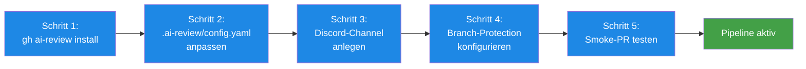

# Quickstart — AI-Review in einem neuen Projekt aktivieren

> **TL;DR:** Um die Pipeline in einem neuen Repo aufzusetzen, braucht man etwa fünf Minuten: GitHub-CLI-Extension installieren, die 10 Workflow-Templates ins Repo kopieren, eine `.ai-review/config.yaml` anpassen, und einen neuen Discord-Kanal anlegen. Das Ergebnis: Jeder neue Pull-Request löst automatisch die fünf Review-Stufen aus, und die Ergebnisse landen im Discord-Channel. Keine Server-Provisionierung nötig — die ganze Infrastruktur (Runner, n8n, Funnel) ist zentral und wird einfach mitgenutzt.

## Wie es funktioniert



Die Einrichtung pro Projekt ist minimal, weil **die Infrastruktur geteilt ist**. Der Self-hosted-Runner auf r2d2 bedient alle Projekte gleichzeitig, der n8n-Container kennt Discord-Credentials für alle Repos zentral, und die Pipeline selbst ist ein installiertes Python-Paket — es gibt keinen projekt-spezifischen Server-Code.

Die **projekt-spezifischen Anpassungen** sind drei: Welche Modell-Versionen man nutzt (meistens Defaults OK), welcher Discord-Channel die Nachrichten bekommt, und welche Branch-Protection-Regeln gelten.

## Technische Details

### Voraussetzungen

Bevor du startest, stelle sicher:

- **GitHub-Repo** existiert und du hast Admin-Rechte (für Branch-Protection)
- **`gh`-CLI** ist installiert und authentifiziert (`gh auth status`)
- **`gh ai-review` Extension** ist installiert:
  ```bash
  gh extension install EtroxTaran/gh-ai-review
  ```
- **Discord-Kanal** existiert (oder wird gleich angelegt)
- **GitHub-Issues** sind für das Repo aktiviert (für Gherkin-AC)

### Schritt 1: Templates installieren

```bash
cd ~/projects/<dein-repo>
gh ai-review install
```

Das kopiert aus dem [ai-review-pipeline-Repo](https://github.com/EtroxTaran/ai-review-pipeline) folgende Dateien in dein Repo:

- `.github/workflows/ai-code-review.yml` — Stage 1 Workflow
- `.github/workflows/ai-cursor-review.yml` — Stage 1b
- `.github/workflows/ai-security-review.yml` — Stage 2
- `.github/workflows/ai-design-review.yml` — Stage 3
- `.github/workflows/ai-review-ac-validation.yml` — Stage 5
- `.github/workflows/ai-review-consensus.yml` — Aggregation
- `.github/workflows/ai-review-nachfrage.yml` — Soft-Consensus-Handler
- `.github/workflows/ai-review-auto-fix.yml` — Manual Auto-Fix
- `.github/workflows/ai-review-auto-escalate.yml` — Cron-Eskalation
- `.github/workflows/ai-review-scope-check.yml` — PR-Body-Validator
- `.ai-review/config.yaml` — Default-Config

Alle Workflows laufen mit `runs-on: [self-hosted, r2d2, ai-review]`, nutzen also den zentralen Runner auf r2d2.

### Schritt 2: Config anpassen

Öffne `.ai-review/config.yaml`:

```yaml
version: "1.0"

# Default-Modelle — meistens OK, pro-Projekt-Override nur wenn nötig
reviewers:
  codex: gpt-5
  cursor: composer-2
  gemini: gemini-2.5-pro
  claude: claude-opus-4-7

stages:
  code_review:
    enabled: true
    blocking: true       # Phase 5: Produktion, blocking. Phase 4 Shadow: false.
  cursor_review:
    enabled: true
    blocking: true
  security:
    enabled: true
    blocking: true
  design:
    enabled: true
    blocking: true
  ac_validation:
    enabled: true
    blocking: true
    judge_model: gpt-5
    second_opinion_model: claude-opus-4-7
    min_coverage: 1.0

consensus:
  success_threshold: 8
  soft_threshold: 5
  fail_closed_on_missing_stage: true

notifications:
  target: discord
  discord:
    channel_id: "${DISCORD_CHANNEL_<REPO_NAME>}"   # wird in Schritt 3 angelegt
    mention_role: "@here"
    sticky_message: true

waivers:
  min_reason_length: 30
  allowed_labels: ["pipeline-bootstrap"]   # erste 1–2 PRs bis Pipeline läuft
```

**Was typischerweise angepasst wird:**
- `channel_id`: auf den neuen Discord-Kanal zeigen
- `allowed_labels`: nur für Bootstrap aktiv lassen, später entfernen

Schema-Referenz: [`20-ai-review-config-schema.md`](20-ai-review-config-schema.md).

### Schritt 3: Discord-Kanal anlegen

```bash
# Via agent-stack-Skript (idempotent):
cd ~/projects/agent-stack
bash ops/discord-bot/init-server.sh --add-channel ai-review-<repo-name>
```

Das Skript:
1. Erstellt zwei Kanäle: `#ai-review-<repo-name>` (regulär) und `#ai-review-shadow-<repo-name>` (für spätere Shadow-Runs)
2. Schreibt die IDs in `~/.config/ai-workflows/env` als `DISCORD_CHANNEL_<REPO_NAME>` und `DISCORD_CHANNEL_<REPO_NAME>_SHADOW`
3. Container-Recreate: `ops/scripts/restart-n8n-with-ai-review.sh` (damit n8n die neue ENV sieht)

Manuell falls das Skript nicht passt:
1. Discord-Client → "Nathan Ops"-Guild → Channel-Create → Typ: Text
2. Channel-ID via Rechtsklick → "Copy Channel ID" (Developer-Mode muss aktiv sein)
3. In `~/.config/ai-workflows/env` eintragen

### Schritt 4: Branch-Protection konfigurieren

```bash
gh api -X PATCH repos/<owner>/<repo>/branches/main/protection \
  -F required_status_checks[strict]=true \
  -F required_status_checks[contexts][]="ai-review/consensus" \
  -F enforce_admins=false
```

Mindestens `ai-review/consensus` muss Required sein — das ist die Aggregations-Gate. Einzelne Stages (code, security, etc.) sind **nicht** Required, weil sie in den Consensus einfließen.

Optional: Wenn du zusätzliche Checks willst (CI, semgrep-im-Repo, trivy), die zur selben Liste hinzufügen.

### Schritt 5: Smoke-PR testen

```bash
# Ein kleiner Test-PR um den Flow zu validieren
git checkout -b chore/ai-review-smoke-test
echo "<!-- test -->" >> README.md
git commit -am "chore: ai-review smoke test"
git push -u origin chore/ai-review-smoke-test

# Issue + PR erstellen:
gh issue create --title "test: Pipeline-Bootstrap" --body "
## Acceptance Criteria

\`\`\`gherkin
Feature: Pipeline activation
  Scenario: Smoke test passes
    Given die Pipeline ist aktiviert
    When ein PR geöffnet wird
    Then alle 5 Stages laufen durch
\`\`\`
"
# Issue-Nummer merken: z.B. #1

gh pr create --title "chore: ai-review smoke test" --body "Closes #1" \
  --label pipeline-bootstrap
```

**Erwartetes Verhalten:**
- 5 Stage-Jobs starten parallel, laufen 1–3 Minuten
- Consensus-Job läuft danach, schreibt `ai-review/consensus = success`
- Discord-Nachricht im neuen Kanal: "5/5 green, avg X"
- Auto-Merge wenn aktiviert

Bei Problemen: [`50-runbooks/`](../50-runbooks/) konsultieren.

### Erste echte PRs

Nach erfolgreichem Smoke-Test:

1. **`allowed_labels: ["pipeline-bootstrap"]` entfernen** — sonst könnte jemand späterhin diesen Label-Workaround missbrauchen
2. **Bootstrap-PR schließen** — der kleine Test-Commit sollte nicht im main bleiben
3. **Team informieren** — der Discord-Kanal ist ab jetzt aktiv

### Häufige Startfehler

| Symptom | Fix |
|---|---|
| Workflow bricht mit `ai-review: command not found` ab | Self-hosted-Runner hat Pipeline nicht installiert. `pip install git+https://...ai-review-pipeline.git@main` |
| Keine Discord-Nachricht | Channel-ID tippfehler oder env-Var nicht im n8n-Container. Container recreaten |
| `ac_validation` meldet "no linked issue" | PR-Body muss `Closes #N` enthalten, Issue muss `## Acceptance Criteria` + Gherkin haben |
| Branch-Protection blockt `ai-review/consensus` nicht | `required_status_checks[contexts]` in Protection-Config nicht gesetzt |

## Automatisierung: Der Setup-Hook

Seit 2026-04-23 feuert bei jedem Claude-Code-Session-Start ein Hook, der unkonfigurierte `EtroxTaran/*`-Repos erkennt und die obigen 5 Schritte als Handlungsvorschlag anzeigt. Der Hook ist rein informativ (exit 0), nicht blockierend. Details: [Projekt-Setup-Hook](50-project-setup-hook.md).

## Verwandte Seiten

- [.ai-review/config.yaml-Schema](20-ai-review-config-schema.md) — alle Config-Optionen
- [Workflow-Templates](30-workflow-templates.md) — die 10 YAMLs erklärt
- [`gh ai-review` Extension](40-gh-extension.md) — Installation + Update
- [Projekt-Setup-Hook](50-project-setup-hook.md) — die Automatisierung, die diesen Quickstart nudged
- [Discord-Bridge](../20-komponenten/40-discord-bridge.md) — warum zentraler Bot
- [AGENTS.md §9 Ticket↔PR-Linkage](https://github.com/EtroxTaran/agent-stack/blob/main/AGENTS.md) — Gherkin-AC-Pflicht

## Quelle der Wahrheit (SoT)

- [`ai-review-pipeline/docs/project-adoption.md`](https://github.com/EtroxTaran/ai-review-pipeline/blob/main/docs/project-adoption.md) — detaillierte 6-Phasen-Anleitung
- [`gh-extension/gh-ai-review/install.sh`](https://github.com/EtroxTaran/ai-review-pipeline/tree/main/gh-extension/gh-ai-review) — CLI-Extension
- [`templates/.ai-review/config.yaml`](https://github.com/EtroxTaran/agent-stack/blob/main/templates/.ai-review/config.yaml) — das Template
