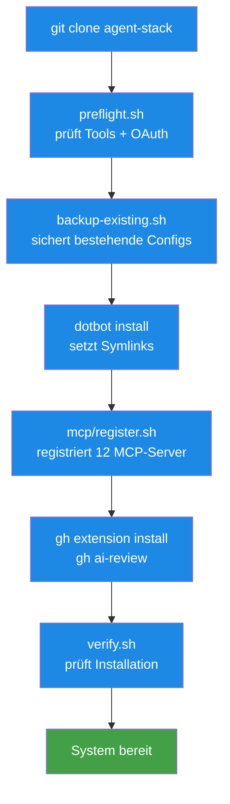

# agent-stack installieren — Bootstrap für alle vier CLIs

> **TL;DR:** Das agent-stack-Repo wird einmalig pro User-Account ausgecheckt und via Installations-Skript aufgesetzt. Das Skript legt Symlinks von `~/.claude/CLAUDE.md`, `~/.gemini/GEMINI.md`, `~/.codex/AGENTS.md`, `~/.cursor/AGENTS.md` auf die zentrale `AGENTS.md`, kopiert die Skills in die vier CLI-Skills-Verzeichnisse, und registriert die 12 MCP-Server in den jeweiligen CLI-Configs. Bestehende Konfigurationen werden vorher gesichert. Der gesamte Prozess ist idempotent — mehrfaches Ausführen ist sicher.

## Wie es funktioniert



Die Installation ist eine **Kette von Skripten**, die jeweils einen Schritt erledigen. Jedes Skript ist idempotent — es erkennt, ob sein Schritt schon gemacht wurde, und überspringt oder aktualisiert entsprechend. Das macht den Install-Prozess debug-freundlich: Wenn etwas schiefgeht, kann man das fehlende Skript einzeln nachholen.

Der **Backup-Schritt** ist zentral: Bevor ein Symlink gelegt wird, wird die bestehende Datei nach `~/backups/agent-stack/<timestamp>/` verschoben. So gehen vorhandene Custom-Configs nicht verloren, und `uninstall.sh` kann sie später wiederherstellen.

## Technische Details

### Voraussetzungen

| Tool | Version | Zweck |
|---|---|---|
| `git` | ≥ 2.30 | Repo klonen |
| `bash` | ≥ 4.0 | Scripts |
| `yq` | ≥ 4.0 | MCP-Servers.yaml parsen |
| `jq` | ≥ 1.6 | JSON-Manipulation |
| `gh` | ≥ 2.40 | GitHub-CLI |

Mindestens eine CLI muss installiert sein (sonst nichts zu symlinken):
- `claude` (Claude Code)
- `cursor-agent`
- `gemini`
- `codex`

### Installation in 5 Befehlen

```bash
# 1. Clone
git clone https://github.com/EtroxTaran/agent-stack.git ~/projects/agent-stack
cd ~/projects/agent-stack

# 2. Preflight-Check
./scripts/preflight.sh

# 3. Install
./install.sh

# 4. Env-File erstellen (für MCP-Server-Credentials)
cp .env.example ~/.config/ai-workflows/env
chmod 600 ~/.config/ai-workflows/env
# → Werte editieren:
$EDITOR ~/.config/ai-workflows/env

# 5. gh extension
gh extension install EtroxTaran/gh-ai-review
```

Der komplette Durchlauf dauert ~2 Minuten (ohne manuelles env-Editieren).

### Was preflight.sh prüft

```bash
./scripts/preflight.sh
```

Output beispielhaft:

```
✓ git 2.43.0
✓ yq 4.40.5
✓ jq 1.7.1
✓ gh 2.67.0 (authenticated as EtroxTaran)
✓ claude (Claude Code)
✓ cursor-agent
✓ gemini (CLI)
✓ codex
✓ OAuth: gh (active)
✗ OAuth: codex (missing — run 'codex auth login')
⚠ ~/.config/ai-workflows/env not found (will be created in step 4)
```

Bei ✗ bricht die Installation ab (preflight exit 1). Bei ⚠ nur Hinweis, Installation läuft weiter.

### Was backup-existing.sh macht

```bash
./scripts/backup-existing.sh
```

- Liest `install.conf.yaml` → welche Paths sollen geänderte werden
- Für jeden Path, der existiert und **kein Symlink** ist:
  - Verschiebt ihn nach `~/backups/agent-stack/<timestamp>/<relative-path>`
  - Legt eine `.restore-manifest.json` an, die den Original-Pfad dokumentiert
- Exit 0: Backup erfolgreich oder nichts zu sichern
- Exit 1: Backup fehlgeschlagen (meist Permission-Denied)

Beispiel: `~/.claude/CLAUDE.md` existiert als echte Datei → wird nach `~/backups/agent-stack/20260423-140000/.claude/CLAUDE.md` verschoben. Danach wird der Symlink dort gelegt, wo die alte Datei war.

### Was dotbot macht

dotbot liest `install.conf.yaml`:

```yaml
- defaults:
    link:
      force: false          # niemals überschreiben ohne Backup
      create: true          # Parent-Dirs anlegen
      relink: false         # existierende Links nicht ändern

- clean:
    - ~/.claude/skills
    - ~/.gemini/skills
    - ~/.codex/skills
    - ~/.cursor/skills

- link:
    ~/.claude/CLAUDE.md: AGENTS.md
    ~/.claude/skills: skills/
    ~/.claude/settings.json: configs/claude/settings.json
    ~/.claude/hooks: configs/claude/hooks/

    ~/.gemini/GEMINI.md: AGENTS.md
    ~/.gemini/skills: skills/
    ~/.gemini/settings.json: configs/gemini/settings.json

    ~/.codex/AGENTS.md: AGENTS.md
    ~/.codex/skills: skills/
    ~/.codex/config.toml: configs/codex/config.toml

    ~/.cursor/AGENTS.md: AGENTS.md
    ~/.cursor/skills: skills/
    ~/.cursor/cli-config.json: configs/cursor/cli-config.json
    ~/.cursor/rules/global.mdc: configs/cursor/rules/global.mdc
```

Das `clean:`-Directive entfernt defekte Symlinks (vom vorherigen Install übrig). Das `link:`-Directive legt neue.

### Was mcp/register.sh macht

```bash
./mcp/register.sh --all
```

Parses `mcp/servers.yaml` (12 Server-Definitionen) und schreibt pro CLI die passende Config-Struktur:

- **Claude Code:** `~/.claude/settings.json` mit `mcpServers`-Section (JSON)
- **Cursor:** `~/.cursor/cli-config.json` mit MCP-Section (JSON)
- **Gemini:** `~/.gemini/settings.json` mit MCP-Section (JSON, CLI-spezifisch)
- **Codex:** `~/.codex/config.toml` mit `[mcp.servers]`-Table (TOML)

**Idempotenz-Garantie:** Bestehende MCP-Einträge werden vor dem Re-Adden entfernt. Mehrfaches Ausführen duplizert nicht.

**Env-Substitution:** `${VAR}`-Placeholders in `servers.yaml` werden via `envsubst` zur Registrar-Zeit ersetzt. Die ENV muss also vor dem Call gesetzt sein:

```bash
set -a
source ~/.config/ai-workflows/env
source ~/.openclaw/.env 2>/dev/null || true
set +a
./mcp/register.sh --all
```

### Was verify.sh prüft

```bash
./scripts/verify.sh
```

Post-Install-Sanity-Checks:

- Alle Symlinks aus `install.conf.yaml` zeigen auf echte Dateien im Repo
- Jede CLI findet `AGENTS.md` (via `claude config show` / `cursor-agent --version` etc.)
- MCP-Server sind in allen CLIs registriert (json-grep / toml-grep)
- GitHub-CLI hat die `gh-ai-review`-Extension
- `git` im agent-stack-Repo ist auf main und clean

Exit 0: alles grün. Exit 1: mindestens ein Check fehlgeschlagen, Details im Output.

### Uninstall

```bash
./scripts/uninstall.sh
```

- Entfernt alle agent-stack-Symlinks
- Restauriert aus `~/backups/agent-stack/<latest>/` zurück an die Original-Positionen
- Entfernt MCP-Einträge aus den CLI-Configs

Der Uninstall ist **nicht-destruktiv** — das Repo bleibt geklont, nur die System-Integration wird zurückgerollt. Re-install via `./install.sh` ist jederzeit möglich.

### Updates

Upgrading auf neuere Stack-Version:

```bash
cd ~/projects/agent-stack
git pull
./install.sh   # idempotent, aktualisiert Symlinks + MCP-Registry
```

Bei **breaking changes** (z.B. MCP-Server-Namen geändert, Skill-Struktur neu) wird in `CHANGELOG.md` dokumentiert. `./scripts/verify.sh` nach dem Update gibt dir Feedback.

### Per-CLI-spezifische Besonderheiten

**Claude Code:** Liest `~/.claude/settings.json` + `~/.claude/CLAUDE.md` automatisch beim Start. Keine weiteren Schritte nötig.

**Cursor:** Neben `~/.cursor/cli-config.json` braucht es `~/.cursor/rules/global.mdc` als Ergänzung. agent-stack liefert beides.

**Gemini:** MCP-Server-Support ist relativ neu, manche Features laufen im Experimental-Status. Falls Probleme → `gemini --config` debuggen.

**Codex:** TOML-basierte Config. agent-stack generiert `~/.codex/config.toml`; bei Codex-CLI-Updates kann das Format sich leicht ändern.

## Verwandte Seiten

- [agent-stack Komponente](../20-komponenten/00-agent-stack.md) — was das Repo enthält
- [Skills & MCP-Server](../20-komponenten/70-skills-mcp.md) — was registriert wird
- [Secrets & Env](../20-komponenten/80-secrets-env.md) — die env-Datei-Struktur
- [Quickstart neues Projekt](00-quickstart-neues-projekt.md) — nach Install das erste Repo aktivieren

## Quelle der Wahrheit (SoT)

- [`install.sh`](https://github.com/EtroxTaran/agent-stack/blob/main/install.sh) — Haupt-Orchestrator
- [`install.conf.yaml`](https://github.com/EtroxTaran/agent-stack/blob/main/install.conf.yaml) — dotbot-Manifest
- [`scripts/preflight.sh`](https://github.com/EtroxTaran/agent-stack/blob/main/scripts/preflight.sh)
- [`scripts/backup-existing.sh`](https://github.com/EtroxTaran/agent-stack/blob/main/scripts/backup-existing.sh)
- [`scripts/verify.sh`](https://github.com/EtroxTaran/agent-stack/blob/main/scripts/verify.sh)
- [`scripts/uninstall.sh`](https://github.com/EtroxTaran/agent-stack/blob/main/scripts/uninstall.sh)
