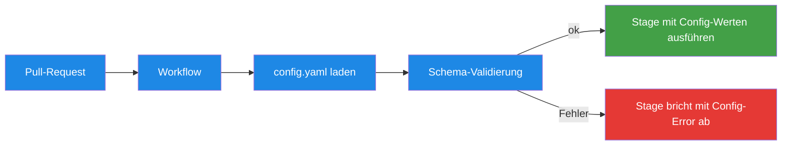

# .ai-review/config.yaml — Die Config-Referenz

> **TL;DR:** Jedes Projekt, das die AI-Review-Pipeline nutzt, hat eine einzelne YAML-Datei unter `.ai-review/config.yaml`, die das Verhalten der Pipeline steuert. Darin stehen Modell-Versionen, welche Stages aktiv sind, ob sie blockieren oder nur informieren, Consensus-Schwellen, Discord-Kanal, und Waiver-Regeln. Die Datei folgt einem festen JSON-Schema (das Pipeline-Repo validiert das zur Laufzeit), sodass Tippfehler früh auffallen. Änderungen werden erst im nächsten PR-Review wirksam — kein Container-Restart nötig.

## Wie es funktioniert



Die Config wird **pro Pipeline-Run** gelesen — also bei jedem PR-Event erneut. Das hat den Vorteil, dass Änderungen sofort greifen: Commit auf main → ab dem nächsten PR wirkt die neue Config.

Die **Schema-Validierung** verhindert, dass eine tippfehlerhafte Config silent durchrutscht. Wenn jemand `blocing: true` statt `blocking: true` schreibt, schlägt der Stage-Run sofort fehl mit einer lesbaren Fehlermeldung.

## Technische Details

### Vollständiges Schema-Beispiel

```yaml
# Schema-Version. Aktuell 1.0.
version: "1.0"

# ---------------------------------------------------------------------
# reviewers: Welche Modelle welche Stage verwendet
# ---------------------------------------------------------------------
reviewers:
  codex: gpt-5.5                    # Stage 1 + Stage 5 (AC primary)
  cursor: composer-2                # Stage 1b
  gemini: gemini-3.1-pro-preview    # Stage 2
  claude: claude-opus-4-7           # Stage 3 + Stage 5 (AC judge)

# ---------------------------------------------------------------------
# stages: Was prüfen, wie
# ---------------------------------------------------------------------
stages:
  code_review:
    enabled: true                   # Stage überhaupt ausführen?
    blocking: true                  # Fail-Closed bei Ausfall?
    auto_fix:
      enabled: false                # Auto-Fix-Loop nach Findings?
      max_iterations: 2             # Max Fix-Retries

  cursor_review:
    enabled: true
    blocking: true
    skip_on_rate_limit: true        # Wenn Cursor rate-limitet → Sentinel-Status statt Fehler

  security:
    enabled: true
    blocking: true
    semgrep_config: "auto"          # "auto" = semgrep --config auto; oder Pfad auf eigene Rules
    auto_fix:
      enabled: false                # Security NIEMALS auto-fixen

  design:
    enabled: true
    blocking: true
    skip_if_no_ui_changes: true     # Skip wenn keine .tsx/.css/.svg in Diff
    design_md_path: "DESIGN.md"     # Pfad zur Design-System-Spec

  ac_validation:
    enabled: true
    blocking: true
    judge_model: gpt-5.5            # Primary judge
    second_opinion_model: claude-opus-4-7
    min_coverage: 1.0               # 100%-AC-Coverage gefordert (0.8 = 80%)
    require_linked_issue: true      # Closes #N erforderlich

# ---------------------------------------------------------------------
# consensus: Wie die Einzel-Scores verrechnet werden
# ---------------------------------------------------------------------
consensus:
  success_threshold: 8              # avg >= 8 → success
  soft_threshold: 5                 # 5 <= avg < 8 → pending (Nachfrage)
  fail_closed_on_missing_stage: true
  confidence_weighting: true        # false = einfacher Durchschnitt

# ---------------------------------------------------------------------
# notifications: Wohin die Nachrichten gehen
# ---------------------------------------------------------------------
notifications:
  target: discord                   # derzeit nur "discord" supported
  discord:
    channel_id: "${DISCORD_CHANNEL_AI_PORTAL}"   # ENV-Var oder hart coded
    mention_role: "@here"                        # "" = kein @here
    sticky_message: true                         # update existing msg vs. new post
    soft_consensus_timeout_min: 30               # 0 = keine Eskalation

# ---------------------------------------------------------------------
# waivers: Welche Findings dürfen überstimmt werden
# ---------------------------------------------------------------------
waivers:
  min_reason_length: 30                          # Waiver-Grund min 30 Zeichen
  allowed_labels:                                # PRs mit diesen Labels dürfen bootstrappen
    - "pipeline-bootstrap"
  anti_generic_phrases:                          # verbotene Formulierungen
    - "false positive"
    - "not relevant"
    - "skip this"
    - "waive this"
```

### Schema-Validierung zur Laufzeit

Das JSON-Schema ist in [`ai-review-pipeline/schema/config.schema.yaml`](https://github.com/EtroxTaran/ai-review-pipeline/blob/main/schema/config.schema.yaml). Die Pipeline validiert die User-Config beim Start:

```python
# Vereinfacht aus common.py:
def load_config(path):
    config = yaml.safe_load(open(path))
    schema = yaml.safe_load(open(SCHEMA_PATH))
    jsonschema.validate(config, schema)
    return config
```

Fehler-Beispiel:

```
$ ai-review stage code-review --pr 42
Error: Config validation failed
  .stages.code_review.blocing: unknown field (did you mean 'blocking'?)
```

### Die Minimum-Config

Für ein neues Projekt reicht dieses Minimum (alles andere default):

```yaml
version: "1.0"

stages:
  code_review:
    enabled: true
  cursor_review:
    enabled: true
  security:
    enabled: true
  design:
    enabled: true
  ac_validation:
    enabled: true

notifications:
  discord:
    channel_id: "${DISCORD_CHANNEL_MY_REPO}"
```

Alles andere (reviewers-defaults, consensus-thresholds, blocking=true) übernimmt die Pipeline aus den Schema-Defaults.

### Übliche Anpassungen

| Was | Wann | Wie |
|---|---|---|
| Eine Stage temporär deaktivieren | Während eines Reviewer-Ausfalls (z.B. Gemini-Outage) | `stages.security.enabled: false` + Branch-Protection anpassen |
| Modell-Version upgraden | Neues Release von Claude / Codex / etc. | `reviewers.claude: claude-opus-4-8` (wenn verfügbar) <!-- pin-drift-ignore: hypothetisches Beispiel --> |
| Threshold lockern | Zu viele False-Soft-Consensuses | `consensus.success_threshold: 7` (vorsicht!) |
| Auto-Fix testen | Nach neuem Modell-Release | `stages.code_review.auto_fix.enabled: true` |
| Shadow-Mode aktivieren | Vor einem Cutover | `stages.*.blocking: false` + Channel-Swap |

### ENV-Variable-Resolution

`${VAR}`-Placeholders werden aus der Runner-Umgebung aufgelöst:

```yaml
channel_id: "${DISCORD_CHANNEL_AI_PORTAL}"
```

Wird zu:

```yaml
channel_id: "1495821862910038117"
```

…wenn der Runner-Env `DISCORD_CHANNEL_AI_PORTAL=1495821862910038117` gesetzt hat.

**Wichtig:** Der Runner sourct vor Pipeline-Calls die env-Datei (`source /home/clawd/.config/ai-workflows/env`). Ohne das sind die Variablen leer und der Config-Load schlägt fehl.

### Schema-Versionierung

`version: "1.0"` ist die aktuelle Schema-Version. Breaking-Changes am Schema bekommen eine neue Major-Version. Die Pipeline validiert:

- `version 1.x`: aktuelles Schema, volle Kompatibilität
- `version 2.x`: future, wird abgelehnt mit Hinweis auf Upgrade-Guide

Die Version im Repo: [`schema/config.schema.yaml` Zeile 1-5](https://github.com/EtroxTaran/ai-review-pipeline/blob/main/schema/config.schema.yaml).

### Debug: Effektive Config anschauen

Um zu sehen, was die Pipeline mit deiner Config wirklich macht (inkl. Defaults + ENV-Resolution):

```bash
ai-review config show
```

Output:

```yaml
# Effective config for /home/clawd/projects/ai-portal/.ai-review/config.yaml
version: "1.0"
reviewers:
  codex: gpt-5.5
  cursor: composer-2
  gemini: gemini-3.1-pro-preview
  claude: claude-opus-4-7
stages:
  code_review:
    enabled: true
    blocking: true
    auto_fix:
      enabled: false          # default
      max_iterations: 2       # default
  # ... alle Stages mit applied Defaults
notifications:
  discord:
    channel_id: "1495821862910038117"   # resolved from ${DISCORD_CHANNEL_AI_PORTAL}
    mention_role: "@here"
    sticky_message: true
```

## Verwandte Seiten

- [Quickstart](00-quickstart-neues-projekt.md) — die Config in einem neuen Projekt anlegen
- [AI-Review-Pipeline (Konzept)](../10-konzepte/00-ai-review-pipeline.md) — was die Stages tun
- [Consensus-Scoring](../10-konzepte/10-consensus-scoring.md) — wie die Thresholds wirken
- [Workflow-Templates](30-workflow-templates.md) — wo die Config geladen wird

## Quelle der Wahrheit (SoT)

- [`schema/config.schema.yaml`](https://github.com/EtroxTaran/ai-review-pipeline/blob/main/schema/config.schema.yaml) — das vollständige JSON-Schema
- [`schema/config.example.yaml`](https://github.com/EtroxTaran/ai-review-pipeline/blob/main/schema/config.example.yaml) — annotiertes Beispiel
- [`templates/.ai-review/config.yaml`](https://github.com/EtroxTaran/agent-stack/blob/main/templates/.ai-review/config.yaml) — Default für neue Projekte
