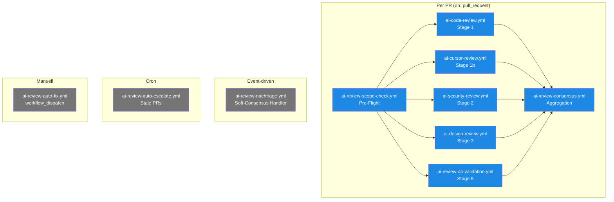

# Workflow-Templates — Die 10 YAML-Dateien erklärt

> **TL;DR:** Jedes Projekt, das die Pipeline nutzt, bekommt 10 YAML-Dateien in sein `.github/workflows/`-Verzeichnis. Jede ist für einen spezifischen Teil der Review zuständig — fünf Stages, ein Consensus-Aggregator, ein Scope-Checker, ein Soft-Consensus-Handler, ein Cron-Escalator, und ein manueller Auto-Fix-Trigger. Die Templates sind so geschrieben, dass sie ohne Änderung in jedem Repo laufen; projekt-spezifisches Verhalten wird über die `.ai-review/config.yaml` gesteuert. Alle nutzen den gemeinsamen Self-hosted-Runner auf r2d2.

## Wie es funktioniert



Die Templates sind **lose gekoppelt**: Jede Stage ist ein eigenständiger Workflow, der seinen Status unabhängig schreibt. Die Koordination passiert über die GitHub-Commit-Status-API, nicht durch direkte Workflow-Abhängigkeiten. Das macht einzelne Stages re-run-bar (über `gh run rerun`), ohne den Rest anzufassen.

Der **Scope-Check** läuft zuerst und liefert eine schnelle Bewertung: Ist der PR-Body OK? Sind die Commits konventions-konform? Wenn nicht → die anderen Stages sparen sich die Zeit, der Entwickler bekommt sofort Feedback.

## Technische Details

### Die 10 Templates im Detail

#### 1. `ai-review-scope-check.yml` — Pre-Flight

**Trigger:** `on: pull_request [opened, synchronize, reopened]`
**Runner:** `[self-hosted, r2d2, ai-review]`
**Zweck:** Prüft PR-Body-Format + Issue-Link + Commit-Messages

**Checks:**
- PR-Body hat `Closes #N` oder `Refs #N` (falls Config `require_linked_issue: true`)
- PR-Body hat `## Summary`-Sektion
- Commits folgen Conventional-Commit-Format
- Keine `nosemgrep`-Kommentare ohne Justification

**Status:** `ai-review/scope-check`

#### 2. `ai-code-review.yml` — Stage 1

**Trigger:** `on: pull_request`
**Zweck:** Codex GPT-5 macht Code-Review
**Key-Step:**
```bash
ai-review stage code-review \
  --pr ${{ github.event.pull_request.number }} \
  --max-iterations 2
```

**Status:** `ai-review/code`

#### 3. `ai-cursor-review.yml` — Stage 1b

Analog Stage 1, aber mit Cursor composer-2 als Modell. **Status:** `ai-review/code-cursor`.

Besonderheit: Bei Rate-Limit postet die Stage einen Sentinel-Status mit Beschreibung `"skipped: rate-limit — consensus uses other stages"` statt `failure`, damit Consensus nicht blockiert.

#### 4. `ai-security-review.yml` — Stage 2

**Zweck:** Gemini 2.5 Pro semantischer Review + `semgrep` SAST
**Key-Step:**
```bash
ai-review stage security \
  --pr ${{ github.event.pull_request.number }} \
  --semgrep-config auto
```

**Status:** `ai-review/security`

Der Workflow installiert `semgrep` via pip zur Laufzeit und cacht es im Runner-Workspace.

#### 5. `ai-design-review.yml` — Stage 3

**Zweck:** Claude Opus 4.7 checkt UI-Änderungen gegen `DESIGN.md`
**Status:** `ai-review/design`

Skippt early wenn `skip_if_no_ui_changes: true` und im Diff keine `.tsx`, `.css`, `.svg`-Files sind. Schreibt dann `success` mit Beschreibung `"skipped — no design-relevant files changed"`.

#### 6. `ai-review-ac-validation.yml` — Stage 5

**Zweck:** AC-Coverage-Check (Gherkin aus Issue matches Tests im PR)
**Key-Step:**
```bash
ai-review ac-validate \
  --pr-body-file "$WORKDIR/pr_body.txt" \
  --linked-issues-file "$WORKDIR/linked_issues.json" \
  --changed-files "$CHANGED_FILES" \
  --diff-file "$WORKDIR/pr_diff.txt"
```

**Status:** `ai-review/ac-validation`

Fetched linked Issues via `gh api graphql` (nicht `gh pr view --json`, weil `closingIssuesReferences` nur im GraphQL-Schema existiert).

#### 7. `ai-review-consensus.yml` — Aggregation

**Trigger:** `on: pull_request` — aber mit `if: always()` auf den Consensus-Job, damit er auch bei Stage-Ausfällen läuft
**`needs:`** die 5 Stages (damit Consensus erst startet, wenn alle terminal sind)

**Key-Step:**
```bash
ai-review consensus \
  --sha "$PR_HEAD_SHA" \
  --pr "$PR_NUMBER" \
  --target-url "$TARGET_URL"
```

**Status:** `ai-review/consensus`

Wenn Stage-Statuses bei Consensus-Job-Start noch nicht final sind → Retry-Loop mit 30s-Wait, max 12 Versuche (6 Min Timeout). Siehe [`50-runbooks/40-consensus-stuck-pending.md`](../50-runbooks/40-consensus-stuck-pending.md).

#### 8. `ai-review-nachfrage.yml` — Soft-Consensus-Handler

**Trigger:** `on: issue_comment [created]`
**Zweck:** Parst `/ai-review approve|retry|security-waiver|ac-waiver`-Kommentare

**Key-Step:**
```bash
ai-review nachfrage \
  --pr-number ${{ github.event.issue.number }} \
  --comment-body "$COMMENT_BODY" \
  --author "${{ github.event.comment.user.login }}"
```

Das schreibt den passenden Status-Update (override Consensus auf success, oder re-trigger Stages).

#### 9. `ai-review-auto-escalate.yml` — Cron-Escalation

**Trigger:** `on: schedule: - cron: "*/5 * * * *"` (alle 5 Min)
**Zweck:** Stale Soft-Consensus-PRs finden und Alert schicken

Dupliziert teilweise den n8n-Escalation-Workflow — der GitHub-Actions-Cron ist ein Backup-Mechanismus für den Fall, dass n8n offline ist.

#### 10. `ai-review-auto-fix.yml` — Manual-Trigger

**Trigger:** `on: workflow_dispatch` (manuell via `gh workflow run`)
**Inputs:** `pr`, `stage`, `reason`

**Zweck:** Auto-Fix-Agent manuell aufrufen, wenn der automatische Loop nicht greift (z.B. Findings aus einem post-hoc Review)

**Key-Step:**
```bash
ai-review auto-fix \
  --pr ${{ inputs.pr }} \
  --stage ${{ inputs.stage }} \
  --reason "${{ inputs.reason }}"
```

### Shared Workflow-Struktur

Alle 10 Templates haben einen gemeinsamen Vorspann:

```yaml
name: AI <Stage-Name>

on:
  pull_request:
    types: [opened, synchronize, reopened]

concurrency:
  group: ai-<stage>-${{ github.event.pull_request.number }}
  cancel-in-progress: true

permissions:
  contents: read
  pull-requests: write
  statuses: write
  issues: read

env:
  AI_REVIEW_METRICS_PATH: .ai-review/metrics.jsonl

jobs:
  <stage>:
    if: github.event.pull_request.draft == false
    runs-on: [self-hosted, r2d2, ai-review]
    timeout-minutes: 20
    steps:
      - uses: actions/checkout@v4
        with:
          ref: ${{ github.event.pull_request.head.sha }}
          fetch-depth: 0
          submodules: false
      - uses: actions/setup-python@v5
        with:
          python-version: '3.12'
      - name: Install ai-review-pipeline
        run: |
          pip install --force-reinstall --no-deps --no-cache-dir \
            git+https://github.com/EtroxTaran/ai-review-pipeline.git@main
          pip install git+https://github.com/EtroxTaran/ai-review-pipeline.git@main
      - name: Run stage
        env:
          GH_TOKEN: ${{ secrets.GITHUB_TOKEN }}
          ANTHROPIC_API_KEY: ${{ secrets.ANTHROPIC_API_KEY }}
        run: |
          ai-review stage <stage> --pr ${{ github.event.pull_request.number }}
```

**Wiederkehrende Design-Entscheidungen:**

- `if: draft == false` — kein Review auf Draft-PRs (nicht ready for review)
- `concurrency + cancel-in-progress: true` — bei neuem Commit alten Run abbrechen
- `submodules: false` — schützt vor Orphan-Gitlink-Problemen
- `--force-reinstall --no-deps --no-cache-dir` — erzwingt frischen Pipeline-Install aus git HEAD
- `timeout-minutes: 20` — Stage bricht ab wenn sie > 20 Min hängt

### Customization pro Projekt

Die Templates sind **bewusst minimal anpassbar** — das Meiste kommt aus der Config. Änderungen an den Templates selbst sollten selten nötig sein.

**Wann Templates anpassen:**
- Neuer Stage-Run-Modus (z.B. mit `--only-changed-files`-Flag)
- Andere Runner-Labels (wenn mehrere Runner existieren)
- Repo-spezifische env-Var-Namen für Secrets

**Wann Templates nicht anpassen:**
- Stage-Logik ändern → im `ai-review-pipeline`-Package
- Modell-Versionen → in `.ai-review/config.yaml`
- Discord-Kanal → in `.ai-review/config.yaml`

### Update-Strategie

```bash
# Neueste Templates ziehen:
gh ai-review update

# Diff zur aktuellen Version:
git diff .github/workflows/
```

`gh ai-review update` ist idempotent — es schreibt die Templates aus `ai-review-pipeline/workflows/` in `.github/workflows/`. Projekt-lokale Änderungen an Templates gehen dabei verloren; besser: lokale Änderungen als Fork-Patches oberhalb der Templates führen (z.B. eigene Workflows ergänzen, Templates unverändert lassen).

## Verwandte Seiten

- [Quickstart neues Projekt](00-quickstart-neues-projekt.md) — wie die Templates ins Repo kommen
- [.ai-review/config.yaml](20-ai-review-config-schema.md) — wie Verhalten gesteuert wird
- [`gh ai-review` Extension](40-gh-extension.md) — Template-Installer
- [Neuer PR E2E](../30-workflows/00-neuer-pr-e2e.md) — wie die Templates im Flow zusammenspielen
- [Self-hosted Runner](../20-komponenten/60-self-hosted-runner.md) — wer die Workflows ausführt

## Quelle der Wahrheit (SoT)

- [`ai-review-pipeline/workflows/`](https://github.com/EtroxTaran/ai-review-pipeline/tree/main/workflows) — die 10 Template-YAMLs
- [`ai-review-pipeline/workflows/README.md`](https://github.com/EtroxTaran/ai-review-pipeline/blob/main/workflows/README.md) — detaillierte Referenz (deutsch)
- [Consumer-Beispiel: ai-portal-Workflows](https://github.com/EtroxTaran/ai-portal/tree/main/.github/workflows) — wie's in einem echten Projekt aussieht
