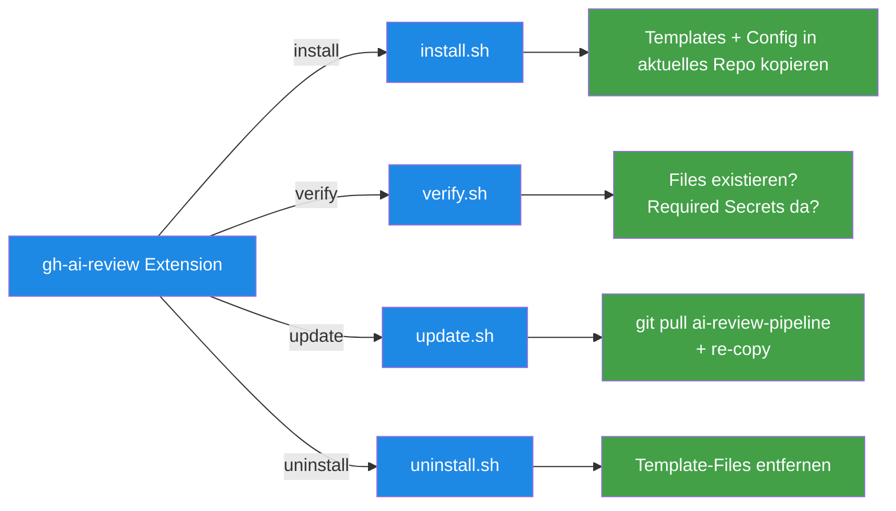

# gh ai-review Extension — CLI-Installer für die Pipeline

> **TL;DR:** Die `gh-ai-review`-Extension ist ein kleines Bash-Skript, das in die GitHub-CLI installiert wird. Drei Subcommands: `install` kopiert die 10 Workflow-Templates plus die Default-Config in ein neues Repo. `verify` prüft, ob Installation korrekt gelaufen ist. `update` aktualisiert die Templates auf die neueste Version. Damit kann man die Pipeline mit drei Befehlen in jedes Repo bringen, ohne Copy-Paste von Files aus dem ai-review-pipeline-Repo.

## Wie es funktioniert



GitHub-CLI-Extensions sind ein einfacher Mechanismus: Ein Bash-Skript wird unter einem Namen registriert, und `gh <name> <subcommand>` ruft es auf. Das Skript kann alles tun, was Bash kann — ideal für kleine Glue-Tools.

Die Extension hält die **Install/Update-Logik** an einer Stelle. Ohne sie müsste jeder Nutzer selbst wissen, welche 10 YAML-Dateien zu kopieren sind, wie die Default-Config aussieht, und wo das Template-Repo liegt. Mit `gh ai-review install` ist das ein Einzeiler.

## Technische Details

### Installation

```bash
gh extension install EtroxTaran/gh-ai-review
```

Das klont das `gh-ai-review`-Repo nach `~/.local/share/gh/extensions/gh-ai-review/`. Damit ist der Command `gh ai-review` verfügbar.

**Update:**

```bash
gh extension upgrade ai-review
```

**Uninstall:**

```bash
gh extension remove ai-review
```

### Subcommands

#### `gh ai-review install`

```bash
cd ~/projects/<mein-repo>
gh ai-review install
```

Macht:

1. Prüft: git-Repo vorhanden? Auf main-Branch?
2. Prüft: Branch hat `.github/workflows/`-Verzeichnis oder legt es an
3. Klont (wenn nicht cached) `ai-review-pipeline`-Repo nach `~/.cache/gh-ai-review/`
4. Kopiert die 10 YAML-Templates nach `.github/workflows/`
5. Kopiert `.ai-review/config.yaml` vom Template
6. Kopiert Issue-Templates aus `agent-stack/templates/ISSUE_TEMPLATE/`
7. Gibt Hinweis: "Nächster Schritt: .ai-review/config.yaml anpassen + Channel anlegen"

**Options:**
- `--no-config` — überspringt das Config-Copy (nützlich beim Re-Install in bestehendes Repo)
- `--branch <name>` — statt main-Branch auf anderen Branch installieren (ungewöhnlich)

#### `gh ai-review verify`

```bash
cd ~/projects/<mein-repo>
gh ai-review verify
```

Macht:

1. Prüft: Alle 10 Templates existieren in `.github/workflows/`
2. Prüft: `.ai-review/config.yaml` existiert + ist Schema-valide
3. Prüft: `channel_id` in der Config ist gesetzt (nicht mehr das Template-Placeholder)
4. Prüft: Branch-Protection auf main hat `ai-review/consensus` als Required
5. Prüft: GitHub-Secrets — gibt Warnung aus, wenn `ANTHROPIC_API_KEY` oder `DISCORD_*`-Secrets fehlen
6. Gibt Summary: "✓ 5/5 Checks grün — Pipeline ready"

Exit 0 = alles gut. Exit 1 = mindestens ein Check rot. Details im Output.

#### `gh ai-review update`

```bash
gh ai-review update
```

Macht:

1. Fetched neueste Version von `ai-review-pipeline` via `git pull`
2. Überschreibt die 10 Templates in `.github/workflows/`
3. **Schreibt `.ai-review/config.yaml` NICHT** — das ist projekt-spezifisch
4. Zeigt Diff: "Diese Zeilen in den Workflows haben sich geändert"

Nach dem Update muss der User den Diff committen:

```bash
git diff .github/workflows/  # anschauen
git add .github/workflows/
git commit -m "chore: update ai-review-pipeline templates"
```

#### `gh ai-review uninstall`

```bash
gh ai-review uninstall
```

Entfernt die 10 Workflow-Templates (nur die, keine andere workflows im Repo). Löscht `.ai-review/config.yaml` **nur**, wenn explizit mit `--all` gerufen:

```bash
gh ai-review uninstall --all   # inkl. Config + Issue-Templates
```

### Die Extension-Struktur

Im [`gh-extension/gh-ai-review/`](https://github.com/EtroxTaran/ai-review-pipeline/tree/main/gh-extension/gh-ai-review)-Verzeichnis:

```
gh-ai-review/
├── gh-ai-review              # Haupt-Bash-Skript (executable)
├── install.sh                # Logik für install-Subcommand
├── verify.sh                 # Logik für verify-Subcommand
├── update.sh                 # Logik für update-Subcommand
├── uninstall.sh              # Logik für uninstall-Subcommand
└── README.md                 # Extension-Dokumentation
```

Der Main-Skript `gh-ai-review` dispatched die Subcommands:

```bash
#!/usr/bin/env bash
set -euo pipefail

CMD="${1:-help}"
shift || true

SCRIPT_DIR="$(cd "$(dirname "${BASH_SOURCE[0]}")" && pwd)"

case "$CMD" in
  install)   exec "$SCRIPT_DIR/install.sh" "$@" ;;
  verify)    exec "$SCRIPT_DIR/verify.sh" "$@" ;;
  update)    exec "$SCRIPT_DIR/update.sh" "$@" ;;
  uninstall) exec "$SCRIPT_DIR/uninstall.sh" "$@" ;;
  help|--help|-h)
    cat <<EOF
Usage: gh ai-review <command> [options]

Commands:
  install     Install AI-Review-Pipeline templates into current repo
  verify      Check installation correctness
  update      Update templates to latest version
  uninstall   Remove templates from current repo

Run 'gh ai-review <command> --help' for subcommand-specific options.
EOF
    ;;
  *)
    echo "Unknown command: $CMD" >&2
    exit 1
    ;;
esac
```

### Template-Source

Die Extension ruft sich Templates aus dem `ai-review-pipeline`-Repo. Erst-Install klont das Repo nach `~/.cache/gh-ai-review/ai-review-pipeline`. Nachfolgende Aufrufe nutzen den Cache, bei `update` wird `git pull` gemacht.

Die Templates liegen unter:
- [`ai-review-pipeline/workflows/*.yml`](https://github.com/EtroxTaran/ai-review-pipeline/tree/main/workflows) — die 10 Workflow-YAMLs
- [`ai-review-pipeline/.ai-review/config.yaml`](https://github.com/EtroxTaran/ai-review-pipeline/blob/main/.ai-review/config.yaml) — als Template (dieses wird als Default kopiert)

### Troubleshooting

**Problem:** `gh ai-review install` schlägt fehl mit "not in a git repo"

**Fix:** Zuerst `cd` in das Ziel-Repo.

**Problem:** `gh ai-review verify` meldet "required secrets missing"

**Fix:** Im Ziel-Repo müssen die Secrets gesetzt sein:
```bash
gh secret set ANTHROPIC_API_KEY --body "$ANTHROPIC_API_KEY"
# Discord-Secrets kommen NICHT aus GitHub-Secrets — die kommen aus dem Runner-Env
```

**Problem:** Nach `update` sehen die Templates weird aus

**Fix:** Das Cache-Verzeichnis löschen und neu initialisieren:
```bash
rm -rf ~/.cache/gh-ai-review
gh ai-review update
```

**Problem:** `gh extension install` bricht mit 404 ab

**Fix:** Die Extension ist privat oder der User hat keinen Zugriff auf EtroxTaran. Alternative: Manuell installieren:
```bash
git clone https://github.com/EtroxTaran/gh-ai-review ~/.local/share/gh/extensions/gh-ai-review
chmod +x ~/.local/share/gh/extensions/gh-ai-review/gh-ai-review
```

## Verwandte Seiten

- [Quickstart neues Projekt](00-quickstart-neues-projekt.md) — die Haupt-Anwendung der Extension
- [Workflow-Templates](30-workflow-templates.md) — was installiert wird
- [agent-stack installieren](10-agent-stack-install.md) — der größere Bootstrap-Flow

## Quelle der Wahrheit (SoT)

- [`gh-extension/gh-ai-review/`](https://github.com/EtroxTaran/ai-review-pipeline/tree/main/gh-extension/gh-ai-review) — der Extension-Code
- [GitHub CLI Extensions Docs](https://cli.github.com/manual/gh_extension) — offizieller Extension-Standard
