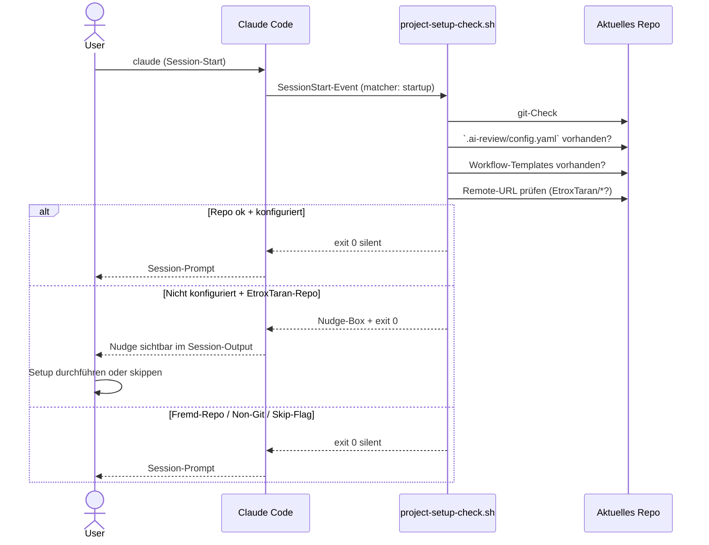

# Projekt-Setup-Hook — Automatischer Nudge beim Session-Start

> **TL;DR:** Ein kleines Skript fährt bei jedem Start einer Claude-Code-Sitzung automatisch an, prüft, ob das gerade geöffnete Projekt die Review-Pipeline eingerichtet hat, und gibt im gegenteiligen Fall eine kurze, handlungsbare Anleitung aus. Dadurch wird das Einrichten der Pipeline zum sichtbaren Standard-Schritt für jedes neue Projekt — kein Suchen in der Dokumentation, kein "war da was?". Der Hinweis ist bewusst nicht blockierend: Man kann ihn ignorieren, skippen oder befolgen. Für Repos, die bewusst ohne Pipeline laufen sollen, gibt es drei Wege, ihn zu deaktivieren.

## Wie es funktioniert



Der Hook ist Teil der agent-stack-Infrastruktur: Er liegt in `configs/claude/hooks/` und wird beim Install automatisch unter `~/.claude/hooks/` verfügbar gemacht. Die Registration im `settings.json` fügt ihn als `SessionStart`-Handler ein — dieser Event-Typ feuert bei jedem neuen Claude-Code-Start, bevor der Agent auf den ersten User-Input wartet.

Die **Design-Philosophie** ist absichtlich passiv: Der Hook kann nicht zwingen, er kann nur zeigen. Menschen machen Fehler, Informationelle `AGENTS.md`-Notizen gehen in vollen Kontexten unter. Aber ein Bash-Output am Session-Start steht am Anfang der Session und wird vom Agent im ersten Request bewusst wahrgenommen.

## Technische Details

### Hook-Skript

Liegt in [`configs/claude/hooks/project-setup-check.sh`](https://github.com/EtroxTaran/agent-stack/blob/main/configs/claude/hooks/project-setup-check.sh) (ca. 120 Zeilen Bash):

1. **Früh-Exit**-Bedingungen (silent exit 0):
   - `CLAUDE_SKIP_AI_REVIEW_SETUP=1` (Environment-Skip)
   - Nicht in einem Git-Repo
   - `.ai-review/config.yaml` **und** `.github/workflows/ai-code-review.yml` existieren bereits
   - `.ai-review/.noreview` oder `.noaireview` im Repo vorhanden
   - `remote.origin.url` enthält nicht `EtroxTaran/` (Fremd-Repo)
   - `gh`-CLI oder `gh ai-review`-Extension nicht installiert (zeigt dann Install-Hinweis statt Setup-Anleitung)

2. **Nudge-Output**, wenn alle Checks bestanden sind — sonst keine Nachricht:

```
┌─────────────────────────────────────────────────────────────────┐
│  ⚠️  AI-Review-Pipeline nicht aktiviert in '<repo-name>'
├─────────────────────────────────────────────────────────────────┤
│  Jedes Projekt unter EtroxTaran sollte die Review-Pipeline
│  haben (5 Stages + Consensus + Discord-Notifications).
│
│  Setup (~5 Min):
│    gh ai-review install
│    $EDITOR .ai-review/config.yaml    # Discord-Channel eintragen
│    gh ai-review verify               # Sanity-Check
│
│  Skip (für dieses Repo dauerhaft):
│    touch .ai-review/.noreview && git add … && git commit …
│
│  Details: agent-stack/docs/wiki/40-setup/00-quickstart-neues-projekt.md
└─────────────────────────────────────────────────────────────────┘
```

Exit-Code ist immer `0` — der Hook ist **nicht blockierend**.

### Registrierung im `settings.json`

Aus [`configs/claude/settings.json`](https://github.com/EtroxTaran/agent-stack/blob/main/configs/claude/settings.json):

```json
{
  "hooks": {
    "SessionStart": [
      {
        "matcher": "startup",
        "hooks": [
          {
            "type": "command",
            "command": "$HOME/.claude/hooks/project-setup-check.sh"
          }
        ]
      }
    ]
  }
}
```

`matcher: "startup"` beschränkt den Hook auf echte Session-Starts — er läuft **nicht** bei Session-Resumes oder Continue-Aufrufen.

### Bypass-Mechanismen

Drei Wege, den Nudge zu unterdrücken:

| Mechanismus | Wo setzen | Wann nutzen |
|---|---|---|
| `CLAUDE_SKIP_AI_REVIEW_SETUP=1` | Shell-ENV oder `~/.profile` | Während Urlaub / Migration / Debugging |
| `.ai-review/.noreview` | Als File im Repo committen | Repo soll dauerhaft keine Pipeline haben (z.B. Spielwiese) |
| Kein `EtroxTaran/`-Remote | automatisch | Fremd-Repos (keine manuelle Aktion nötig) |

### Agent-Verhalten (aus AGENTS.md §8.3)

Der globale `AGENTS.md §8.3 "Project-Setup-Step"` definiert, was der Agent mit dem Nudge tun soll:

1. Beim ersten nicht-trivialen User-Request den Nudge **einmal** erwähnen
2. Bei erkennbarem "neues-Projekt-aufsetzen"-Intent aktiv das Setup anbieten
3. Bei User-Ablehnung: respektieren, nicht drängen

Das heißt: Wenn Claude beim Session-Start den Nudge sieht und der User sofort "Hilf mir dieses Projekt aufzusetzen" schreibt, schlägt Claude den Setup-Flow vor. Wenn der User aber nur "Fix typo in README" will, macht Claude den Fix und erwähnt den Nudge am Ende einmal kurz.

### Das Zusammenspiel mit `gh ai-review install`

Der Hook verweist auf `gh ai-review install` als eigentlichen Setup-Schritt. Details dazu stehen in [`40-gh-extension.md`](40-gh-extension.md) — kurz:

```bash
cd ~/projects/<neues-repo>
gh ai-review install          # kopiert 10 Workflow-Templates + .ai-review/config.yaml
$EDITOR .ai-review/config.yaml
gh ai-review verify           # checkt Installation + Required Secrets
```

Nach dem Install feuert der Hook beim nächsten Session-Start nicht mehr — die Erkennungs-Bedingungen (`.ai-review/config.yaml` + `ai-code-review.yml` vorhanden) sind erfüllt.

### Lokaler Test ohne Claude-Code-Start

```bash
# Im konfigurierten Repo → keine Ausgabe, exit 0
cd ~/projects/ai-portal
bash ~/.claude/hooks/project-setup-check.sh
echo "Exit: $?"
# → Exit: 0

# Im unkonfigurierten EtroxTaran-Repo → Nudge
cd ~/projects/agent-stack   # hat selbst noch kein .ai-review/config.yaml
bash ~/.claude/hooks/project-setup-check.sh
# → Zeigt Nudge-Box, Exit: 0

# In Nicht-Git-Dir → keine Ausgabe
cd /tmp
bash ~/.claude/hooks/project-setup-check.sh
# → Exit: 0

# Skip per ENV → keine Ausgabe
CLAUDE_SKIP_AI_REVIEW_SETUP=1 bash ~/.claude/hooks/project-setup-check.sh
# → Exit: 0
```

### Historischer Kontext

Der Hook wurde am 2026-04-23 als Follow-up zur Wiki-Einführung ergänzt. Bis dahin war die Pipeline **opt-in pro Projekt** — man musste wissen, dass es sie gibt, und sie manuell einrichten. Bei neuen Projekten wurde das regelmäßig vergessen.

Die Entscheidung für einen `SessionStart`-Hook statt anderer Mechanismen (projekt-lokale `CLAUDE.md`-Notizen, Skill-Auto-Trigger) fiel, weil:

- `SessionStart` feuert **garantiert** bei jedem Session-Start, ohne vom Agent-Kontext abhängig zu sein
- Skills triggern nur auf matchende User-Prompts — zu spät für einen "du hast kein Setup gemacht"-Hinweis
- Projekt-lokale `CLAUDE.md`-Notizen fordern, dass das Projekt bereits aufgesetzt ist, was ein Henne-Ei-Problem ist

## Verwandte Seiten

- [Quickstart neues Projekt](00-quickstart-neues-projekt.md) — der manuelle 5-Minuten-Setup-Flow, auf den der Hook hinweist
- [`gh ai-review` Extension](40-gh-extension.md) — das Install-Werkzeug, das der Hook vorschlägt
- [agent-stack installieren](10-agent-stack-install.md) — Bootstrap, der u.a. die `configs/claude/hooks/` als Symlink anlegt
- [Skills & MCP-Server](../20-komponenten/70-skills-mcp.md) — Abgrenzung: Skills vs. Hooks
- [Contribute](../99-meta/00-contribute.md) — wie man neue Hooks vorschlägt

## Quelle der Wahrheit (SoT)

- [`configs/claude/hooks/project-setup-check.sh`](https://github.com/EtroxTaran/agent-stack/blob/main/configs/claude/hooks/project-setup-check.sh) — das Skript
- [`configs/claude/settings.json`](https://github.com/EtroxTaran/agent-stack/blob/main/configs/claude/settings.json) — Hook-Registrierung
- [`configs/claude/hooks/README.md`](https://github.com/EtroxTaran/agent-stack/blob/main/configs/claude/hooks/README.md) — komplettes Hook-Inventar
- [`AGENTS.md §8.3 "Project-Setup-Step"`](https://github.com/EtroxTaran/agent-stack/blob/main/AGENTS.md) — Agent-Verhaltensregel
- [PR #9](https://github.com/EtroxTaran/agent-stack/pull/9) — Einführungs-PR
