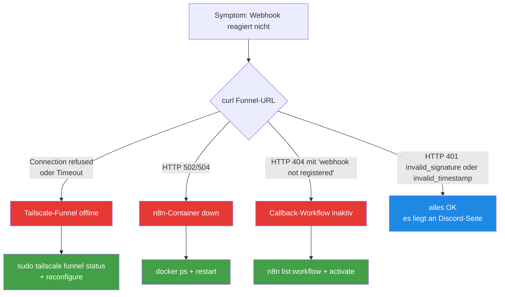

# Discord-Webhook down

> **TL;DR:** Wenn Button-Klicks in Discord nichts auslösen oder das Dev-Portal die Interactions-Endpoint-URL nicht speichert, liegt der Fehler fast immer in einer von drei Schichten: Tailscale-Funnel offline, n8n-Container gestoppt, oder Callback-Workflow inaktiv. Das Runbook führt diese drei Schichten von außen nach innen durch und zeigt für jede den konkreten Fix. Die Gesamt-Diagnose dauert unter fünf Minuten; der Fix ist meist ein einziger Befehl.

## Symptom

- Discord-Button-Klick: Discord zeigt "This interaction failed" nach 3 Sekunden
- Dev-Portal: "The specified interactions endpoint URL could not be verified" beim Save
- Live-Probe auf Funnel gibt `Connection refused` oder Timeout

## Diagnose (5-Minuten-Flowchart)



### Probe-Commands

```bash
# Schritt 1: Ist der Funnel-Endpoint überhaupt erreichbar?
curl -sS -X POST https://r2d2.tail4fc6dd.ts.net/webhook/discord-interaction \
  -H 'Content-Type: application/json' \
  --data-raw '{"type":1}' \
  -w '\nHTTP %{http_code}\n'

# Schritt 2: Was sagt Tailscale?
tailscale funnel status

# Schritt 3: Läuft der n8n-Container?
docker ps --filter name=ai-portal-n8n-portal-1 --format "{{.Names}} {{.Status}}"

# Schritt 4: Ist der Callback-Workflow aktiv?
docker exec ai-portal-n8n-portal-1 n8n list:workflow | grep callback
```

Erwartete Antwort bei funktionierendem System (Schritt 1):

```
{"error":"invalid_timestamp"}
HTTP 401
```

Das ist **korrekt** — die Verify-Logik lehnt unsigierte Requests ab. Bedeutet: Funnel, n8n, Callback alles online.

## Fix pro Schicht

### Schicht A: Tailscale-Funnel

**Diagnose:**

```bash
tailscale funnel status
# Output sollte enthalten:
# https://r2d2.tail4fc6dd.ts.net (Funnel on)
# |-- /webhook/discord-interaction proxy http://localhost:5678/...
```

**Fix wenn Funnel off ist:**

```bash
sudo tailscale serve --bg --https=443 \
  --set-path /webhook/discord-interaction \
  http://localhost:5678/webhook/discord-interaction

sudo tailscale funnel --bg --https=443 on
```

**Fix wenn Tailscale selbst offline:**

```bash
systemctl status tailscaled
sudo systemctl restart tailscaled
# Warten 5s, dann Funnel-Reconfig wie oben
```

### Schicht B: n8n-Container

**Diagnose:**

```bash
docker ps --filter name=ai-portal-n8n-portal-1
# Wenn nichts zurückkommt → Container stopped oder entfernt
```

**Fix:**

```bash
# Start wenn nur gestoppt
docker start ai-portal-n8n-portal-1

# Wenn wirklich weg (sollte nicht passieren):
bash ~/projects/agent-stack/ops/scripts/restart-n8n-with-ai-review.sh
```

**Health-Check nach Restart:**

```bash
sleep 10  # n8n braucht ~10s zum Hochfahren
curl -sf http://127.0.0.1:5678/healthz
# Erwartet: {"status":"ok"}
```

### Schicht C: Callback-Workflow

**Diagnose:**

```bash
docker exec ai-portal-n8n-portal-1 n8n list:workflow 2>&1 | grep -i callback
# Erwartet: ai-review-callback|[AI-Review] Discord Interaction → GitHub Action
# Wenn nicht gelistet: Workflow gelöscht, muss re-importiert werden
```

**Fix wenn Workflow gelistet, aber inaktiv:**

```bash
docker exec ai-portal-n8n-portal-1 n8n update:workflow --id ai-review-callback --active true
docker restart ai-portal-n8n-portal-1
```

**Fix wenn Workflow gelöscht (schlimmster Fall):**

```bash
bash ~/projects/agent-stack/ops/scripts/restart-n8n-with-ai-review.sh
# Das Skript importiert alle 3 Workflows neu + aktiviert
```

### Schicht D: Discord-Seite

Wenn alle drei obigen Schichten grün sind aber Discord trotzdem meckert:

**Dev-Portal prüfen:**
1. [Nathan-Ops-App im Dev-Portal](https://discord.com/developers/applications/1472703891371069511)
2. General Information → Interactions Endpoint URL
3. URL muss genau sein: `https://r2d2.tail4fc6dd.ts.net/webhook/discord-interaction`
4. "Save" drücken — Discord schickt dann einen Test-PING
5. Bei Fehler: "The specified ... could not be verified" → zurück zu Schicht A–C

**Public Key prüfen:**

```bash
# Was ist im Container gesetzt?
docker exec ai-portal-n8n-portal-1 printenv DISCORD_PUBLIC_KEY | cut -c1-8

# Was steht im Dev-Portal?
# → General Information → Public Key
# Erste 8 Zeichen müssen übereinstimmen
```

Wenn sie divergieren: `DISCORD_PUBLIC_KEY` in `~/.config/ai-workflows/env` auf den Dev-Portal-Wert setzen + Container recreate. Siehe [`50-token-rotation.md`](50-token-rotation.md).

## Prevention

- **Monitoring:** E2E-Probe alle 15 Minuten via Cron (nicht implementiert — offener Task)
- **Alert bei 3× 401 in 5 Min:** wäre ein klares Signal dass Discord-Signatur-Problem besteht
- **`tailscale funnel status` in E2E-Validation-Script** enthalten — siehe [`60-tests/00-e2e-validate-script.md`](../60-tests/00-e2e-validate-script.md)
- **Bot-Token / Public-Key nicht ohne Rotation-Runbook wechseln** — jede Änderung braucht Container-Recreate, vergisst man das, ist 20 Min später der Webhook tot

## Verwandte Seiten

- [Tailscale-Funnel](../20-komponenten/50-tailscale-funnel.md) — Konfiguration
- [n8n Workflows](../20-komponenten/30-n8n-workflows.md) — Callback-Details
- [Token-Rotation-Runbook](50-token-rotation.md) — wenn Public-Key/Bot-Token gewechselt werden muss
- [Button-Click-Callback-Workflow](../30-workflows/10-button-click-callback.md) — wie der Flow normal aussieht

## Quelle der Wahrheit (SoT)

- [`ops/n8n/tests/callback-live-probe.sh`](https://github.com/EtroxTaran/agent-stack/blob/main/ops/n8n/tests/callback-live-probe.sh) — automatisierte Probe
- [`ops/scripts/restart-n8n-with-ai-review.sh`](https://github.com/EtroxTaran/agent-stack/blob/main/ops/scripts/restart-n8n-with-ai-review.sh) — Container-Recreate-Skript
