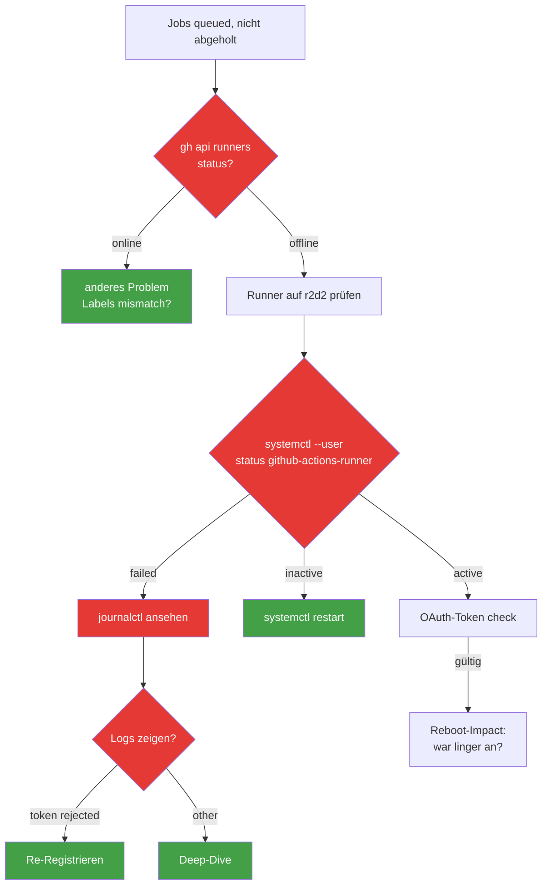

# Runner offline

> **TL;DR:** Wenn GitHub-Actions-Jobs in der Queue hängen bleiben und nicht vom Self-hosted-Runner abgeholt werden, ist der Runner offline. Ursache ist fast immer einer von drei Fällen: der systemd-User-Service ist gestoppt, der r2d2-Host wurde neu gestartet und "linger" war nicht gesetzt, oder der Runner hat seinen OAuth-Token verloren. Die Diagnose prüft diese drei in 2 Minuten; die Reparatur ist in den meisten Fällen ein `systemctl --user restart` oder eine Re-Registrierung. Kritische Jobs können in der Zwischenzeit manuell auf GitHub-hosted Runner umgeleitet werden (als Notlösung).

## Symptom

- Jobs mit `runs-on: [self-hosted, r2d2, ai-review]` bleiben in "Queued" hängen
- GitHub Actions-Tab zeigt: "Waiting for a runner to pick up this job"
- `gh api repos/EtroxTaran/ai-review-pipeline/actions/runners` zeigt `status: offline`
- `ai-review-v2-shadow.yml` Runs erscheinen nicht neben Einträgen aus der Cloud

## Diagnose



### Diagnose-Commands

```bash
# 1. Remote-Check: Was sagt GitHub?
gh api repos/EtroxTaran/ai-review-pipeline/actions/runners \
  --jq '.runners[] | {name, status, busy, labels: [.labels[].name]}'
# Erwartet: {"name":"r2d2-ai-review-pipeline", "status":"online", "busy":false, "labels":[...]}

# 2. Lokal auf r2d2:
systemctl --user status github-actions-runner
# Erwartet: active (running)

# 3. Logs der letzten Minuten
journalctl --user -u github-actions-runner --since "5 min ago" | tail -30

# 4. Runner-Identity-Datei vorhanden?
ls -la /home/clawd/github-runner/.runner
# Erwartet: Existiert + ist lesbar
```

## Fix-Szenarien

### Szenario A: Service ist inactive (häufigster Fall)

```bash
systemctl --user start github-actions-runner
sleep 5
systemctl --user status github-actions-runner
# Wenn active (running) → fertig
```

Falls der Service immer wieder auf inactive geht:

```bash
# Restart-Loop-Grund finden:
journalctl --user -u github-actions-runner -f
# In neuem Terminal: ist der Prozess gekillt? Memory-Probleme?
```

### Szenario B: Nach Reboot offline, linger war nicht gesetzt

```bash
# Linger aktivieren (erlaubt User-Services ohne Login zu laufen)
loginctl enable-linger clawd

# Service manuell starten
systemctl --user start github-actions-runner
systemctl --user enable github-actions-runner  # autostart bei Reboot
```

### Szenario C: OAuth-Token abgelaufen

Runner-Tokens können ablaufen, wenn der Runner lange offline war (>14 Tage) oder wenn jemand den Token aus GitHub-UI zurückgesetzt hat.

**Re-Registrierung:**

```bash
cd ~/github-runner

# 1. Service stoppen
systemctl --user stop github-actions-runner

# 2. Alten Runner entfernen
./config.sh remove --token <removal-token-von-github-UI>

# 3. Neuen Registration-Token von GitHub holen:
# Repo Settings → Actions → Runners → "New self-hosted runner" → token kopieren

# 4. Neu registrieren
./config.sh \
  --url https://github.com/EtroxTaran/ai-review-pipeline \
  --token <registration-token> \
  --name r2d2-ai-review-pipeline \
  --labels self-hosted,Linux,X64,r2d2,ai-review \
  --work _work \
  --unattended

# 5. Service starten
systemctl --user start github-actions-runner
```

### Szenario D: Runner läuft, aber Labels stimmen nicht

```bash
# Check: Welche Labels hat der Runner laut GitHub?
gh api repos/EtroxTaran/ai-review-pipeline/actions/runners \
  --jq '.runners[] | .labels[].name'
# Muss enthalten: self-hosted, Linux, X64, r2d2, ai-review
```

Wenn `ai-review` Label fehlt (Runner wurde ohne das Label registriert):

```bash
# Entweder re-register (Szenario C) oder Label via UI hinzufügen:
# Repo Settings → Actions → Runners → Runner auswählen → "Add label" → "ai-review"
```

## Notlösung: Auf GitHub-hosted umleiten

Wenn der Runner länger offline ist und kritische PRs blockieren, kann man temporär auf GitHub-hosted Runner umleiten:

```yaml
# ai-review-v2-shadow.yml (temporär patch)
jobs:
  code-review:
    runs-on: ubuntu-latest  # statt [self-hosted, r2d2, ai-review]
    # ...
```

**Problem:** Die LLM-Credentials sind lokal auf r2d2, nicht in GitHub-Secrets. Also muss man zusätzlich:
- `ANTHROPIC_API_KEY` als GitHub-Secret setzen
- Codex/Cursor/Gemini-Auth geht nicht (keine OAuth-Flow in Cloud-Runner)

→ Realistisch nur für den Claude-basierten Teil (Design-Stage + AC-Validation) als Bridge möglich.

**Besser:** Runner fixen statt umleiten. GitHub-hosted Notlösung nur wenn r2d2 für >24h offline ist.

## Prevention

- **Linger ON:** `loginctl enable-linger clawd` als Standard-Setup
- **Auto-Restart:** `Restart=always, RestartSec=10` in Service-File (bereits konfiguriert)
- **Monitoring:** Pingdom/UptimeRobot auf `https://api.github.com/repos/.../actions/runners` mit JSON-Check auf `status == online`
- **Backup-Runner:** Ein zweiter Runner auf einem anderen Gerät (z.B. NAS) als Fallback — noch nicht implementiert

## Verwandte Seiten

- [Self-hosted Runner](../20-komponenten/60-self-hosted-runner.md) — Setup + Architektur
- [pip-install-bricht](30-pip-install-bricht.md) — verwandtes Runner-Problem
- [Tools im Runner-Workspace](../20-komponenten/60-self-hosted-runner.md#runner-workspace-struktur)

## Quelle der Wahrheit (SoT)

- `~/.config/systemd/user/github-actions-runner.service` — Service-Definition
- [GitHub Runner Admin-Docs](https://docs.github.com/en/actions/hosting-your-own-runners)
