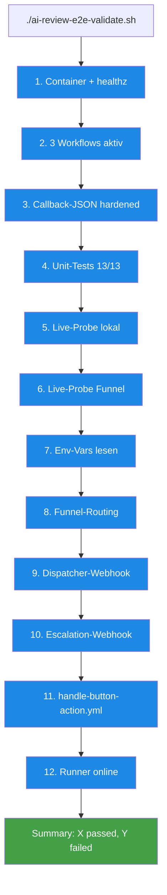

# E2E-Validation-Script — `ai-review-e2e-validate.sh`

> **TL;DR:** Ein Bash-Skript, das die komplette Toolchain in 25 Einzel-Checks abklopft und am Ende ein grün/rot-Urteil liefert. Läuft in unter 30 Sekunden und prüft: n8n-Container-Health, alle drei Workflows aktiv, Callback-Unit-Tests, Live-Probes auf lokalem und öffentlichem Webhook, Env-Variablen, Tailscale-Funnel, Dispatcher-/Escalation-Webhooks, das handle-button-action-Target auf main, und den Self-hosted-Runner-Online-Status. Das Skript ist Pflicht-Check nach jeder Infrastruktur-Änderung.

## Wie es funktioniert



Das Skript ist **linear und unkompliziert**: Ein Check nach dem anderen, jeder schreibt ein Ergebnis, am Ende Zusammenfassung. Bei `--verbose` werden Details ausgegeben, sonst nur die Pass/Fail-Zeilen.

Der Schlüssel-Wert ist **vollständige Abdeckung**: Alle Komponenten, die man manuell via `docker ps`, `curl`, `gh api` prüfen würde, sind hier skriptiert. Ein grünes Run-Resultat heißt: System komplett gesund.

## Technische Details

### Aufruf

```bash
# Standard (alle Checks)
./ops/n8n/tests/ai-review-e2e-validate.sh

# Ohne Discord-Posts (schneller, keine Test-Messages im Channel)
./ops/n8n/tests/ai-review-e2e-validate.sh --skip-discord

# Mit Verbose-Output
./ops/n8n/tests/ai-review-e2e-validate.sh --verbose
```

### Die 12 Check-Gruppen (mit 25 einzelnen Assertions)

**1. n8n-Container-Health**
- Container läuft (`docker inspect --format '{{.State.Running}}'`)
- `:5678/healthz` liefert `{"status":"ok"}`

**2. ai-review Workflows aktiv**
- `ai-review-escalation` in der Workflow-Liste
- `ai-review-callback` in der Workflow-Liste
- `ai-review-dispatcher` in der Workflow-Liste

**3. Callback-JSON enthält Hardening**
- `"webhookId": "discord-interaction"` im Workflow-JSON
- `MAX_TIMESTAMP_SKEW_SEC` im JS-Code
- SPKI-Ed25519-Prefix (`302a300506032b6570032100`) im JS-Code
- `"rawBody": true` in Webhook-Optionen

**4. Callback-Unit-Tests**
- `node callback-logic.test.js` → erwartet `N/N tests passed`

**5. Live-Probe lokal**
- `callback-live-probe.sh` mit `BASE_URL=localhost:5678` → alle 3 Cases grün (unsigned, bogus-sig, old-ts)

**6. Live-Probe Funnel**
- `callback-live-probe.sh` mit `BASE_URL=https://r2d2.tail4fc6dd.ts.net` → alle 3 Cases grün

**7. Env-Vars im Container**
- `DISCORD_BOT_TOKEN` Länge ≥ 40
- `DISCORD_PUBLIC_KEY` Länge = 64
- `GITHUB_TOKEN` Länge ≥ 40
- `GITHUB_REPO = EtroxTaran/ai-review-pipeline`
- `GITHUB_TARGET_REPO = EtroxTaran/ai-portal`

**8. Tailscale-Funnel**
- `tailscale funnel status` zeigt "Funnel on"
- Pfad-Passthrough `/webhook/discord-interaction` eingerichtet

**9. Dispatcher-Webhook E2E (nur ohne `--skip-discord`)**
- `curl -X POST /webhook/ai-review-dispatch` mit Test-Payload liefert HTTP 200 mit `{"ok":true,"message_id":"..."}`

**10. Escalation-Webhook E2E (nur ohne `--skip-discord`)**
- `curl -X POST /webhook/ai-review-escalation` liefert HTTP 200 mit `{"ok":true}`

**11. handle-button-action.yml**
- File existiert lokal im ai-review-pipeline-Repo
- Hat `workflow_dispatch` + `pr_number`-Input + `action`-Input
- Existiert auf remote main (via `gh api`)

**12. Self-hosted-Runner**
- `gh api repos/.../actions/runners --jq` zeigt `status: online`

### Beispiel-Output

```
=========================================================================
  AI-Review-Pipeline E2E Validation — 2026-04-23 21:11 CET
=========================================================================

[Check 1]  n8n-Container läuft ................................ [PASS]
[Check 2]  n8n /healthz liefert OK ............................. [PASS]
[Check 3]  Workflow ai-review-escalation aktiv ................. [PASS]
[Check 4]  Workflow ai-review-callback aktiv ................... [PASS]
[Check 5]  Workflow ai-review-dispatcher aktiv ................. [PASS]
[Check 6]  Callback-JSON hat webhookId ......................... [PASS]
[Check 7]  Callback-JSON hat Replay-Schutz ..................... [PASS]
[Check 8]  Callback-JSON hat SPKI-Prefix ....................... [PASS]
[Check 9]  Callback-JSON hat rawBody: true ..................... [PASS]
[Check 10] Callback-Logik Unit-Tests 13/13 ..................... [PASS]
[Check 11] Live-Probe localhost (3/3) .......................... [PASS]
[Check 12] Live-Probe Funnel (3/3) ............................. [PASS]
[Check 13] DISCORD_BOT_TOKEN gesetzt ........................... [PASS]
[Check 14] DISCORD_PUBLIC_KEY gesetzt .......................... [PASS]
[Check 15] GITHUB_TOKEN gesetzt ................................ [PASS]
[Check 16] GITHUB_REPO gesetzt ................................. [PASS]
[Check 17] GITHUB_TARGET_REPO gesetzt .......................... [PASS]
[Check 18] Tailscale Funnel on ................................. [PASS]
[Check 19] Funnel Path-Passthrough ............................. [PASS]
[Check 20] Dispatcher-Webhook postet Discord-Nachricht ......... [PASS]
[Check 21] Escalation-Webhook postet Discord-Alert ............. [PASS]
[Check 22] handle-button-action.yml lokal vorhanden ............ [PASS]
[Check 23] handle-button-action.yml auf main ................... [PASS]
[Check 24] workflow_dispatch-Inputs korrekt .................... [PASS]
[Check 25] Self-hosted Runner online ........................... [PASS]

=========================================================================
  Result: 25 passed, 0 failed — AI-Review-Pipeline ist vollständig grün.
=========================================================================
```

### Exit-Codes

- `0` — Alle Checks grün
- `1` — Mindestens ein Check rot (Details im Output)
- `2` — Skript-Fehler (z.B. `docker` nicht im PATH)

### Wann laufen lassen?

- **Nach jeder Änderung** an `ops/n8n/workflows/*.json`
- **Nach jeder Token-Rotation**
- **Nach Container-Recreate** (`restart-n8n-with-ai-review.sh`)
- **Nach r2d2-Reboot** als Sanity-Check
- **Vor Release** oder größeren Änderungen

Zeitaufwand: ~25 Sekunden (mit Discord-Posts), ~10 Sekunden (ohne).

### Integration in CI

Geplant (Phase 5): Der Script läuft als GitHub-Actions-Cron alle 15 Minuten und alerted bei Failure ins Alerts-Channel. Aktuell manuell ausgeführt.

## Verwandte Seiten

- [Callback-Unit-Tests](10-callback-unit-tests.md) — die 13 Tests, die Check #10 ausführt
- [Discord-Webhook-Down-Runbook](../50-runbooks/00-discord-webhook-down.md) — was tun wenn Check 1–8 rot wird
- [Token-Rotation](../50-runbooks/50-token-rotation.md) — nach Rotation sollte das Script grün werden

## Quelle der Wahrheit (SoT)

- [`ops/n8n/tests/ai-review-e2e-validate.sh`](https://github.com/EtroxTaran/agent-stack/blob/main/ops/n8n/tests/ai-review-e2e-validate.sh) — der Script selbst
- [`ops/n8n/tests/callback-logic.test.js`](https://github.com/EtroxTaran/agent-stack/blob/main/ops/n8n/tests/callback-logic.test.js) — Unit-Tests
- [`ops/n8n/tests/callback-live-probe.sh`](https://github.com/EtroxTaran/agent-stack/blob/main/ops/n8n/tests/callback-live-probe.sh) — Live-Probe
