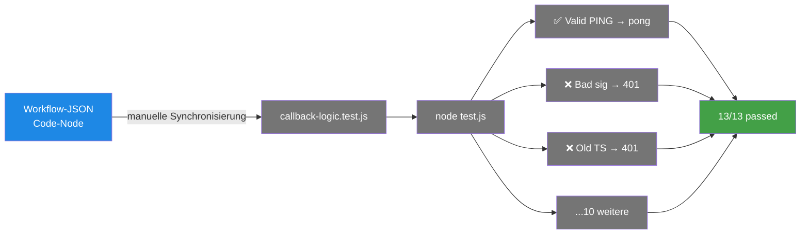

# Callback-Unit-Tests — Die 13 Verify-Cases

> **TL;DR:** Der Callback-Workflow in n8n enthält kryptographisch relevanten JavaScript-Code (Ed25519-Signatur-Verify, Timestamp-Skew-Check, Button-ID-Parsing). Um sicherzustellen, dass dieser Code bei Änderungen korrekt bleibt, wird die identische Logik in einer Node.js-Datei dupliziert und mit 13 Test-Cases gegengeprüft. Das Prinzip ist: Wenn diese Tests grün sind, arbeitet die Workflow-Logik genau so wie erwartet — jeder Edge-Case vom PING über replay-Attack bis zu kaputten Button-IDs ist abgedeckt.

## Wie es funktioniert



Die **Doppelung** ist bewusst: Der JS-Code läuft produktiv im n8n-Workflow-JSON, und **identisch** in der Test-Datei. Wenn man den Workflow-Code ändert, muss man auch die Test-Datei updaten — das ist eine manuelle Synchronisierungs-Pflicht. Das E2E-Validation-Script wird am Ende sicherstellen, dass beide konsistent sind (Check #10).

Warum diese Architektur statt Integration-Tests gegen den echten Workflow? Weil die 13 Cases nicht auf n8n-Runtime angewiesen sind — pure JavaScript-Logik, die man in Millisekunden in node laufen lassen kann. Schneller als 30 Sekunden n8n-Webhook-Roundtrip.

## Technische Details

### Die 13 Test-Cases

Aus [`ops/n8n/tests/callback-logic.test.js`](https://github.com/EtroxTaran/agent-stack/blob/main/ops/n8n/tests/callback-logic.test.js):

| # | Test | Expected Route | Expected Status |
|---|---|---|---|
| 1 | Valid Discord PING (type 1) | pong | type:1 |
| 2 | Valid Button-Click (type 3), custom_id="approve:42" | dispatch | type:6 (deferred ack) |
| 3 | Valid Button-Click, custom_id="fix:42" | dispatch | type:6 |
| 4 | Valid Button-Click, custom_id="manual:42" | dispatch | type:6 |
| 5 | Missing X-Signature-Ed25519 header | reject | 401 invalid_signature |
| 6 | Wrong signature (not signed by Discord's key) | reject | 401 invalid_signature |
| 7 | Missing X-Signature-Timestamp header | reject | 401 invalid_timestamp |
| 8 | Old timestamp (>300s ago) — replay attack | reject | 401 invalid_timestamp |
| 9 | Future timestamp (>300s ahead) | reject | 401 invalid_timestamp |
| 10 | Malformed custom_id "bogus:abc" (non-numeric PR) | reject | ephemeral error type:4 flags:64 |
| 11 | Unknown action "delete:5" | reject | ephemeral error type:4 |
| 12 | Unknown interaction type (type: 99) | reject | 400 unknown_type |
| 13 | Empty body | reject | 400 missing_body |

### Die `handleInteraction()`-Funktion

Die zentrale Funktion, die die Tests aufrufen:

```javascript
function handleInteraction(rawBody, signature, timestamp, publicKey) {
  const MAX_TIMESTAMP_SKEW_SEC = 300;
  const VALID_ACTIONS = new Set(['approve', 'fix', 'manual']);

  // Parse body
  let body = {};
  try { body = JSON.parse(rawBody || '{}'); } catch (e) {}

  // Timestamp-Skew-Check
  const tsNum = parseInt(timestamp, 10);
  const nowSec = Math.floor(Date.now() / 1000);
  if (!Number.isFinite(tsNum) || Math.abs(nowSec - tsNum) > MAX_TIMESTAMP_SKEW_SEC) {
    return { _route: 'reject', _response: { error: 'invalid_timestamp' }, _status: 401 };
  }

  // Ed25519-Verify mit SPKI-Prefix
  const SPKI_ED25519_PREFIX = Buffer.from('302a300506032b6570032100', 'hex');
  const crypto = require('crypto');
  const verifyOk = crypto.verify(
    null,
    Buffer.from(timestamp + rawBody, 'utf8'),
    { key: Buffer.concat([SPKI_ED25519_PREFIX, Buffer.from(publicKey, 'hex')]),
      format: 'der', type: 'spki' },
    Buffer.from(signature, 'hex')
  );

  if (!verifyOk) {
    return { _route: 'reject', _response: { error: 'invalid_signature' }, _status: 401 };
  }

  // Type-Routing
  if (body.type === 1) {
    return { _route: 'pong', _response: { type: 1 }, _status: 200 };
  }

  if (body.type === 3) {
    const customId = body.data?.custom_id ?? '';
    const [actionRaw, prRaw] = customId.split(':');
    const action = (actionRaw ?? '').toLowerCase().trim();
    const prNumber = parseInt(prRaw ?? '', 10);

    if (!VALID_ACTIONS.has(action) || !Number.isFinite(prNumber) || prNumber <= 0) {
      return {
        _route: 'reject',
        _response: { type: 4, data: { content: `Unknown action \`${customId}\``, flags: 64 } },
        _status: 200
      };
    }

    return {
      _route: 'dispatch',
      _response: { type: 6 },
      _dispatch: { action, pr_number: prNumber, user_id: body.member?.user?.id }
    };
  }

  return { _route: 'reject', _response: { error: 'unknown_type' }, _status: 400 };
}
```

Exakt derselbe Code steht im Workflow-JSON unter dem Code-Node "Verify + Route". Änderungen müssen bidirektional synchronisiert werden.

### Das Test-Harness

```javascript
const { handleInteraction } = require('./callback-logic');
const { sign, generateKeyPairSync } = require('crypto');

// Generiere Key-Pair für valide Signaturen in Tests
const { publicKey: pubKey, privateKey: privKey } = generateKeyPairSync('ed25519');
const publicKeyHex = pubKey.export({type: 'spki', format: 'der'})
                          .slice(-32)
                          .toString('hex');

function signRequest(rawBody, ts) {
  const msg = Buffer.from(ts + rawBody, 'utf8');
  return sign(null, msg, privKey).toString('hex');
}

// Test 1: Valid PING
function testValidPing() {
  const ts = String(Math.floor(Date.now() / 1000));
  const rawBody = JSON.stringify({ type: 1 });
  const sig = signRequest(rawBody, ts);
  const result = handleInteraction(rawBody, sig, ts, publicKeyHex);
  assert.strictEqual(result._route, 'pong');
  assert.strictEqual(result._response.type, 1);
}

// ... 12 weitere Tests

let passed = 0, failed = 0;
const tests = [testValidPing, testValidButtonApprove, ...];
tests.forEach(t => {
  try { t(); console.log(`✅ ${t.name}`); passed++; }
  catch (e) { console.log(`❌ ${t.name}: ${e.message}`); failed++; }
});

console.log(`\n${passed}/${passed + failed} tests passed`);
process.exit(failed > 0 ? 1 : 0);
```

### Ausführung

```bash
cd ~/projects/agent-stack
node ops/n8n/tests/callback-logic.test.js
# Erwartet:
# ✅ testValidPing
# ✅ testValidButtonApprove
# ...
# 13/13 tests passed
```

### Node-Version-Anforderungen

Braucht Node ≥ 16 für `crypto.verify` mit `'ed25519'`-Algorithmus. Im Runner ist Python 3.12 + Node 20+ vorinstalliert.

### Warum Duplizierung statt Import?

Problem: Der Code im n8n-Workflow-JSON ist eine String-Repräsentation. Ihn direkt importieren geht nicht (Parser-Overhead, Kontext-Abhängigkeiten vom n8n-Runner).

Alternative wäre ein Integration-Test gegen echten Webhook-Endpoint — aber das erfordert n8n up, Tailscale up, Discord-Signatur (die wir nicht haben, weil wir nicht Discord sind). 

Duplizierung + Review-Discipline ist ein akzeptabler Kompromiss für unsere Scope (kleine Family-Toolchain, selten geänderter Kern-Code).

### Was passiert bei Test-Failure

Wenn `callback-logic.test.js` rot wird:

1. **Logik ist gebrochen** — entweder im Test oder im Workflow. Prüfen: welche Zeilen unterscheiden sich?
2. **CI schlägt fehl** (falls in CI-Pipeline eingebunden — aktuell nicht)
3. **E2E-Validation Check #10 wird rot** — blockt Release

Workflow-JSON und Test-JS-File müssen **immer synchron** sein. Ein Vorschlag für besseres Tooling: `scripts/verify-callback-sync.sh` das die JS aus JSON extrahiert und mit der Test-Datei diffed. (Offener Task.)

## Verwandte Seiten

- [Button-Click-Callback-Workflow](../30-workflows/10-button-click-callback.md) — der Flow, den die Tests absichern
- [n8n Workflows](../20-komponenten/30-n8n-workflows.md) — wo der Workflow lebt
- [E2E-Validation-Script](00-e2e-validate-script.md) — umfasst diese Tests als Check #10
- [Stolpersteine #3 + #4 + #5](../50-runbooks/60-stolpersteine.md) — Ed25519 + rawBody + Replay

## Quelle der Wahrheit (SoT)

- [`ops/n8n/tests/callback-logic.test.js`](https://github.com/EtroxTaran/agent-stack/blob/main/ops/n8n/tests/callback-logic.test.js) — die Tests
- [`ops/n8n/workflows/ai-review-callback.json`](https://github.com/EtroxTaran/agent-stack/blob/main/ops/n8n/workflows/ai-review-callback.json) — der Workflow (Code-Node "Verify + Route")
