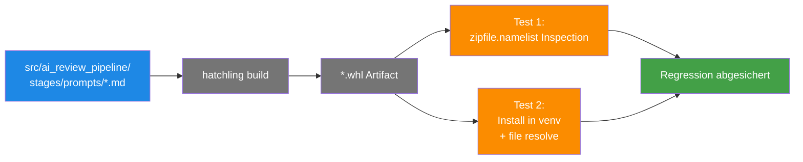

# Wheel-Packaging-Regression — `.md`-Files im Wheel

> **TL;DR:** Im April 2026 gab es einen Bug, bei dem die Stage-Prompts (Markdown-Dateien im `stages/prompts/`-Verzeichnis) zwar im Source-Tree waren, aber nicht im gebauten Wheel-Artifact. Das Ergebnis: Alle Review-Stages crashten zur Laufzeit mit `FileNotFoundError`. Der Fix war eine Korrektur der hatchling-Package-Config. Um zu verhindern, dass das nochmal passiert, gibt es jetzt zwei spezielle Regressions-Tests, die das gebaute Wheel inspizieren und die Prompt-Files darin finden müssen.

## Wie es funktioniert



Die zwei Tests prüfen **zwei unabhängige Eigenschaften**:

1. **Physische Präsenz im Wheel** (Zipfile-Inspection): Das Wheel ist ein ZIP-Archiv. Wir laden es und prüfen, dass die `.md`-Einträge dort drin sind.
2. **Lauffähigkeit nach Install** (Integration): Ein frisches venv bekommt das Wheel installiert, dann probiert der Test die Files zu resolven — genau wie der Production-Code es zur Laufzeit tut.

Beide Tests zusammen fangen den gesamten Pipeline-Weg ab: Sourcetree → Build → Artifact → Install → Laufzeit-Access.

## Technische Details

### Der historische Bug (PR #8)

**Symptom (Shadow-Run #24689725932, 2026-04-20):**

```
Stage code crashed: [Errno 2] No such file or directory:
'/home/clawd/github-runner/_work/_tool/Python/3.12.13/x64/lib/python3.12/site-packages/ai_review_pipeline/stages/prompts/code_review.md'
```

**Root Cause:**

Im `pyproject.toml`:

```toml
# ALT (buggy):
[tool.hatch.build.targets.wheel]
packages = ["src"]

# NEU (fix):
[tool.hatch.build.targets.wheel]
packages = ["src/ai_review_pipeline"]
```

Mit `packages = ["src"]` nahm hatchling nur die `.py`-Dateien, **nicht** die `.md`-Prompt-Files. Mit `packages = ["src/ai_review_pipeline"]` wird der komplette Package-Tree inklusive Nicht-Python-Dateien eingeschlossen.

### Test 1: Zipfile-Inspection

```python
# tests/test_wheel_packaging.py
import zipfile
from pathlib import Path

def test_wheel_contains_prompts():
    """Build wheel + inspect zip."""
    import subprocess
    subprocess.run(
        ["python", "-m", "build", "--wheel", "--outdir", "/tmp/test-dist"],
        check=True
    )

    wheel_files = list(Path("/tmp/test-dist").glob("*.whl"))
    assert len(wheel_files) == 1
    wheel = wheel_files[0]

    with zipfile.ZipFile(wheel) as zf:
        names = zf.namelist()

    expected_prompts = [
        "ai_review_pipeline/stages/prompts/code_review.md",
        "ai_review_pipeline/stages/prompts/cursor_review.md",
        "ai_review_pipeline/stages/prompts/security_review.md",
        "ai_review_pipeline/stages/prompts/design_review.md",
    ]
    for prompt in expected_prompts:
        assert prompt in names, f"Missing in wheel: {prompt}"
```

Der Test baut das Wheel on-demand (`python -m build`), inspiziert das ZIP, prüft Präsenz der 4 Prompts. Läuft in < 5 Sekunden.

### Test 2: Install + File-Resolve

```python
def test_wheel_install_enables_prompt_loading():
    """Install wheel into fresh venv + try to load prompts."""
    import subprocess
    import sys

    venv_dir = "/tmp/wheel-test-venv"
    subprocess.run([sys.executable, "-m", "venv", venv_dir], check=True)

    pip = f"{venv_dir}/bin/pip"
    subprocess.run([pip, "install", "build"], check=True)
    subprocess.run(
        [pip, "install", "/tmp/test-dist/ai_review_pipeline-*.whl"],
        shell=True, check=True
    )

    python = f"{venv_dir}/bin/python"
    result = subprocess.run(
        [python, "-c",
         "from importlib.resources import files;\n"
         "from ai_review_pipeline.stages import prompts;\n"
         "for stage in ['code_review', 'cursor_review', 'security_review', 'design_review']:\n"
         "    p = files(prompts) / f'{stage}.md'\n"
         "    assert p.is_file(), f'Missing: {p}'\n"
         "print('OK')"
        ],
        check=True, capture_output=True, text=True
    )
    assert "OK" in result.stdout
```

Erster Test macht die Artifact-Prüfung; zweiter beweist, dass die installierte Package tatsächlich die Files resolven kann. Zusammen: vollständige Abdeckung.

### Warum beide Tests?

Theoretisch reicht Test 1 — wenn das Wheel die Files enthält, installiert pip sie auch. Aber Test 2 schützt gegen einen anderen Pfad: Wenn `pip install` aus irgendwelchen Gründen Files drop (z.B. custom egg-info-Handling, wheel-Caching mit falschen Metadaten), merkt Test 2 das.

Doppelte Versicherung für einen Kern-Bug, der uns schon mal 4 Stunden Debugging gekostet hat.

### Run im CI

Die Tests liegen in `tests/test_wheel_packaging.py` und laufen als Teil der Standard-pytest-Suite:

```bash
pytest tests/test_wheel_packaging.py -v
```

In [`ci.yml`](https://github.com/EtroxTaran/ai-review-pipeline/blob/main/.github/workflows/ci.yml) ist das ein Standard-Job. Wenn die Tests rot werden → CI rot → kein Merge.

### Was wenn die Tests rot werden?

**Check 1 rot (Zipfile):** Package-Config prüfen in `pyproject.toml`. Suche `packages`-Key. Muss `["src/ai_review_pipeline"]` sein.

**Check 2 rot (Install):** Wheel-Build ist möglicherweise korrupt. `rm -rf /tmp/test-dist` + rebuild. Wenn immer noch rot → pip-Cache leeren: `pip cache purge`.

**Beides rot:** Wahrscheinlich kein Test-Setup-Problem, sondern tatsächliche Regression. Git-Blame auf `pyproject.toml` + Package-Config. Rollback falls nötig.

## Verwandte Seiten

- [ai-review-pipeline Repo](../20-komponenten/10-ai-review-pipeline-repo.md) — Package-Struktur + hatchling-Config
- [AI-Review-Pipeline (Konzept)](../10-konzepte/00-ai-review-pipeline.md) — Stage-Prompts-Architektur
- [pip-install-bricht-Runbook](../50-runbooks/30-pip-install-bricht.md) — verwandte Install-Probleme
- [Stolpersteine #8](../50-runbooks/60-stolpersteine.md) — der historische Kontext

## Quelle der Wahrheit (SoT)

- [`tests/test_wheel_packaging.py`](https://github.com/EtroxTaran/ai-review-pipeline/blob/main/tests/test_wheel_packaging.py) — die beiden Tests
- [`pyproject.toml`](https://github.com/EtroxTaran/ai-review-pipeline/blob/main/pyproject.toml) — Package-Config
- [PR #9](https://github.com/EtroxTaran/ai-review-pipeline/pull/9) — Einführung der Regression-Tests
- [PR #8](https://github.com/EtroxTaran/ai-review-pipeline/pull/8) — der Root-Cause-Fix (hatchling-Config)
