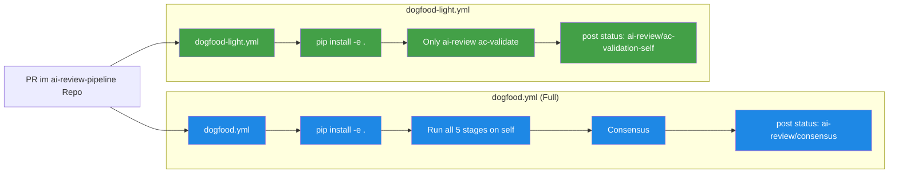

# Dogfood-Pipeline — Review auf sich selbst

> **TL;DR:** Das ai-review-pipeline-Repository lässt seine eigenen PRs von seiner eigenen Pipeline reviewen. Das heißt: Wenn jemand eine Änderung an der Pipeline-Logik vorschlägt, läuft die aktuelle Pipeline-Version gegen den Code und bewertet ihn. Das ist "eat your own dogfood" — die Pipeline muss Vertrauen genug sein, um ihre eigene Weiterentwicklung zu validieren. Der Dogfood-Mechanismus ist in zwei Varianten implementiert: ein voller Self-Review ("dogfood") und ein kompakter Smoke-Test ("dogfood-light"), der nur AC-Validation macht.

## Wie es funktioniert



Der **Dogfood-Prinzip** ist nicht nur Symbolik: Es ist ein **zusätzlicher Quality-Check**. Wenn ein PR in der Pipeline selbst Logik-Fehler einführt, die den eigenen Review-Code brechen, merkt der Dogfood-Run das sofort. Kein anderer Test würde das so gut fangen, weil er die Pipeline als Ganzes exerziert.

Die **zwei Varianten** (full + light) haben unterschiedliche Zwecke:
- **Full Dogfood:** Auf Release-Branches oder vor größeren Merges, um komplett zu validieren
- **Light Dogfood:** Auf jedem PR, weil schneller — prüft nur die AC-Coverage ohne alle 5 Stages zu starten

## Technische Details

### dogfood.yml — der volle Self-Review

Aus [`.github/workflows/dogfood.yml`](https://github.com/EtroxTaran/ai-review-pipeline/blob/main/.github/workflows/dogfood.yml):

```yaml
name: Dogfood Self-Review

on:
  pull_request:
    types: [opened, synchronize, reopened]
  workflow_dispatch:
    inputs:
      pr_number:
        required: true
        type: string

jobs:
  self-review:
    runs-on: [self-hosted, r2d2, ai-review]
    steps:
      - uses: actions/checkout@v4
      - uses: actions/setup-python@v5
      - run: pip install -e ".[dev,gherkin]"
      - run: |
          # Alle 5 Stages auf die PR-Änderungen selbst ausführen
          PR=${{ inputs.pr_number || github.event.pull_request.number }}
          ai-review stage code-review --pr $PR
          ai-review stage cursor-review --pr $PR
          ai-review stage security --pr $PR
          ai-review stage design --pr $PR
          ai-review ac-validate --pr-body-file ...
          ai-review consensus --sha ${{ github.sha }} --pr $PR
```

**Einschränkung:** Weil das Repo die Pipeline *ist*, kann ein neu-hinzugefügter Code-Pfad theoretisch beim Review-Prozess selbst aktiv werden — potential für Heisenbugs. Aber in der Praxis haben wir das bisher nicht erlebt; die Stage-Interfaces sind stabil.

### dogfood-light.yml — AC-Only-Smoke

Aus [`.github/workflows/dogfood-light.yml`](https://github.com/EtroxTaran/ai-review-pipeline/blob/main/.github/workflows/dogfood-light.yml):

```yaml
name: Dogfood Light — AC-Validate Self

on:
  pull_request:
    types: [opened, synchronize, reopened]

jobs:
  ac-validate-self:
    runs-on: [self-hosted, r2d2, ai-review]
    steps:
      - uses: actions/checkout@v4
      - uses: actions/setup-python@v5
      - run: pip install -e ".[dev,gherkin]"
      - name: Fetch PR data
        run: |
          gh pr view $PR --json body,files > /tmp/pr_meta.json
          # ... PR-Body, changed-files, linked-issues extrahieren
      - name: Run AC validation
        run: |
          ai-review ac-validate \
            --pr-body-file /tmp/pr_body.txt \
            --linked-issues-file /tmp/linked_issues.json \
            --changed-files "$(cat /tmp/changed.txt)" \
            --diff-file /tmp/pr_diff.txt
      - name: Post status
        run: |
          gh api -X POST repos/.../statuses/${{ github.event.pull_request.head.sha }} \
            -F state=success \
            -F context="ai-review/ac-validation-self" \
            -F description="[dogfood-light] AC-Coverage X/Y (conf Z%)"
```

Output-Beispiel einer Dogfood-Light-Status: `[dogfood-light] AC-Coverage 1/10 (100% confidence) — waived=False`.

### Warum `pip install -e .` statt `git+URL`?

In den Consumer-Workflows (ai-portal) nutzen wir `pip install git+…` weil dort die Pipeline extern installiert werden muss. Im Dogfood-Fall ist die Pipeline das Repo selbst — `pip install -e .` (editable install) ist schneller und nutzt den lokalen Checkout direkt.

### Status-Context-Name

Die Dogfood-Status-Contexts enden mit `-self`:
- `ai-review/consensus` (Full Dogfood) — überschreibt denselben Context wie normale PRs
- `ai-review/ac-validation-self` (Light Dogfood) — expliziter Name für AC-Only

Mit `-self`-Suffix wird klar dass das ein Self-Review ist und nicht verwechselt mit Consumer-PRs (die normalerweise in anderen Repos laufen).

### Branch-Protection-Integration

Im ai-review-pipeline-Repo ist in Branch-Protection aktuell nur `Test & Coverage` + `Lint (ruff)` + `YAML lint` required — nicht das Dogfood. Begründung: Dogfood ist Diagnose-Mechanismus, nicht Gatekeeper. Wenn Dogfood rot wird, interessiert es uns, aber der PR soll nicht zwangsweise blockieren — vielleicht ist das "Findings" wirklich der richtige Move.

Für Consumer-Projekte wie ai-portal ist das anders: Dort ist `ai-review/consensus` required. Siehe [`70-reference/20-status-contexts.md`](../70-reference/20-status-contexts.md).

### Was lernen wir aus Dogfood-Runs?

**Konkrete Funde aus letzten Monaten:**

1. **PR#8 Prompts-Fix** hätte durch Dogfood gefangen werden können, wurde aber nicht — der Fix wurde durch einen echten ai-portal Shadow-Run entdeckt. Lesson: Dogfood reicht nicht allein, echte Consumer-Runs braucht's auch.

2. **PR#7 handle-button-action** — Dogfood lief grün, weil die Änderung keine Pipeline-Interna berührte. Hat kein False-Positive erzeugt. OK.

3. **PR#9 Wheel-Packaging-Tests** — Dogfood hätte das auch nicht gefangen (die Tests prüfen spezifisch Packaging, was normal-Pipeline nicht tut). Dedizierte Tests schlagen Dogfood hier.

**Lesson Learned:** Dogfood ist eine Zusatz-Versicherung, keine Einzel-Quelle. Zusätzliche Regression-Tests + Real-Consumer-Shadows sind Pflicht.

### Manuelles Dogfood triggern

Für Debug-Zwecke:

```bash
gh workflow run dogfood.yml \
  --repo EtroxTaran/ai-review-pipeline \
  --ref main \
  -f pr_number=10
```

Das läuft den Dogfood-Full-Flow gegen PR #10 manuell. Nützlich wenn man nach einem Fix prüfen will, ob der Self-Review noch durchläuft.

## Verwandte Seiten

- [AI-Review-Pipeline (Konzept)](../10-konzepte/00-ai-review-pipeline.md) — die Stages, die Dogfood ausführt
- [ai-review-pipeline Repo](../20-komponenten/10-ai-review-pipeline-repo.md) — das Repo, das sich selbst reviewed
- [Wheel-Packaging-Regression](20-wheel-packaging-regression.md) — dedizierte Tests, wo Dogfood nicht reicht

## Quelle der Wahrheit (SoT)

- [`.github/workflows/dogfood.yml`](https://github.com/EtroxTaran/ai-review-pipeline/blob/main/.github/workflows/dogfood.yml)
- [`.github/workflows/dogfood-light.yml`](https://github.com/EtroxTaran/ai-review-pipeline/blob/main/.github/workflows/dogfood-light.yml)
