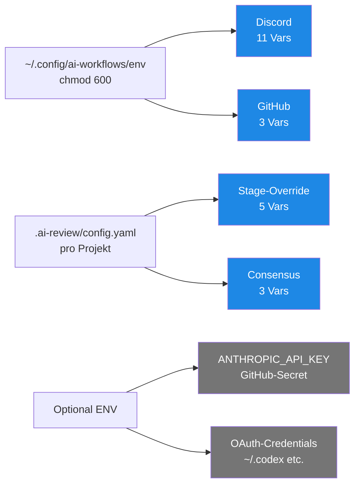

# Env-Variablen — Referenz

> **TL;DR:** Die Toolchain nutzt etwa 20 Umgebungs-Variablen über drei Kategorien verteilt: Discord-Credentials, GitHub-Integration und optionale Overrides. Alle sensiblen Werte leben in `/home/clawd/.config/ai-workflows/env` (chmod 600), die nicht-sensiblen Konfigurationen in der jeweiligen `.ai-review/config.yaml` pro Projekt. Diese Seite listet jede Variable mit Zweck, erwartetem Wertformat und welche Komponente sie liest.

## Kategorien-Übersicht



## Discord-Variablen (11)

Alle in `/home/clawd/.config/ai-workflows/env`:

| Variable | Typ | Zweck |
|---|---|---|
| `DISCORD_BOT_TOKEN` | 72 chars | Bot-API-Token (sensitiv, rotiert im Dev-Portal) |
| `DISCORD_APPLICATION_ID` | 19 chars | Application-ID (öffentlich: `1472703891371069511`) |
| `DISCORD_PUBLIC_KEY` | 64 hex chars | Ed25519 Public Key (für Interactions-Signatur-Verify) |
| `DISCORD_GUILD_ID` | 19 chars | Guild-ID "Nathan Ops" |
| `DISCORD_ALERTS_CHANNEL_ID` | 19 chars | Gemeinsamer Alerts-Channel (Eskalationen) |
| `DISCORD_CHANNEL_AI_PORTAL` | 19 chars | Regulärer Review-Channel für ai-portal |
| `DISCORD_CHANNEL_AI_PORTAL_SHADOW` | 19 chars | Shadow-Channel für ai-portal |
| `DISCORD_CHANNEL_AI_REVIEW_PIPELINE` | 19 chars | Regulärer Review-Channel für ai-review-pipeline |
| `DISCORD_CHANNEL_AI_REVIEW_PIPELINE_SHADOW` | 19 chars | Shadow-Channel für ai-review-pipeline |
| `DISCORD_CHANNEL_AGENT_STACK` | 19 chars | Regulärer Review-Channel für agent-stack |
| `DISCORD_CHANNEL_AGENT_STACK_SHADOW` | 19 chars | Shadow-Channel für agent-stack |

**Wo gelesen:**
- Von n8n-Workflows (gemountet via Docker-Compose-Override)
- Vom Self-hosted-Runner (explizit per `source` in Workflow-Steps)

Details: [`20-komponenten/80-secrets-env.md`](../20-komponenten/80-secrets-env.md).

## GitHub-Variablen (3)

| Variable | Typ | Zweck |
|---|---|---|
| `GITHUB_TOKEN` | 40 chars (classic PAT) oder `github_pat_…` (fine-grained) | PAT mit `repo` + `workflow` Scopes, für n8n workflow_dispatch und API-Calls |
| `GITHUB_REPO` | `owner/name` | Default-Repo für Button-Action-Dispatches (z.B. `EtroxTaran/ai-review-pipeline`) |
| `GITHUB_TARGET_REPO` | `owner/name` | Ziel-Repo für Stage-Aktionen (z.B. `EtroxTaran/ai-portal`) |

Unterschied `GITHUB_REPO` vs. `GITHUB_TARGET_REPO`:
- **`GITHUB_REPO`:** Wo der Button-Handler läuft (der `handle-button-action.yml`-Workflow)
- **`GITHUB_TARGET_REPO`:** Auf welches Repo sich die Aktion bezieht

## Stage-Override-Variablen (in `.ai-review/config.yaml`)

Pro Projekt-Config, nicht global:

| Key | Typ | Zweck | Default |
|---|---|---|---|
| `reviewers.codex` | str | Codex-Modell-ID (Override; Default aus Registry `OPENAI_MAIN`) | `gpt-5.5` |
| `reviewers.cursor` | str | Cursor-Modell-ID | `composer-2` |
| `reviewers.gemini` | str | Gemini-Modell-ID (Override; Default aus Registry `GEMINI_PRO`) | `gemini-3.1-pro-preview` |
| `reviewers.claude` | str | Claude-Modell-ID (Override; Default aus Registry `CLAUDE_OPUS`) | `claude-opus-4-7` |

> **Best Practice (Phase 5):** Das `reviewers:`-Block pro Projekt ist optional und wird selten gebraucht — die Pipeline holt die Pins aus der [MODEL_REGISTRY.env](https://github.com/EtroxTaran/ai-review-pipeline/blob/main/src/ai_review_pipeline/registry/MODEL_REGISTRY.env). Nur setzen, wenn du absichtlich von der Registry abweichen willst (Experimente, Cost-Optimierung). Per-Run-Override via `AI_REVIEW_MODEL_<ROLE>` Env-Var.
| `stages.<name>.enabled` | bool | Stage überhaupt aktiv? | `true` |
| `stages.<name>.blocking` | bool | Fail-Closed bei Ausfall? | `true` |

## Consensus-Variablen (in Config)

| Key | Typ | Zweck | Default |
|---|---|---|---|
| `consensus.success_threshold` | int | `avg ≥ X → success` | `8` |
| `consensus.soft_threshold` | int | `X ≤ avg < success_threshold → soft` | `5` |
| `consensus.fail_closed_on_missing_stage` | bool | Fail-Closed-Verhalten | `true` |

## Discord-Notifications-Variablen (in Config)

| Key | Typ | Zweck |
|---|---|---|
| `notifications.discord.channel_id` | str | Channel-ID, entweder hart coded oder als `"${DISCORD_CHANNEL_*}"` env-resolved |
| `notifications.discord.mention_role` | str | `"@here"` oder `""` (leer = kein Ping) |
| `notifications.discord.sticky_message` | bool | Update existing message vs. neuer Post |
| `notifications.discord.soft_consensus_timeout_min` | int | Minuten bis Eskalation (0 = keine) |

## Optionale Variablen (GitHub-Secrets oder lokal)

| Variable | Typ | Zweck | Wo gesetzt |
|---|---|---|---|
| `ANTHROPIC_API_KEY` | `sk-ant-…` | Claude-API (für Design-Stage + AC-Judge) | GitHub-Secret im jeweiligen Repo |
| `ai-workflows/env` | file | Runner-ENV-Quelle | `/home/clawd/.config/ai-workflows/env` |
| `OAuth-Credentials` | dir | Codex/Cursor/Gemini-Login-State | `~/.codex/`, `~/.cursor/`, `~/.gemini/` im Runner-Home |

## Runner-interne Variablen

Diese werden von `actions/setup-python@v5` + Runner-Subsystem automatisch gesetzt:

| Variable | Bedeutung |
|---|---|
| `pythonLocation` | Pfad zum Python-Binary, z.B. `/home/clawd/github-runner/_work/_tool/Python/3.12.13/x64` |
| `PYTHONPATH` | Wird implizit gesetzt, damit `import ai_review_pipeline` funktioniert |
| `PKG_CONFIG_PATH` | `$pythonLocation/lib/pkgconfig` |
| `LD_LIBRARY_PATH` | `$pythonLocation/lib` |
| `RUNNER_WORKSPACE` | Workspace-Root, z.B. `_work/<repo>/<repo>/` |

Diese sollten **nicht** manuell überschrieben werden — setup-python managed sie.

## Beispiel: Vollständige env-Datei (nur Keys, keine Werte)

```bash
# ~/.config/ai-workflows/env (chmod 600)

# --- Discord ---
DISCORD_BOT_TOKEN=<72 chars>
DISCORD_APPLICATION_ID=1472703891371069511
DISCORD_PUBLIC_KEY=<64 hex chars>
DISCORD_GUILD_ID=<19 chars>
DISCORD_ALERTS_CHANNEL_ID=<19 chars>
DISCORD_CHANNEL_AI_PORTAL=<19 chars>
DISCORD_CHANNEL_AI_PORTAL_SHADOW=<19 chars>
DISCORD_CHANNEL_AI_REVIEW_PIPELINE=<19 chars>
DISCORD_CHANNEL_AI_REVIEW_PIPELINE_SHADOW=<19 chars>
DISCORD_CHANNEL_AGENT_STACK=<19 chars>
DISCORD_CHANNEL_AGENT_STACK_SHADOW=<19 chars>

# --- GitHub ---
GITHUB_TOKEN=<40 chars classic PAT>
GITHUB_REPO=EtroxTaran/ai-review-pipeline
GITHUB_TARGET_REPO=EtroxTaran/ai-portal
```

**Total: 14 Keys.** Die 11 Discord-Vars + 3 GitHub-Vars decken die komplette Integration ab.

## Wann welche Variable ändern?

| Trigger | Variable | Runbook |
|---|---|---|
| Neue Discord-App oder neuer Bot | `DISCORD_BOT_TOKEN`, `DISCORD_APPLICATION_ID` | [`50-runbooks/50-token-rotation.md`](../50-runbooks/50-token-rotation.md) |
| Public-Key-Reset | `DISCORD_PUBLIC_KEY` | 50-token-rotation.md |
| Neues Projekt onboarden | `DISCORD_CHANNEL_<NAME>` + `DISCORD_CHANNEL_<NAME>_SHADOW` | [`40-setup/00-quickstart-neues-projekt.md`](../40-setup/00-quickstart-neues-projekt.md) |
| GitHub-Token abgelaufen | `GITHUB_TOKEN` | 50-token-rotation.md |
| Neue Modell-Version (z.B. Claude 5) | `reviewers.claude` in Config | `.ai-review/config.yaml` Edit + Commit |
| Consensus-Schwelle anpassen | `consensus.success_threshold` in Config | Config-Edit + Commit |

## Verwandte Seiten

- [Secrets & Env](../20-komponenten/80-secrets-env.md) — Domain-Separation und Handling
- [.ai-review/config.yaml-Schema](../40-setup/20-ai-review-config-schema.md) — alle Config-Optionen
- [Token-Rotation](../50-runbooks/50-token-rotation.md) — wie rotieren
- [Channel-Mapping](30-channel-mapping.md) — welcher Channel für was

## Quelle der Wahrheit (SoT)

- [`agent-stack/.env.example`](https://github.com/EtroxTaran/agent-stack/blob/main/.env.example) — Template (Keys ohne Werte)
- [`ops/compose/n8n-ai-review.override.yml`](https://github.com/EtroxTaran/agent-stack/blob/main/ops/compose/n8n-ai-review.override.yml) — Env-Mount-Config
- [`schema/config.schema.yaml`](https://github.com/EtroxTaran/ai-review-pipeline/blob/main/schema/config.schema.yaml) — Config-Schema
