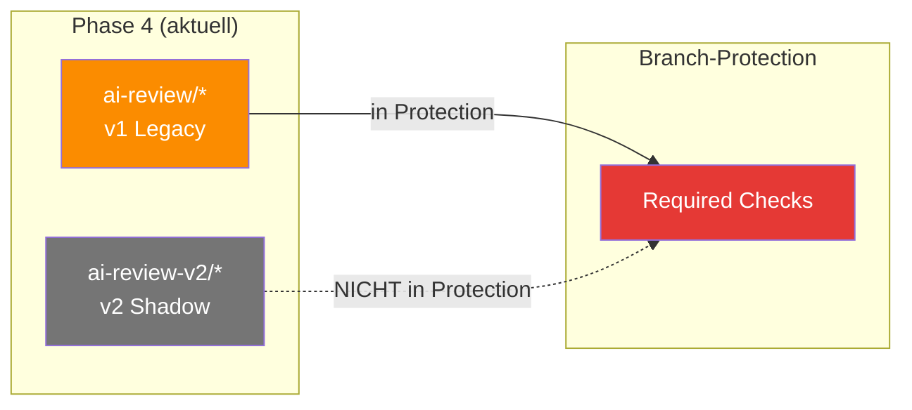

# Status-Contexts — `ai-review/*` vs. `ai-review-v2/*`

> **TL;DR:** Jede Review-Stage schreibt am Ende einen GitHub-Commit-Status auf den PR-HEAD-Commit. Der "Context-Name" dieses Status entscheidet, ob die Branch-Protection ihn als Required-Check behandelt. Aktuell laufen zwei parallele Präfix-Räume: `ai-review/*` ist die Legacy-v1-Pipeline (required), `ai-review-v2/*` ist die neue Shadow-Pipeline (non-required). Diese Seite zeigt die vollständige Matrix und was beim Cutover zu Phase 5 mit den Namen passiert.

## Kontext-Matrix



## Die Context-Namen im Detail

### v1 Legacy-Pipeline (required)

| Context | Stage | Status-Werte |
|---|---|---|
| `ai-review/scope-check` | Pre-Flight | success (ok), failure (PR-Body-Fehler) |
| `ai-review/code` | Stage 1 Codex | success, failure, pending |
| `ai-review/code-cursor` | Stage 1b Cursor | success (+"skipped: rate-limit" möglich), failure, pending |
| `ai-review/security` | Stage 2 Gemini+semgrep | success, failure, pending |
| `ai-review/design` | Stage 3 Claude | success (+"skipped — no UI"), failure, pending |
| `ai-review/ac-validation` | Stage 5 Codex+Claude | success, failure (coverage < min), pending |
| `ai-review/consensus` | Aggregation | success (avg≥8), pending (soft 5-7 oder missing), failure (<5) |

### v2 Shadow-Pipeline (non-required)

| Context | Stage | Status-Werte |
|---|---|---|
| `ai-review-v2/scope-check` | Pre-Flight | (wie v1) |
| `ai-review-v2/code` | Stage 1 | (wie v1) |
| `ai-review-v2/code-cursor` | Stage 1b | (wie v1) |
| `ai-review-v2/security` | Stage 2 | (wie v1) |
| `ai-review-v2/design` | Stage 3 | (wie v1) |
| `ai-review-v2/ac-validation` | Stage 5 | (wie v1) |
| `ai-review-v2/consensus` | Aggregation | (wie v1) |

## Branch-Protection-Konfiguration

Die Protection auf `ai-portal/main` listet folgende Required-Checks (Stand Phase 4):

```
checks                                                         [CI]
e2e                                                            [Playwright]
design-conformance                                             [Design-Linter]
Secret Scan (gitleaks)                                         [Security]
SAST (semgrep)                                                 [Security]
Container CVE Scan (trivy) (portal-api, ., apps/portal-api/Dockerfile)
Container CVE Scan (trivy) (portal-shell, ., apps/portal-shell/Dockerfile)
ai-review/consensus                                            [v1 Aggregation]
```

**Kritisch:** Nur `ai-review/consensus` ist aus der Pipeline required, nicht die einzelnen Stages. Die Stages fließen in die Aggregation ein, der Branch-Protection-Gate ist der Consensus-Status.

`ai-review-v2/*` ist **nirgends** in der Protection-Liste — das ist das Kern-Merkmal des Shadow-Modus.

## Welches Präfix welchem Stage-Call?

Die Pipeline nutzt den `--status-context-prefix`-Flag zum Steuern:

```bash
# v1 Legacy (default):
ai-review stage code-review --pr 42
# schreibt: ai-review/code = success

# v2 Shadow:
ai-review stage code-review --pr 42 --status-context-prefix ai-review-v2
# schreibt: ai-review-v2/code = success
```

Im Workflow-YAML des Shadow-Runs:

```yaml
- run: |
    ai-review stage code-review \
      --pr ${{ github.event.pull_request.number }} \
      --status-context-prefix ai-review-v2
```

Für Consensus zusätzlich `--status-context`:

```bash
ai-review consensus \
  --sha $SHA \
  --pr 42 \
  --status-context ai-review-v2/consensus \
  --status-context-prefix ai-review-v2
```

## Status-Description-Konventionen

Jeder Context hat eine kurze Description (max 140 chars), die im GitHub-UI als Tooltip erscheint:

**Success-Descriptions:**
- `"Codex GPT-5 clean"` — Stage 1 ohne Findings
- `"2/5 green"` — altes v1-Format bei Consensus
- `"5/5 stages green, avg 9.2"` — neues v2-Format
- `"skipped — no design-relevant files changed"` — Design-Skip
- `"skipped: rate-limit — consensus uses other stages"` — Cursor-Sentinel

**Failure-Descriptions:**
- `"Gemini 2.5 Pro flagged 1 critical finding"`
- `"AC-Validation failed: 0/3 AC mapped to tests"`
- `"consensus below threshold: avg 4.2"`

**Pending-Descriptions:**
- `"Waiting for stages to complete"` (Consensus-Race-Condition)
- `"3/5 green, 2 soft — requires human ack"` (Soft-Consensus)

Die Descriptions werden im [`ai-review-pipeline/src/.../consensus.py`](https://github.com/EtroxTaran/ai-review-pipeline/blob/main/src/ai_review_pipeline/consensus.py) und pro Stage-Modul gesetzt.

## Wie Status-Updates ineinandergreifen

Status-API ist **write-once-by-context**: Ein neuer POST überschreibt den alten. Die Stages schreiben ihr eigenes Präfix, der Consensus-Job liest alle passenden Präfixe und schreibt sein eigenes.

Timeline einer erfolgreichen v1-Pipeline:

```
t=00s  PR opened → 5 Stage-Jobs + 1 Consensus-Job queued
t=05s  Scope-Check → success → writes ai-review/scope-check
t=20s  Code-Review → success → writes ai-review/code
t=30s  Cursor-Review → success → writes ai-review/code-cursor
t=35s  Security-Review → success → writes ai-review/security
t=15s  Design-Review → success (skipped) → writes ai-review/design
t=45s  AC-Validate → success → writes ai-review/ac-validation
t=50s  Consensus → polls alle ai-review/*, aggregiert, writes ai-review/consensus = success
```

Ab Sekunde 50 ist die Pipeline grün, Branch-Protection erfüllt.

## Beim Cutover-Swap

Im Cutover Phase 4 → 5 werden die Kontext-Namen umgestellt:

```
Phase 4:
  v1 required:     ai-review/consensus
  v2 non-required: ai-review-v2/consensus

Phase 5 (nach Cutover):
  v2 required:     ai-review/consensus    ← umgestellt!
  v1 gelöscht:     keine ai-review-v2/* mehr
```

Die alten `ai-review-v2/*` Status-Contexts existieren nach Cutover nicht mehr, weil das Präfix umbenannt wurde. Die neue (ehemals v2) Pipeline schreibt jetzt `ai-review/*`.

**Potential Pitfall:** Wenn noch offene PRs bestehen beim Cutover, haben sie alte v2-Status-Contexts, die plötzlich "stale" wirken. Option: Cutover nur bei leerer PR-Queue, oder manueller Status-Rewrite auf offenen PRs.

Details: [`30-workflows/40-cutover-phase-4-zu-5.md`](../30-workflows/40-cutover-phase-4-zu-5.md).

## Status-Context abfragen

**Via `gh` CLI:**

```bash
HEAD=$(gh pr view 42 --repo EtroxTaran/ai-portal --json headRefOid --jq .headRefOid)
gh api repos/EtroxTaran/ai-portal/commits/$HEAD/status \
  --jq '.statuses[] | {context, state, description}'
```

**Via UI:**

GitHub PR-Seite → "Checks"-Tab → jeder Context hat Status + Description sichtbar.

## Verwandte Seiten

- [Consensus-Scoring](../10-konzepte/10-consensus-scoring.md) — wie die Aggregation entscheidet
- [Shadow-Mode vs. Cutover](../10-konzepte/20-shadow-vs-cutover.md) — Phasenmodell
- [Cutover Phase 4 → 5](../30-workflows/40-cutover-phase-4-zu-5.md) — Migration
- [Consensus-stuck-pending Runbook](../50-runbooks/40-consensus-stuck-pending.md)

## Quelle der Wahrheit (SoT)

- [`src/ai_review_pipeline/common.py`](https://github.com/EtroxTaran/ai-review-pipeline/blob/main/src/ai_review_pipeline/common.py) — Status-Post-Helper
- [GitHub Commit Status API](https://docs.github.com/en/rest/commits/statuses)
- [Branch-Protection-API](https://docs.github.com/en/rest/branches/branch-protection)
