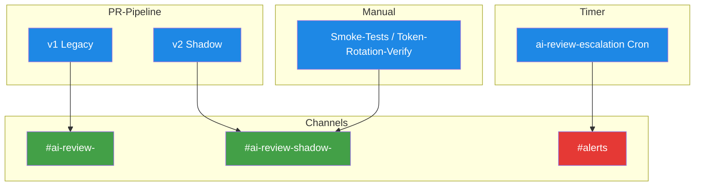

# Discord-Channel-Mapping

> **TL;DR:** Jedes Projekt hat zwei Discord-Channels: einen regulären für Produktions-Reviews und einen Shadow-Channel für nicht-blockierende Tests. Dazu kommt ein gemeinsamer Alerts-Kanal für Eskalationen. Alle Channels leben in der Discord-Guild "Nathan Ops". Die Channel-IDs werden als Env-Variablen im Runner-Env referenziert, damit Scripts und Workflows sie nicht hart verdrahten müssen.

## Channel-Tabelle

| Env-Var | Channel-Name (in Discord) | Zweck | Wer postet rein |
|---|---|---|---|
| `DISCORD_ALERTS_CHANNEL_ID` | `#alerts` | Gemeinsamer Alerts-Kanal (Eskalationen, Infra-Warnungen) | `ai-review-escalation` Workflow, manuelle Test-Posts |
| `DISCORD_CHANNEL_AI_PORTAL` | `#ai-review-ai-portal` | Produktions-Reviews für ai-portal-PRs | v1 Legacy-Pipeline, Phase 5 danach v2 |
| `DISCORD_CHANNEL_AI_PORTAL_SHADOW` | `#ai-review-shadow-ai-portal` | Shadow-Mode-Tests für ai-portal | v2 Shadow-Pipeline |
| `DISCORD_CHANNEL_AI_REVIEW_PIPELINE` | `#ai-review-ai-review-pipeline` | Produktions-Reviews für ai-review-pipeline-PRs (Dogfood) | Dogfood-Workflow |
| `DISCORD_CHANNEL_AI_REVIEW_PIPELINE_SHADOW` | `#ai-review-shadow-ai-review-pipeline` | Shadow-Mode für ai-review-pipeline | Dogfood-Shadow |
| `DISCORD_CHANNEL_AGENT_STACK` | `#ai-review-agent-stack` | Produktions-Reviews für agent-stack-PRs | v1/v2-Pipeline auf agent-stack |
| `DISCORD_CHANNEL_AGENT_STACK_SHADOW` | `#ai-review-shadow-agent-stack` | Shadow-Mode für agent-stack | Shadow-Pipeline |

Das sind **7 Channel-IDs insgesamt**. Die Guild hat zusätzlich typische Kanäle wie `#general`, `#bot-commands` etc., die aber **nicht** Teil der AI-Review-Toolchain sind.

## Namens-Konvention

```
#ai-review-<repo-name>               → regulärer Channel
#ai-review-shadow-<repo-name>        → Shadow-Channel (Phase 4)
```

Der `<repo-name>` ist das "Human-readable" Namens-Suffix, nicht zwingend gleich dem GitHub-Repo-Namen. In der Praxis matchen sie aber: `ai-portal` → `#ai-review-ai-portal`.

## Wer was postet



**Regel-of-Thumb:**
- **Produktions-Review-Ergebnis** → regulärer Channel
- **Experimenteller v2-Run / Test-Post** → Shadow-Channel
- **Eskalation / Infra-Alarm** → Alerts-Kanal

## Der Alerts-Kanal im Detail

`#alerts` bekommt:
- Nach 30 Min unbeantworteter Soft-Consensus: `@here` Eskalation
- Nach 60 Min: direkte Owner-Mention
- Manuelle Smoke-Test-Posts (via `DISCORD_ALERTS_CHANNEL_ID`)
- In Zukunft: Runner-offline-Benachrichtigungen, DB-Korruption-Warnungen

**Wichtig:** Alerts-Kanal sollte **nicht** von User stumm-geschaltet werden. Deshalb ist er bewusst separat vom normalen Review-Kanal.

## Channel-ID herausfinden

**Via Discord-Client:**

1. Developer-Mode aktivieren: Settings → Advanced → Developer Mode: On
2. Rechtsklick auf Channel → "Copy Channel ID"
3. Als 19-chars-String in env eintragen

**Via API (für Debugging):**

```bash
curl -sS -H "Authorization: Bot $DISCORD_BOT_TOKEN" \
  "https://discord.com/api/v10/guilds/$DISCORD_GUILD_ID/channels" \
  | jq '.[] | {id, name, type}'
```

## Channel bei neuem Projekt anlegen

```bash
cd ~/projects/agent-stack
bash ops/discord-bot/init-server.sh --add-project <project-name>
```

Das Skript:
1. Erstellt `#ai-review-<project-name>` + `#ai-review-shadow-<project-name>` in der Guild
2. Schreibt `DISCORD_CHANNEL_<UPPER_NAME>` + `DISCORD_CHANNEL_<UPPER_NAME>_SHADOW` in `~/.config/ai-workflows/env`
3. Triggert n8n-Container-Recreate (damit die neuen Vars sichtbar werden)

**Manuell, falls Skript nicht passt:**

```bash
# Via Discord API:
curl -sS -X POST \
  -H "Authorization: Bot $DISCORD_BOT_TOKEN" \
  -H "Content-Type: application/json" \
  "https://discord.com/api/v10/guilds/$DISCORD_GUILD_ID/channels" \
  -d '{"name":"ai-review-myproject","type":0}'

# Dann ID in env eintragen:
$EDITOR ~/.config/ai-workflows/env
# DISCORD_CHANNEL_MYPROJECT=<neue 19-char ID>

# Container reload
bash ops/scripts/restart-n8n-with-ai-review.sh
```

## Beim Cutover Phase 4 → 5

Im Cutover wird pro Projekt:

- `DISCORD_CHANNEL_<NAME>_SHADOW` bleibt bestehen (für zukünftige Experimente)
- In `.ai-review/config.yaml`: `channel_id` wird von `$DISCORD_CHANNEL_<NAME>_SHADOW` auf `$DISCORD_CHANNEL_<NAME>` umgestellt
- Shadow-Channel wird nach Cutover zum "Training-Channel" für neue Features

Details: [`30-workflows/40-cutover-phase-4-zu-5.md`](../30-workflows/40-cutover-phase-4-zu-5.md).

## Discord-Permissions pro Channel

Der Bot "Nathan Ops" braucht pro Channel:
- Send Messages
- Read Message History
- Use Application Commands (für Buttons)

Keine Admin-Permissions. Das wird beim Bot-Invite via OAuth-Scope-URL voreingestellt.

Falls Bot nicht posten kann: Channel → Edit → Permissions → Bot-Rolle prüfen.

## Verwandte Seiten

- [Discord-Bridge](../20-komponenten/40-discord-bridge.md) — Bot-Setup + Guild-Infos
- [Env-Variablen](10-env-variables.md) — alle ENV-Vars
- [Quickstart neues Projekt](../40-setup/00-quickstart-neues-projekt.md) — Channel-Anlage-Schritt
- [Soft-Consensus & Nachfrage](../10-konzepte/40-nachfrage-soft-consensus.md) — was in welchen Channel geht

## Quelle der Wahrheit (SoT)

- [Discord Guild "Nathan Ops"](https://discord.com/channels/<guild-id>) — echte Channel-Liste
- [`ops/discord-bot/init-server.sh`](https://github.com/EtroxTaran/agent-stack/blob/main/ops/discord-bot/init-server.sh) — Guild-Setup-Skript
- [`~/.config/ai-workflows/env`](../20-komponenten/80-secrets-env.md) — konkrete Channel-IDs
