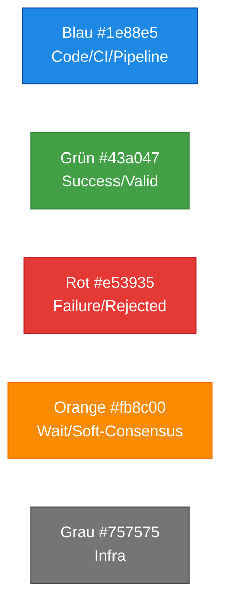
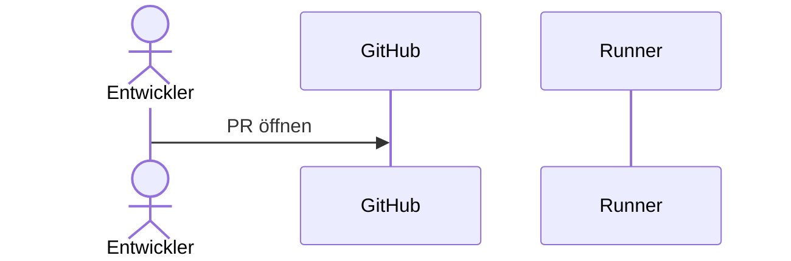
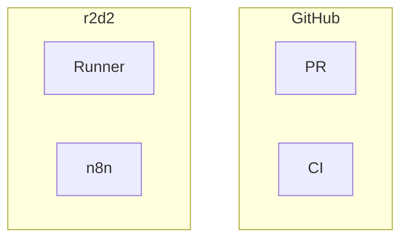
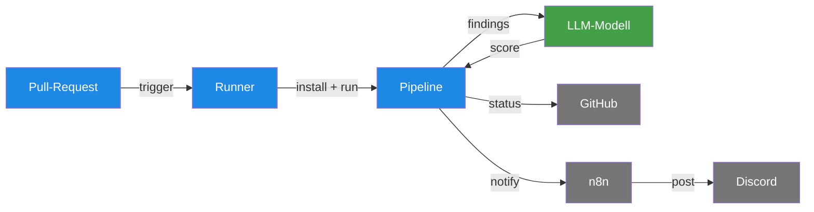
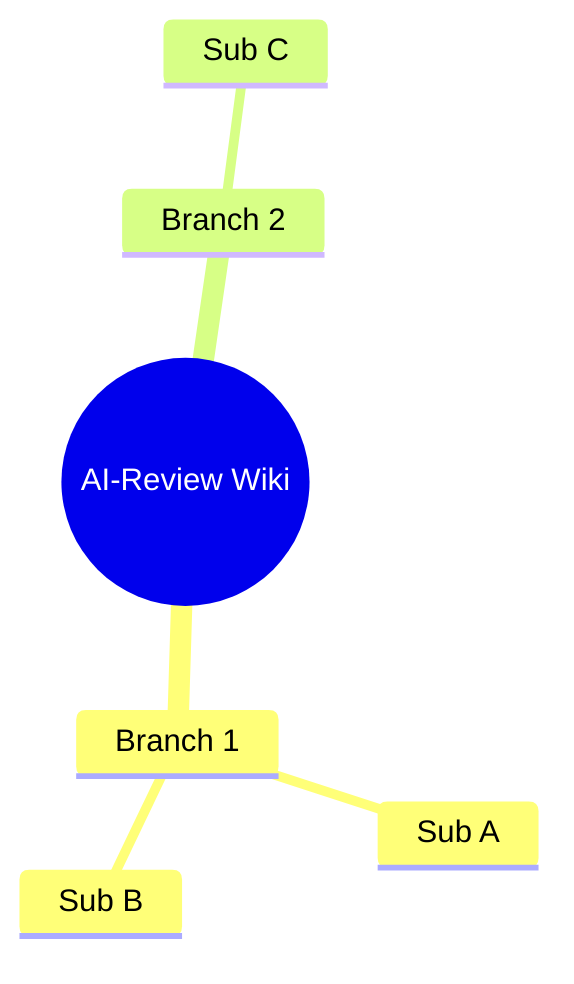

# Mermaid-Konventionen im Wiki

> **TL;DR:** Dieses Wiki nutzt Mermaid-Diagramme für visuelle Darstellungen. Damit die Diagramme konsistent aussehen und in allen Rendering-Tools (GitHub-Web, VSCode, mkdocs-mermaid) funktionieren, gelten fünf Regeln: nur stabile Diagramm-Typen nutzen (graph, sequenceDiagram, flowchart, stateDiagram-v2, mindmap), einheitliche Farb-Palette, keine Unicode-Emojis als Node-Labels, Akteur-Namen für sequenceDiagram, und beim `subgraph`-Nesting nicht tiefer als 2 Ebenen gehen.

## Wie es funktioniert

Mermaid wird direkt in Markdown geschrieben, in ` ```mermaid ` Code-Blöcken. GitHub rendert das auto, ebenso die meisten IDEs mit Markdown-Preview. Der Style-Guide hier legt Konventionen fest, damit alle Diagramme einen wiedererkennbaren Look haben.

## Technische Details

### Die 5 erlaubten Diagramm-Typen

| Typ | Wann | Beispiel-Seite |
|---|---|---|
| `graph LR` / `graph TB` | Statische Architektur-Übersichten, Kompontenten-Beziehungen | [`00-ueberblick.md`](../00-ueberblick.md) |
| `sequenceDiagram` | Request/Response-Abläufe mit Zeitachse | [`30-workflows/00-neuer-pr-e2e.md`](../30-workflows/00-neuer-pr-e2e.md) |
| `flowchart TD` / `flowchart LR` | Entscheidungs-Logik mit Verzweigungen | [`99-meta/10-style-guide.md`](../99-meta/10-style-guide.md) |
| `stateDiagram-v2` | Zustände + Übergänge | [`10-konzepte/10-consensus-scoring.md`](../10-konzepte/10-consensus-scoring.md) |
| `mindmap` | Top-Level-Navigation oder -Übersicht | [`README.md`](../README.md) |

**NICHT verwenden:**
- `gantt` — zu spezifisch für Zeitpläne
- `classDiagram` — Python-Package-Details gehören in Code-Docstrings, nicht ins Wiki
- `erDiagram` — SurrealDB-Schemas haben ihre eigene Doku
- `timeline` — zu Beta-ish, viele Renderer unterstützen es nicht
- `journey` — zu spezifisch für User-Experience-Maps
- `C4Context` — overkill für unsere Scope

### Farb-Palette



**Semantik:**
- **Blau:** CI-Pipeline, Workflow-Jobs, Entwickler-Aktionen
- **Grün:** Erfolgs-Zustände, gültige Pfade
- **Rot:** Fehler-Zustände, abgelehnte Requests, Infrastructure-Outages
- **Orange:** Wartende Zustände, Soft-Consensus, Timeouts
- **Grau:** Infrastruktur-Komponenten (n8n, Docker, Tailscale), External-Systems

### classDef-Template

Standard-Definitionen, die man am Ende jedes Diagramms anhängt:

```mermaid
classDef blue fill:#1e88e5,color:#fff,stroke:#0d47a1
classDef green fill:#43a047,color:#fff,stroke:#2e7d32
classDef red fill:#e53935,color:#fff,stroke:#b71c1c
classDef orange fill:#fb8c00,color:#fff,stroke:#ef6c00
classDef grey fill:#757575,color:#fff,stroke:#424242
```

Dann Nodes zuweisen:

```
class NODE_A,NODE_B blue
class NODE_C green
```

### Unicode / Emojis in Labels

**Sparsam verwenden.** Einige Mermaid-Renderer haben Probleme mit komplexen Unicode-Zeichen, und Screen-Reader haben Schwierigkeiten.

**Erlaubt:**
- Einfache Symbole in Pipe-Labels: `-->|triggert|` statt `-->|📣 triggert|`
- Status-Emojis nur bei klarem Label-Kontext: `✅ Freigeben` (Button), `❌ Invalid`

**Vermeiden:**
- Emojis als einzige Node-Labels (`🎯` → unklar)
- Komplexe Emoji-Kombinationen (`👨‍💻` → Rendering-Risiko)

### Sequence-Diagrams: Akteur-Namen

Für menschliche Akteure **`actor`** statt **`participant`**:



`as`-Alias benutzen für lesbare Kurz-Namen — sonst wird das Diagramm schnell zu breit.

### Subgraph-Nesting

**Maximal 2 Ebenen.** Tieferes Nesting wird unübersichtlich und einige Renderer brechen.

**OK:**



**Nicht OK:**

```
graph TB
    subgraph "Cloud"
        subgraph "GitHub"
            subgraph "Actions"
                A[Runner]    # zu tief
            end
        end
    end
```

Wenn man wirklich tiefere Struktur zeigen muss: Auf zwei separate Diagramme aufteilen.

### Graph-Richtungen

- **`graph LR`** (left-to-right): Lineare Flüsse, Bottom-Up-Architektur
- **`graph TB`** (top-to-bottom): Hierarchische Strukturen, Komponenten-Diagramme
- **`flowchart TD`** (top-down): Entscheidungs-Logik

Vermeiden: `graph RL` oder `graph BT` — führt zu verwirrender Leserichtung.

### Beispiel: Ein sauberes Diagramm



Eigenschaften:
- Kurze Labels, gruppiert
- Klare Farb-Semantik
- Kein Emoji-Overload
- Ein-Ebenen-Layout

### Rendering-Test

Bevor ein Diagramm committet wird, teste:

```bash
# Per mermaid-cli (npm install -g @mermaid-js/mermaid-cli)
echo '```mermaid
graph LR
  A --> B
```' | mmdc -i - -o /tmp/test.svg
```

Wenn `mmdc` ein SVG erzeugt ohne Fehler, wird auch GitHub es rendern.

### Mindmap-Spezifika

Die `mindmap` (nur in `README.md` genutzt) braucht mermaid ≥ v9.3. Syntax:



- `root((…))` ist die zentrale Node mit Doppel-Klammern
- Einrückung bestimmt die Hierarchie
- Keine Pfeile oder Styling — das kommt aus der Tree-Struktur

## Verwandte Seiten

- [Style-Guide](../99-meta/10-style-guide.md) — Gesamt-Wiki-Konventionen
- [Contribute](../99-meta/00-contribute.md) — wie man neue Seiten + Diagramme hinzufügt
- [Überblick](../00-ueberblick.md) — Hauptbeispiel für `graph TB`

## Quelle der Wahrheit (SoT)

- [Mermaid-Docs](https://mermaid.js.org/intro/) — offizielle Syntax-Referenz
- [Mermaid Live Editor](https://mermaid.live/) — interaktiv zum Testen
