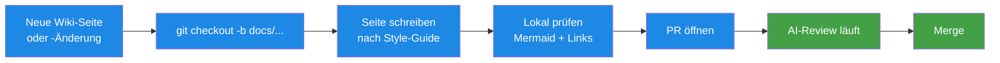

# Contribute — Wie man das Wiki erweitert

> **TL;DR:** Neue Seiten folgen dem Template im Style-Guide, landen in einem der neun thematischen Unterordner, werden per Pull-Request gegen `agent-stack/main` vorgeschlagen und durchlaufen die normale AI-Review-Pipeline. Infrastruktur-Änderungen am System müssen begleitet von einer Wiki-Aktualisierung sein — "docs-later" gibt es nicht. Diese Seite erklärt, wo welcher Typ von Wiki-Eintrag hingehört, wie Pull-Requests strukturiert sein sollten, und welche Verifikations-Schritte vor dem Merge greifen.

## Wie es funktioniert



Das Wiki lebt als Markdown-Dateien im agent-stack-Repo. Jede Änderung geht durch einen PR, wird von der Pipeline reviewt (Code-Review, Design, AC) und dann gemerged. Keine direkten main-Pushes.

## Technische Details

### Seiten-Strukturierung

Entscheide, in welchen der neun Ordner deine neue Seite gehört:

| Ordner | Für | Typische Trigger |
|---|---|---|
| `10-konzepte/` | Was-ist-Fragen | "Ich will erklären, was ein Waiver/Consensus/Shadow-Mode ist" |
| `20-komponenten/` | Was-ist-wo-Fragen | "Neue Komponente ins System integriert" |
| `30-workflows/` | Wie-läuft-ab-Fragen | "Neuer automatisierter Flow" |
| `40-setup/` | How-To-Anleitungen | "Wie installiere / konfiguriere ich X?" |
| `50-runbooks/` | Incident-Response | "Neues Problem, hier der Fix" |
| `60-tests/` | Test-Artefakte | "Neue Test-Suite dokumentieren" |
| `70-reference/` | Nachschlagewerk | "Tabelle aller CLI-Flags / Env-Vars" |
| `80-historie/` | Rückblick | "Retrospektive auf vergangene Entscheidung" |
| `99-meta/` | Über das Wiki selbst | "Style-Guide-Änderung / Contributing-Regel" |

Unsicher? Lieber fragen (Issue aufmachen) als in den falschen Ordner packen.

### Dateiname-Konvention

```
<prefix>-<slug>.md
```

- `<prefix>` ist eine zweistellige Zahl (00, 10, 20, ...). Der Prefix bestimmt die Reihenfolge im Ordner-Listing.
- `<slug>` ist kebab-case, englisch wenn Tool-Bezug, deutsch wenn konzeptionell. Beispiele:
  - `10-konzepte/00-ai-review-pipeline.md` ✓
  - `50-runbooks/30-pip-install-bricht.md` ✓ (gemischt, weil deutscher Verb + englisches Tool)
  - `70-reference/00-cli-commands.md` ✓

Neue Prefix-Zahlen sollten Lücken zu bestehenden lassen (10, 20, 30, ...) — so kann man später dazwischen einfügen ohne Renaming.

### Seiten-Template

**Jede neue Seite** muss diesem Template folgen:

```markdown
# <Titel>

> **TL;DR:** 3–5 Sätze. Was ist es, warum existiert es, was leistet es.
> Keine Commands, keine Tool-Namen, keine Abkürzungen ohne Erklärung.

## Wie es funktioniert

<Mermaid-Diagramm wenn Ablauf / Struktur zu zeigen ist>

<1–2 Absätze Prose-Erklärung>

## Technische Details

<Pfade, Commands, Config-Snippets, Links>

## Verwandte Seiten

- [Seite A](../path/file.md) — kurz warum relevant
- [Seite B](../path/file.md) — Folge-Thema

## Quelle der Wahrheit (SoT)

- [`datei.json`](https://github.com/EtroxTaran/...) — canonische Quelle
```

Details: [Style-Guide](10-style-guide.md).

### Mermaid-Diagramme

- Nur erlaubte Typen: `graph`, `sequenceDiagram`, `flowchart`, `stateDiagram-v2`, `mindmap`
- Farb-Palette aus [Mermaid-Konventionen](../70-reference/40-mermaid-conventions.md)
- Keine komplexen Emojis in Node-Labels

### PR-Workflow für Wiki-Änderungen

1. **Branch:**
   ```bash
   git checkout -b docs/<slug>
   # z.B.: docs/add-runbook-for-ci-timeout
   ```

2. **Schreiben + lokal prüfen:**
   ```bash
   # Mermaid-Diagramme validieren
   mmdc -i new-page.md -o /tmp/test.svg

   # Markdown-Preview in VSCode oder `grip`
   pip install grip
   grip docs/wiki/your-page.md
   ```

3. **Issue referenzieren:** Jeder PR braucht ein Issue mit Gherkin-AC.
   - Entweder ein bestehendes "Wiki-Page XYZ fehlt" Issue aufgreifen
   - Oder neues Issue mit AC aufmachen (z.B. "Given [Zustand], When [Aktion], Then [Wiki-Page existiert + erfüllt Template]")

4. **PR öffnen:**
   ```bash
   gh pr create --title "docs(wiki): <kurze Beschreibung>" \
                --body "Closes #N"
   ```

5. **Review durchlaufen:**
   Die 5 Stages der AI-Review-Pipeline werden ausgeführt. Für reine Wiki-PRs sind typischerweise:
   - `ai-review/code` → skippable / clean (keine Code-Änderung)
   - `ai-review/security` → clean
   - `ai-review/design` → möglicherweise Findings wenn Markdown-Style abweicht
   - `ai-review/ac-validation` → prüft dass Issue-AC = PR-Inhalt matcht

6. **Bei Soft-Consensus:** Reviewer/User klickt passend:
   - "Freigeben" wenn die Findings Nice-to-Have sind
   - "Nochmal prüfen" wenn ein Fix nötig ist

### Wiki-Aktualisierungen bei Code-Änderungen

Wenn ein PR Infrastruktur ändert, **muss** er das Wiki mit aktualisieren:

| Change | Betroffene Wiki-Seite |
|---|---|
| Neuer MCP-Server | `20-komponenten/70-skills-mcp.md` |
| Neuer Discord-Channel | `20-komponenten/40-discord-bridge.md` + `70-reference/30-channel-mapping.md` |
| CLI-Flag geändert | `70-reference/00-cli-commands.md` |
| Neuer Workflow-Template | `40-setup/30-workflow-templates.md` |
| Neuer Env-Var | `70-reference/10-env-variables.md` |
| Neue Stage / Scoring-Änderung | `10-konzepte/00-ai-review-pipeline.md` + `10-konzepte/10-consensus-scoring.md` |
| Incident gelöst | Neuer Eintrag in `50-runbooks/` + `60-stolpersteine.md` |

**Fehlende Wiki-Aktualisierung ist ein Finding in der Design-Stage.**

### Owner-Rolle

Jeder Ordner hat einen **fachlichen Owner**:

- `10-konzepte/` + `99-meta/` → Nico (der die Konzepte setzt)
- `20-komponenten/` → alle, die die Komponente anfassen (code-based ownership)
- `30-workflows/` → wer den Workflow implementiert
- `40-setup/` + `70-reference/` → alle (Community-Content)
- `50-runbooks/` → wer den Incident löst, schreibt den Runbook
- `60-tests/` → Test-Autor
- `80-historie/` → kollektiv; ADRs werden einzeln reviewt

Der Owner muss nicht jede Änderung approven, aber sollte bei größeren Änderungen eingebunden werden (via PR-Review-Request).

### Stakeholder-Check (Nico)

Nico liest regelmäßig ausgewählte Seiten, insbesondere neue TL;DRs. Wenn eine TL;DR nicht ohne Technical-Jargon auskommt, kommt Rückmeldung — Umschreiben erforderlich.

**Praxis:** TL;DR darf nicht folgende Wörter enthalten ohne Erklärung: Container, Webhook, API, Token, CLI, YAML, JSON, SDK. Wenn doch, in Klammern erklären: "Container (ein eingepackter Dienst, läuft isoliert auf dem Server)".

### Lessons-Learned aus dem Wiki-Schreiben selbst

Nach ~46 Seiten Wiki-Aufbau:

- **Templates ersparen enormen Arbeitsaufwand** — das fixe Template macht jede neue Seite in 15–30 Min schreibbar
- **Mermaid-Diagramme sind der Haupt-Mehrwert** — ohne sie wäre das Wiki nur eine bessere Doku-Sammlung
- **Cross-Links werden oft vergessen** — jede neue Seite braucht "Verwandte Seiten" mit 2–5 konkreten Links
- **SoT-Sektion zwingt zur Präzision** — wenn ich keinen GitHub-Link finde, heißt das meist: der Inhalt ist fabricated statt aus echtem Code gelesen

### Das nicht-technical Review

Wenn du eine Seite fertig hast, lies nur die **TL;DR + Mermaid + erste drei Zeilen "Wie es funktioniert"**. Frage dich:

> Verstehe ich als jemand, der das Thema nicht kennt, worum es geht?

Wenn nein, umschreiben. Das ist der wichtigste Qualitäts-Test.

## Verwandte Seiten

- [Style-Guide](10-style-guide.md) — das Template im Detail
- [Mermaid-Konventionen](../70-reference/40-mermaid-conventions.md) — Diagramm-Regeln
- [AGENTS.md §9](https://github.com/EtroxTaran/agent-stack/blob/main/AGENTS.md) — Ticket↔PR-Linkage für Issues
- [Lessons Learned](../80-historie/10-lessons-learned.md) — Lesson #10 zum Dokumentations-Prinzip

## Quelle der Wahrheit (SoT)

- [`99-meta/10-style-guide.md`](10-style-guide.md) — das formale Template
- [Repo](https://github.com/EtroxTaran/agent-stack) — wo die PRs geöffnet werden
