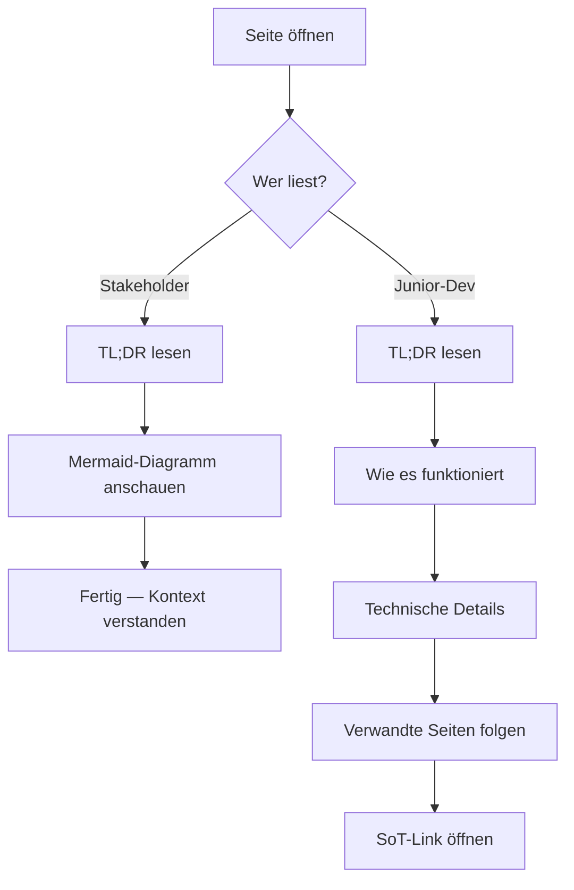

# Style-Guide — Wie dieses Wiki geschrieben wird

> **TL;DR:** Jede Seite im Wiki folgt einem festen Template, damit sowohl ein Junior-Developer (beim ersten Mal) als auch ein nicht-technischer Stakeholder den Inhalt versteht. Deutsche Prose, englische Code-Identifier, immer ein TL;DR oben, immer Mermaid bei Abläufen, immer Verlinkung statt Duplizierung. Wer sich nicht an das Template hält, schwächt das gesamte Wiki.

## Wie es funktioniert

Das Wiki hat **eine Zielgruppen-Vertrag**: Stakeholder liest nur die TL;DR und schaut das Diagramm an. Junior-Dev liest die Seite linear komplett durch und folgt den Links. Das bedeutet: Das, was oben steht, muss ohne Fachbegriffe funktionieren; das, was unten steht, darf präzise-technisch werden.



## Technische Details

### Seiten-Template (verpflichtend)

Jede `.md`-Datei im Wiki — außer `README.md` und dieser Style-Guide selbst — beginnt mit diesem Skelett:

```markdown
# <Titel der Seite>

> **TL;DR:** 3–5 Sätze. Beschreibt was-ist-das, warum-existiert-es, was-leistet-es.
> Keine Commands, keine Tool-Namen, keine Abkürzungen ohne Erklärung.

## Wie es funktioniert

<Mermaid-Diagramm wenn ein Ablauf oder eine Struktur zu zeigen ist>

<1–2 Absätze Prose: warum genau dieser Flow, welche Rollen/Aktoren, was ist
 die Kernidee. Immer noch keine Code-Snippets, eher Konzepte in Worten.>

## Technische Details

<Jetzt wird es konkret: Pfade, Commands, Config-Snippets, Error-Messages.
 Code-Blocks mit Sprachangabe (```yaml, ```bash, ```python, ```json).
 Hier darf Fachsprache rein.>

## Verwandte Seiten

- [Titel der Seite A](../10-konzepte/00-xyz.md) — kurz warum relevant
- [Titel der Seite B](../20-komponenten/30-abc.md) — Folge-Thema

## Quelle der Wahrheit (SoT)

- [`datei.json`](https://github.com/EtroxTaran/agent-stack/blob/main/pfad/datei.json#L42) — der canonische Stand
- [CLAUDE.md §8](https://github.com/EtroxTaran/agent-stack/blob/main/AGENTS.md) — global verankerte Regel
```

### Sprache

| Element | Sprache | Beispiel |
|---|---|---|
| Prose (Fließtext) | Deutsch | "Die Pipeline prüft jeden PR in fünf Stufen." |
| Zwischenüberschriften | Deutsch | "Wie es funktioniert" |
| Code-Identifier | Englisch | `ai-review-callback`, `load_prompt()` |
| CLI-Commands | Englisch (wie im Tool) | `ai-review stage code-review --pr 42` |
| Error-Messages | Original belassen | `FileNotFoundError: stages/prompts/...` |
| Datei-Pfade | Original | `/home/clawd/.config/ai-workflows/env` |
| Fachbegriffe (wenn kein deutsches Wort üblich) | Englisch in Backticks | `Consensus`, `Waiver`, `Shadow-Mode` |

### TL;DR-Regeln

- **Länge:** 3–5 Sätze. Lieber weniger als zu viel.
- **Keine Tool-Namen im ersten Satz.** Wer nicht weiß was n8n ist, darf die TL;DR trotzdem verstehen.
- **Keine Abkürzungen** ohne Erklärung. "AC" → "Acceptance Criteria (die prüfbaren Kriterien eines Tickets)" beim ersten Mal pro Seite.
- **Aktiv, nicht passiv.** "Die Pipeline prüft…" statt "Es wird geprüft…".
- **Kein "wir", kein "du"** — neutrale Formulierung.

### Mermaid-Konventionen

Immer Mermaid statt ASCII-Grafik. Diagramm-Typen nach Zweck:

| Zweck | Diagramm-Typ | Beispiel-Seite |
|---|---|---|
| Komponenten-Übersicht | `graph LR` oder `graph TB` | `00-ueberblick.md` |
| Zeitliche Abläufe (Request/Response) | `sequenceDiagram` | `30-workflows/00-neuer-pr-e2e.md` |
| Zustände + Übergänge | `stateDiagram-v2` | `10-konzepte/10-consensus-scoring.md` |
| Entscheidungs-Logik | `flowchart TD` | dieser Style-Guide oben |
| Top-Level-Navigation | `mindmap` | `README.md` |

Details inklusive Farb-Konventionen in [`70-reference/40-mermaid-conventions.md`](../70-reference/40-mermaid-conventions.md).

### Verlinkungs-Prinzip

**Nicht duplizieren, immer verlinken.**

- Einen Fakt aus `CLAUDE.md §8`? → **Verlinken**, nicht kopieren. Wenn `CLAUDE.md` sich ändert, folgt das Wiki automatisch.
- Ein Workflow-Template aus `ai-review-pipeline/workflows/`? → **Verlinken** auf GitHub (mit Zeilennummer wenn sinnvoll), nicht den Inhalt ins Wiki gießen.
- Eine Runbook-Schritt-Folge, die man oft braucht? → **Im Wiki schreiben**, aber am Ende auf die SoT-Datei verweisen.

Faustregel: **Wenn der Inhalt woanders lebt und sich dort ändert, → verlinken. Wenn er hier entsteht und das Wiki die SoT ist, → schreiben.**

### Secrets-Regeln

Das Wiki darf **niemals** Token-Werte oder Credentials enthalten. Wiederkehrende Regeln:

- ❌ Nicht: `DISCORD_BOT_TOKEN=MTAwMzUwNjE0MjY5MzY3MTg...`
- ✅ Stattdessen: `DISCORD_BOT_TOKEN` (72 Zeichen lang, Discord-Bot-Credential, rotiert im Dev-Portal)
- ❌ Nicht: konkrete Channel-IDs hart verdrahtet (kann sich ändern)
- ✅ Stattdessen: "Der Alerts-Channel (siehe `DISCORD_ALERTS_CHANNEL_ID`)"

Einzige Ausnahme: Öffentliche Identifikatoren wie Guild-ID, Application-ID und die Tailscale-Funnel-URL sind dokumentierbar, weil sie öffentlich exponiert sind.

### Commit-Konvention für Wiki-Änderungen

```
docs(wiki): <kurze Beschreibung>

<optional längere Erklärung>
```

Beispiele:
- `docs(wiki): add runbook for pip-half-upgrade on self-hosted runner`
- `docs(wiki): update channel mapping after cutover to Phase 5`
- `docs(wiki): fix broken SoT links after ai-review-pipeline refactor`

### Wann aktualisieren?

Das Wiki ist **reaktiv**, nicht prophetisch:

- Infrastruktur-Änderung → zugehörige Komponenten-Seite im selben PR aktualisieren
- Neuer Incident gelöst → Runbook im `50-runbooks/` Ordner hinzufügen oder ergänzen
- CLI-Flag gewechselt → `70-reference/00-cli-commands.md` sofort nachziehen
- Phase-Wechsel (4→5 Cutover) → `20-shadow-vs-cutover.md` + `30-workflows/40-cutover-...` anpassen

Keine "Das dokumentieren wir später"-Schulden. Ein veraltetes Wiki ist schlimmer als kein Wiki.

## Verwandte Seiten

- [Wie man das Wiki erweitert](00-contribute.md) — PR-Workflow, Owner-Rolle
- [Mermaid-Konventionen](../70-reference/40-mermaid-conventions.md) — Diagramm-Farben und -Typen
- [Glossar](../70-reference/50-glossar.md) — Fachbegriffe von A bis Z

## Quelle der Wahrheit (SoT)

- [`AGENTS.md §7` (globale Code-Standards)](https://github.com/EtroxTaran/agent-stack/blob/main/AGENTS.md) — Deutsche Prose + englische Identifier
- [`AGENTS.md §11` (Always Latest)](https://github.com/EtroxTaran/agent-stack/blob/main/AGENTS.md) — aktuelle Modell-IDs + Version-Check
