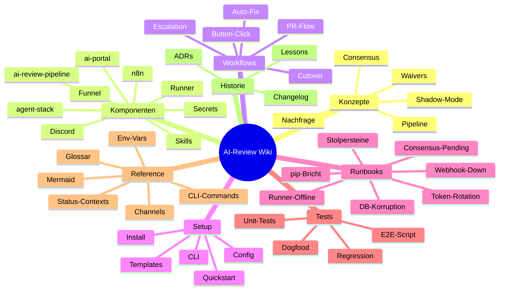

# AI-Review-Toolchain Wiki

> **Was ist das hier?** Dieses Wiki erklärt die komplette AI-Review-Toolchain — von dem Moment, in dem ein Entwickler einen Pull-Request öffnet, bis zu dem Moment, in dem der Code automatisch auf die Produktion deployed wird. Inklusive Discord-Benachrichtigungen, automatisierter Code-Reviews durch vier unterschiedliche KI-Modelle, und was zu tun ist, wenn ein Teil der Kette mal aussetzt.

## Für wen ist das?

- **Nico & Sabine** (Stakeholder): Ihr lest die `TL;DR`-Abschnitte und schaut euch die Diagramme an. Das reicht.
- **Neue Entwickler** (Junior-Dev): Ihr lest eine Seite komplett linear — TL;DR → "Wie es funktioniert" → "Technische Details" → folgt den Links.

Jede Seite hält sich an dieses Format. Wer das Format ändern will, liest zuerst den [Style-Guide](99-meta/10-style-guide.md).

## Überblick in einem Bild

## Lese-Reihenfolge

**Wenn du noch nie davon gehört hast** — diese Reihenfolge in ~30 Minuten:

1. [Überblick](00-ueberblick.md) — Was ist die Toolchain überhaupt
2. [AI-Review-Pipeline](10-konzepte/00-ai-review-pipeline.md) — Die 5 Review-Stufen
3. [Consensus-Scoring](10-konzepte/10-consensus-scoring.md) — Wann ein PR gemerged wird
4. [Ein neuer PR, End-to-End](30-workflows/00-neuer-pr-e2e.md) — Der komplette Flow mit Diagramm
5. [Quickstart für neues Projekt](40-setup/00-quickstart-neues-projekt.md) — So aktivierst du die Pipeline

**Wenn etwas kaputt ist** — diese Reihenfolge in ~5 Minuten bis zum Fix:

1. [Stolpersteine](50-runbooks/60-stolpersteine.md) — Die 15 häufigsten Probleme in einer Liste
2. Das passende Runbook im Ordner [`50-runbooks/`](50-runbooks/) öffnen
3. Wenn dort nicht gelöst: [Lessons Learned](80-historie/10-lessons-learned.md) durchsuchen

## Inhaltsverzeichnis

### [10 — Konzepte](10-konzepte/) · *Was-ist-was*

| Seite | Inhalt |
|---|---|
| [AI-Review-Pipeline](10-konzepte/00-ai-review-pipeline.md) | Die 5 Stages: Code, Code-Cursor, Security, Design, AC-Validation |
| [Consensus-Scoring](10-konzepte/10-consensus-scoring.md) | Bewertungssystem: avg ≥ 8 = success, 5–7 = soft, < 5 = fail |
| [Shadow-Mode vs. Cutover](10-konzepte/20-shadow-vs-cutover.md) | Phase 4 (nicht-blockierend) vs. Phase 5 (required-check) |
| [Waiver-System](10-konzepte/30-waiver-system.md) | Security- und AC-Waiver mit Audit-Trail |
| [Soft-Consensus & Nachfrage](10-konzepte/40-nachfrage-soft-consensus.md) | Wann manuelle Freigabe nötig ist, Eskalation |

### [20 — Komponenten](20-komponenten/) · *Was-ist-wo*

| Seite | Inhalt |
|---|---|
| [agent-stack](20-komponenten/00-agent-stack.md) | Das Infrastruktur-Repo (dieses hier) |
| [ai-review-pipeline](20-komponenten/10-ai-review-pipeline-repo.md) | Python-Package + CLI |
| [ai-portal Integration](20-komponenten/20-ai-portal-integration.md) | Wie das Zielprojekt die Pipeline nutzt |
| [n8n Workflows](20-komponenten/30-n8n-workflows.md) | Dispatcher, Callback, Escalation |
| [Discord-Bridge](20-komponenten/40-discord-bridge.md) | Guild "Nathan Ops", Bot, Channels |
| [Tailscale-Funnel](20-komponenten/50-tailscale-funnel.md) | Öffentlicher Webhook-Endpoint |
| [Self-Hosted Runner](20-komponenten/60-self-hosted-runner.md) | r2d2 GitHub-Actions-Runner |
| [Skills & MCP-Server](20-komponenten/70-skills-mcp.md) | Agent-Skills + MCP-Registry |
| [Secrets & Env](20-komponenten/80-secrets-env.md) | Wo welche Credentials leben |

### [30 — Workflows](30-workflows/) · *Wie-läuft-was-ab*

| Seite | Inhalt |
|---|---|
| [Neuer PR E2E](30-workflows/00-neuer-pr-e2e.md) | PR geöffnet → Stages → Consensus → Auto-Merge |
| [Button-Click-Callback](30-workflows/10-button-click-callback.md) | Discord-Button → GitHub-Action |
| [Eskalation nach 30 Min](30-workflows/20-escalation-30-min.md) | Stale Nachfrage → @here-Alert |
| [Auto-Fix-Loop](30-workflows/30-auto-fix-loop.md) | Findings → automatischer Fix → erneutes Review |
| [Cutover Phase 4 → 5](30-workflows/40-cutover-phase-4-zu-5.md) | Shadow-Modus zu Required-Check migrieren |

### [40 — Setup](40-setup/) · *How-to*

| Seite | Inhalt |
|---|---|
| [Quickstart für neues Projekt](40-setup/00-quickstart-neues-projekt.md) | AI-Review in einem neuen Repo aktivieren |
| [agent-stack installieren](40-setup/10-agent-stack-install.md) | dotbot, MCP, Skills bootstrap |
| [.ai-review/config.yaml](40-setup/20-ai-review-config-schema.md) | Config-Schema-Referenz |
| [Workflow-Templates](40-setup/30-workflow-templates.md) | Die 10 YAML-Templates erklärt |
| [`gh ai-review` Extension](40-setup/40-gh-extension.md) | GitHub-CLI-Extension installieren |

### [50 — Runbooks](50-runbooks/) · *Wenn-es-brennt*

| Seite | Symptom |
|---|---|
| [Discord-Webhook down](50-runbooks/00-discord-webhook-down.md) | Keine Nachrichten im Channel, Save im Dev-Portal schlägt fehl |
| [n8n DB-Korruption](50-runbooks/10-n8n-db-korruption.md) | `SQLITE_CORRUPT: database disk image is malformed` |
| [Runner offline](50-runbooks/20-runner-offline.md) | Jobs bleiben in Queue, runner-status = offline |
| [`pip install` bricht ab](50-runbooks/30-pip-install-bricht.md) | `ImportError: RequirementInformation`, force-reinstall-Logik |
| [`ai-review/consensus` hängt](50-runbooks/40-consensus-stuck-pending.md) | Status bleibt auf `pending` obwohl Stages grün sind |
| [Token-Rotation](50-runbooks/50-token-rotation.md) | Discord-Bot-Token oder GitHub-PAT ohne Downtime wechseln |
| [Stolpersteine](50-runbooks/60-stolpersteine.md) | Aggregierte Liste der 15 häufigsten Fallen |

### [60 — Tests](60-tests/) · *Was-geprüft-wird*

| Seite | Inhalt |
|---|---|
| [E2E-Validation-Script](60-tests/00-e2e-validate-script.md) | `ai-review-e2e-validate.sh` — 25 End-to-End-Checks |
| [Callback-Unit-Tests](60-tests/10-callback-unit-tests.md) | 13 Cases für Ed25519-Verify + Button-Parsing |
| [Wheel-Packaging-Regression](60-tests/20-wheel-packaging-regression.md) | `.md`-Prompt-Files müssen im Wheel sein |
| [Dogfood-Pipeline](60-tests/30-dogfood-pipeline.md) | Pipeline reviewt sich selbst |

### [70 — Reference](70-reference/) · *Nachschlagewerk*

| Seite | Inhalt |
|---|---|
| [CLI-Commands](70-reference/00-cli-commands.md) | `ai-review stage/consensus/ac-validate/...` mit allen Flags |
| [Env-Variablen](70-reference/10-env-variables.md) | Alle `DISCORD_*`, `GITHUB_*` Vars erklärt |
| [Status-Contexts](70-reference/20-status-contexts.md) | `ai-review/*` vs. `ai-review-v2/*` Matrix |
| [Channel-Mapping](70-reference/30-channel-mapping.md) | 11 Discord-Channels und ihre Zwecke |
| [Mermaid-Konventionen](70-reference/40-mermaid-conventions.md) | Farben, Diagramm-Typen, Beispiele |
| [Glossar](70-reference/50-glossar.md) | 40 Fachbegriffe von A bis Z |

### [80 — Historie](80-historie/) · *Wie-wir-hier-hingekommen-sind*

| Seite | Inhalt |
|---|---|
| [Changelog](80-historie/00-changelog.md) | Chronologie der Entwicklung |
| [Lessons Learned](80-historie/10-lessons-learned.md) | pip-Half-Upgrade, webhookId, SPKI, … |
| [ADRs-Index](80-historie/20-adrs-index.md) | Linkliste zu allen Architecture-Decision-Records |

### [99 — Meta](99-meta/) · *Das-Wiki-über-sich-selbst*

| Seite | Inhalt |
|---|---|
| [Contribute](99-meta/00-contribute.md) | Wie man das Wiki erweitert, Owner-Rolle |
| [Style-Guide](99-meta/10-style-guide.md) | Seiten-Template, Sprache, Mermaid-Konventionen |

## Quelle der Wahrheit (SoT)

Das Wiki **verlinkt** auf canonische Quellen, **dupliziert** sie nicht. Die wichtigsten externen SoTs:

- [`AGENTS.md` (agent-stack)](https://github.com/EtroxTaran/agent-stack/blob/main/AGENTS.md) — globale Engineering-Rules, insbesondere §8 Review-Charter
- [`ai-review-pipeline`](https://github.com/EtroxTaran/ai-review-pipeline) — die Python-Pipeline + CLI
- [`ai-portal`](https://github.com/EtroxTaran/ai-portal) — das zu reviewende Produkt-Repo

## Wann wurde das zuletzt aktualisiert?

Commit-Zeit dieser Datei: siehe [Git-History](https://github.com/EtroxTaran/agent-stack/commits/main/docs/wiki/README.md). Jede Seite hat einen eigenen Commit-Log — wenn du wissen willst, wann ein Detail zuletzt geprüft wurde, schau dort.
